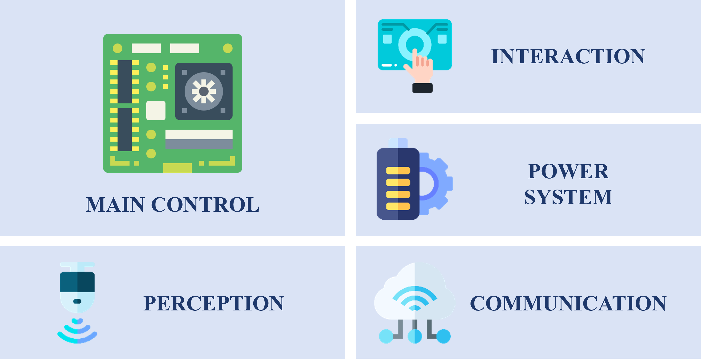

# ARCHITECTURE

## HARDWARE ARCHITECTURE

MAIN CONTROL + PERCEPTION + COMMUNICATION + INTERACTION + POWER SUPPLY




!!! note
    The above is a schematic diagram of the hardware abstraction layer. The specific modules and functions are subject to the actual hardware.

## SOFTWARE ARCHITECTURE

HARDWARE LAYER + PLATFORM ABSTRACTION LAYER + SYSTEM SERVICES LAYER + APPLICATION LAYER

```shell
+------------------------------+
| Application Layer            | <-- Application Code
+------------------------------+
| System Services Layer        | <-- OS + Middleware
+------------------------------+
| Platform Abstraction Layer   | <-- Startup Code + HAL (register-level) + BSP (board-level)
+------------------------------+
| Hardware Layer               | <-- Main Control + Peripherals
+------------------------------+
```

