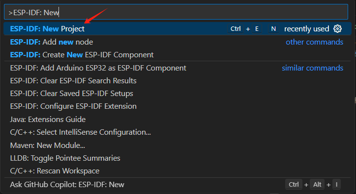
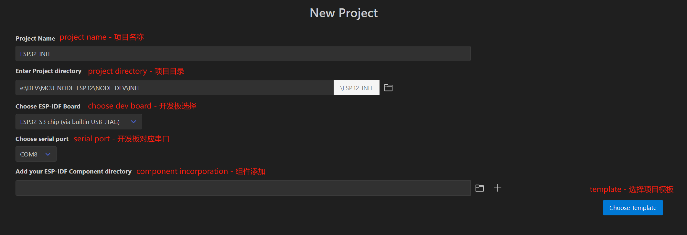
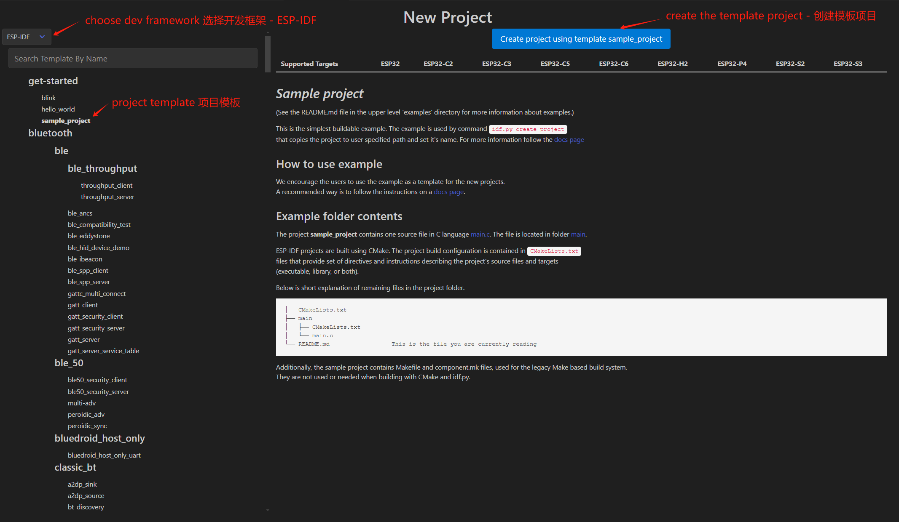
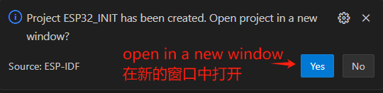
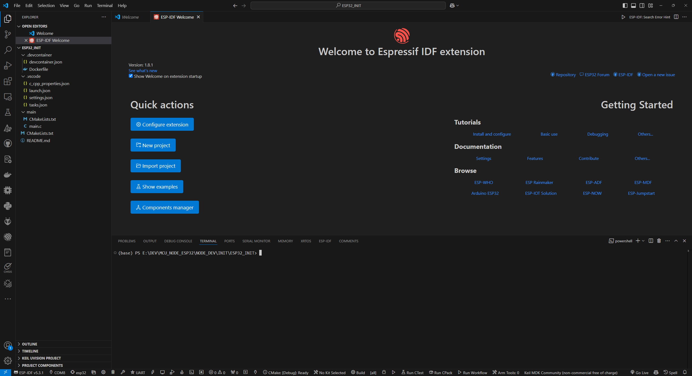
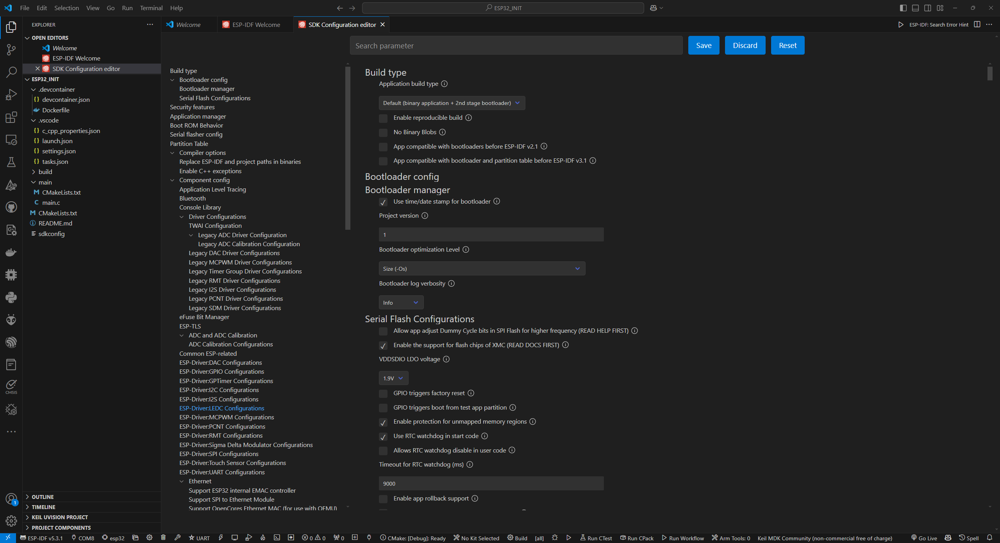
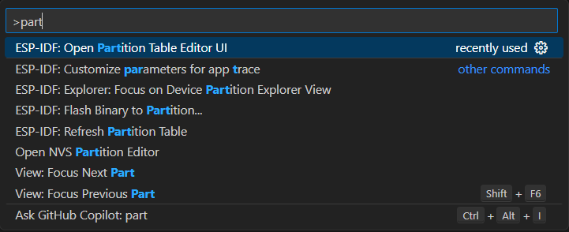
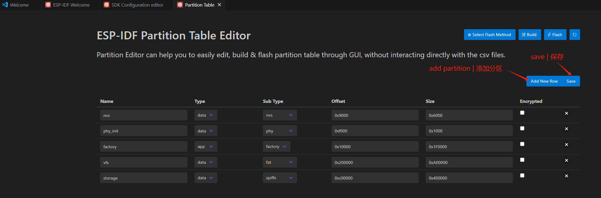

# PROJECT INITIALIZATION

## ENVIRONMENT SETUP

!!! info
    We use VSCode + ESP-IDF for development. Details to setup the development environment can be found on the internet. I assume you have already set up the development environment.

## CREATE A NEW PROJECT

1. Launch VSCode and then open the command palette by pressing `Ctrl+Shift+P` (Windows/Linux) or `Cmd+Shift+P` (macOS).
2. Type `ESP-IDF: New Project` and press `Enter`.
{ width=600px }
3. Enter the project configuration UI and fill in the required information.
{ width=800px }
4. Choose a template to create a new project.
{ width=800px }
5. Open in a new window.
{ width=400px }
{ width=800px }

## TEMPLATED PROJECT STRUCTURE
```bash
sample_proj/ # Project root directory
├── CMakeLists.txt # Project CMake configuration file
├── main/ # Main application directory
│   ├── CMakeLists.txt # Application CMake configuration file
│   └── main.c # Application source file
└── sdkconfig # Project configuration file
```

## PROJECT CONFIGURATION

!!! note
    This step is to configure the project settings to maximize the power of the hardware, i.e., use target-specific configurations rather than default configurations.
!!! warning
    Before you open the project configuration UI, make sure you have the project open in VSCode, **set the target to your board**, and have the ESP-IDF extension installed.

1. Enter the project configuration UI by pressing `Ctrl+Shift+P` (Windows/Linux) or `Cmd+Shift+P` (macOS) and type `ESP-IDF: Configure Project`. Alternatively, one can click the gear icon on the bottom menu of the VSCode window.
{ width=800px }
2. 'FLASH' configuration. In the search bar, type `flash` and press `Enter`. 
{ width=800px }
3. 'Partition Table' configuration. In the search bar, type `partition` and press `Enter`.
{ width=800px }
details to be provided later
4. 'PSRAM' configuration. In the search bar, type `psram` and press `Enter`.
{ width=800px }
5. Change the CPU frequency. In the search bar, type `cpu` and press `Enter`. Modify the CPU frequency to 240 MHz.
{ width=600px }
6. Modify the FreeRTOS tick clock frequency. In the search bar, type `tick` and press `Enter`. Modify the tick clock frequency to 1000 Hz.
{ width=600px }
7. Modify the partition table. In the command palette, type `ESP-IDF: Open Partition Table Editor UI`.
{ width=500px }
8. Modify the partition table as shown below.
{ width=800px }
9. Save the all the modifications.

By far, we have finished the project initialization. The configuration is now consistent with the hardware onboard resources. 

## TEMPLATE PROGRAM
Now, let's create a simple program to test the board. 

Go to the main.c file and replace the content with the following code:

```c
#include "freertos/FreeRTOS.h"
#include "freertos/task.h"
#include "nvs_flash.h"
#include "esp_system.h"
#include "esp_chip_info.h"
#include "esp_psram.h"
#include "esp_flash.h"

/**
 * @brief Entry point of the program
 * @param None
 * @retval None
 */
void app_main(void)
{
    esp_err_t ret;
    uint32_t flash_size;
    esp_chip_info_t chip_info;

    // Initialize NVS
    ret = nvs_flash_init();
    if (ret == ESP_ERR_NVS_NO_FREE_PAGES || ret == ESP_ERR_NVS_NEW_VERSION_FOUND)
    {
        ESP_ERROR_CHECK(nvs_flash_erase()); // Erase if needed
        ret = nvs_flash_init();
    }

    // Get FLASH size
    esp_flash_get_size(NULL, &flash_size);
    esp_chip_info(&chip_info);

    // Display CPU core count
    printf("CPU Cores: %d\n", chip_info.cores);

    // Display FLASH size
    printf("Flash size: %ld MB flash\n", flash_size / (1024 * 1024));

    // Display PSRAM size
    printf("PSRAM size: %d bytes\n", esp_psram_get_size());

    while (1)
    {
        printf("Hello-ESP32\r\n");
        vTaskDelay(1000);
    }
}
```

Then, ensure the serial port number is corrrect, the target board is selected, then click the "fire flame" icon to build, flash and monitor the program. Then, you should be able to see the printouts on the serial monitor. 

## CONCLUSIONS

!!! note
    This project sets up the minimal system development board DNESP32S3M, and this project can serve as a useful template for future development. Compared to STM32, many low level details are hidden from the user, therefore the set up process is much simpler.