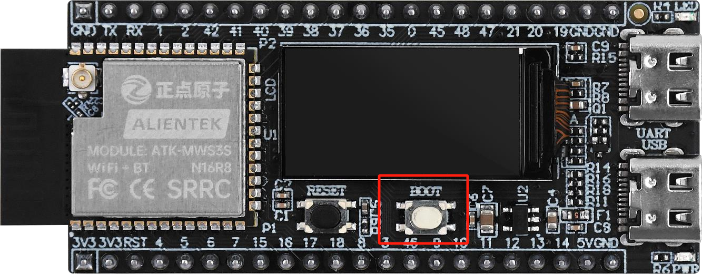

# KEY

## Introduction

!!! note
    In this section, we will talk about the onboard key on the DNESP32S3M development board.

Alientek DNESP32S3M development board has a key button (boot) for user input. Before reset, BOOT can be used to choose startup mode. After reset, BOOT can be used as normal key.

{ width=800px }

## Overview

In the project, we created a new directory named `KEY` under the `components` directory to store the key driver code, including the `key.h` and `key.c` files.

## Pin Configuration

According to the schematic, the onboard key is connected to GPIO0.

{ width=800px }

## Code

### KEY.h
    
```c
/**
 * @file key.h
 * @author SHUAIWEN CUI (SHUAIWEN001@e.ntu.edu.sg)
 * @brief This file is for the onboard key.
 * @version 1.0
 * @date 2024-11-17
 * 
 * @copyright Copyright (c) 2024
 * 
 */

#ifndef __KEY_H__
#define __KEY_H__

#include "freertos/FreeRTOS.h"
#include "freertos/task.h"
#include "driver/gpio.h"

/* Pin Definition */
#define BOOT_GPIO_PIN   GPIO_NUM_0

/* IO Operation */
#define BOOT            gpio_get_level(BOOT_GPIO_PIN)

/* Key Press Definition */
#define BOOT_PRES       1       /* BOOT key pressed */

/* Function declarations */
/**
 * @brief       Initialize the key
 * @param       None
 * @retval      None
 */
void key_init(void);            /* Initialize the key */

/**
 * @brief       Key scan function
 * @param       mode: 0 / 1, with the following meanings:
 *              0: Non-continuous press (returns key value only on the first press.
 *                 Must release and press again to return a value).
 *              1: Continuous press supported (returns key value each time the function is called while the key is pressed).
 * @retval      Key value, defined as follows:
 *              BOOT_PRES, 1, BOOT key pressed
 */
uint8_t key_scan(uint8_t mode); /* Key scan function */

#endif

```

### KEY.c

```c
/**
 * @file key.c
 * @author SHUAIWEN CUI (SHUAIWEN001@e.ntu.edu.sg)
 * @brief This file is for the onboard key.
 * @version 1.0
 * @date 2024-11-17
 * 
 * @copyright Copyright (c) 2024
 * 
 */

#include "key.h"

/**
 * @brief       Initialize the key
 * @param       None
 * @retval      None
 */
void key_init(void)
{
    gpio_config_t gpio_init_struct;

    gpio_init_struct.intr_type = GPIO_INTR_DISABLE;         /* Disable pin interrupt */
    gpio_init_struct.mode = GPIO_MODE_INPUT;                /* Input mode */
    gpio_init_struct.pull_up_en = GPIO_PULLUP_ENABLE;       /* Enable pull-up */
    gpio_init_struct.pull_down_en = GPIO_PULLDOWN_DISABLE;  /* Disable pull-down */
    gpio_init_struct.pin_bit_mask = 1ull << BOOT_GPIO_PIN;  /* BOOT key pin */
    gpio_config(&gpio_init_struct);                         /* Configure and enable */
}

/**
 * @brief       Key scan function
 * @param       mode: 0 / 1, with the following meanings:
 *              0: Non-continuous press (returns key value only on the first press.
 *                 Must release and press again to return a value).
 *              1: Continuous press supported (returns key value each time the function is called while the key is pressed).
 * @retval      Key value, defined as follows:
 *              BOOT_PRES, 1, BOOT key pressed
 */
uint8_t key_scan(uint8_t mode)
{
    uint8_t keyval = 0;
    static uint8_t key_boot = 1;    /* Key release flag */

    if(mode)
    {
        key_boot = 1;
    }

    if (key_boot && (BOOT == 0))    /* Key release flag is 1 and any key is pressed */
    {
        vTaskDelay(10);             /* Debounce */
        key_boot = 0;

        if (BOOT == 0)
        {
            keyval = BOOT_PRES;
        }
    }
    else if (BOOT == 1)
    {
        key_boot = 1;
    }

    return keyval;                  /* Return key value */
}

```

## Test Program

Replace the code in the `main.c` file with the following code:

```c
/**
 * @file main.c
 * @author SHUAIWEN CUI (SHUAIWEN001@e.ntu.edu.sg)
 * @brief 
 * @version 1.0
 * @date 2024-11-17
 * 
 * @copyright Copyright (c) 2024
 * 
 */

/* Dependencies */
// Basic
#include "esp_system.h"
#include "esp_chip_info.h"
#include "esp_psram.h"
#include "esp_flash.h"
#include "nvs_flash.h"
#include "esp_log.h"

// RTOS
#include "freertos/FreeRTOS.h"
#include "freertos/task.h"

// BSP
#include "led.h"
#include "key.h"

/**
 * @brief Entry point of the program
 * @param None
 * @retval None
 */
void app_main(void)
{
    esp_err_t ret;
    uint32_t flash_size;
    esp_chip_info_t chip_info;

    uint8_t key;

    // Initialize NVS
    ret = nvs_flash_init();
    if (ret == ESP_ERR_NVS_NO_FREE_PAGES || ret == ESP_ERR_NVS_NEW_VERSION_FOUND)
    {
        ESP_ERROR_CHECK(nvs_flash_erase()); // Erase if needed
        ret = nvs_flash_init();
    }

    // Get FLASH size
    esp_flash_get_size(NULL, &flash_size);
    esp_chip_info(&chip_info);

    // Display CPU core count
    printf("CPU Cores: %d\n", chip_info.cores);

    // Display FLASH size
    printf("Flash size: %ld MB flash\n", flash_size / (1024 * 1024));

    // Display PSRAM size
    printf("PSRAM size: %d bytes\n", esp_psram_get_size());

    // BSP
    led_init();
    key_init();

    while (1)
    {
        key = key_scan(0);

        switch(key)
        {
            case BOOT_PRES:
                led_toggle();
                break;
            default:
                break;
        }

        vTaskDelay(10);

    }

}

```

