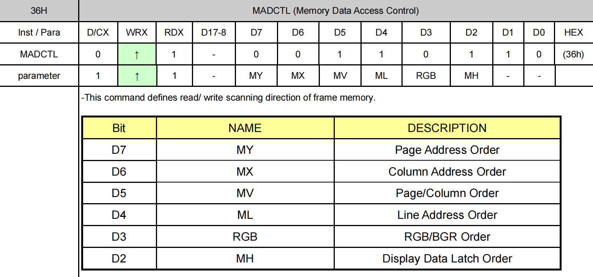

# 液晶显示屏

ESP32S3 最小系统板板载 0.96 英寸高清 IPS LCD 显示屏，其分辨率为 160x80，支持 16 位真彩色显示。该显示屏采用 ST7735S 作为驱动芯片，其内置 RAM 无需外部驱动器或存储器。ESP32S3 芯片仅需通过 SPI 接口即可轻松驱动此显示屏。0.96 寸 LCD 屏在四线 SPI 通讯模式下，仅需四根信号线（CS、SCL、SDA、RS（DC））就能够驱动。


该屏幕通过 13 个引脚与 PCB 电路连接。引脚详细描述，如下表所示。

| 序号 | 名称  | 说明                                   |
|------|-------|----------------------------------------|
| 1    | TP0   | NC                                     |
| 2    | TP1   | NC                                     |
| 3    | SDA   | SPI 通讯 MOSI 信号线                  |
| 4    | SCL   | SPI 通讯 SCK 信号线                   |
| 5    | RS    | 写命令/数据信号线（低电平：写命令；高电平：写数据） |
| 6    | RES   | 硬件复位引脚（低电平有效）            |
| 7    | CS    | SPI 通讯片选信号（低电平有效）        |
| 8    | GND   | 电源地                                 |
| 9    | NC    | NC                                     |
| 10   | VCC   | 3.3V 电源供电                          |
| 11   | LEDK  | LCD 背光控制引脚（阴极）              |
| 12   | LEDA  | LCD 背光控制引脚（阳极）              |
| 13   | GND   | 电源地                                 |


从上图中可以看出，0.96 寸 LCD 模块四线 SPI 的写周期是非常快的（TSCYCW = 66ns），而读周期就相对慢了很多（TSCYCR = 150ns）。

0.96 寸 LCD 屏采用 ST7735S 作为 LCD 驱动器，LCD 的显存可直接存放在 ST7735S 的片上RAM中，ST7735S的片上RAM有132*162*18-bits，并且ST7735S会在没有外部时钟的情况下，自动将其片上 RAM 的数据显示至 LCD 上，以最小化功耗。

在每次初始化显示模块之前，必须先通过 RST 引脚对显示模块进行硬件复位，硬件复位要求 RST 至少被拉低 10 微秒，拉高 RST 结束硬件复位后，须延时 120 毫秒等待复位完成后，才能够往显示模块传输数据。

LEDK 引脚用于控制显示模块的 LCD 背光，该引脚自带下拉电阻，当 LEDK 引脚被拉高或悬空时，0.96 寸 LCD 模块的 LCD 背光都处于关闭状态，当 LEDK 引脚被拉低时，显示模块的LCD 背光才会点亮。

ST7735S 最高支持 18 位色深（262K 色），不过一般使用 16 位颜色深度（65K 色），RGB565格式，这样可以在 16 位色深下达到最快的速度。在 16 位色深模式下，ST7789V 采用 RGB565格式传输、存储颜色数据，如下图所示。

上图是一个传输像素数据的时序过程，D/CX 线需要拉高，表示传输的是数据。一个像素的颜色数据需要使用 16比特来传输，这 16 比特数据中，高 5 比特用于表示红色，低 5 比特用于表示蓝色，中间的 6 比特用于表示绿色。数据的数值越大，对应表示的颜色就越深。

ST7735S支持连续读写RAM中存放的LCD上颜色对应的数据，并且连续读写的方向（LCD的扫描方向）是可以通过命令 0x36 进行配置的，如下图所示。



从上图中可以看出，命令 0x36 可以配置 6 个参数，但对于配置 LCD 的扫描方向，仅需关心 MY、MX 和 MV 这三个参数，如下表所示。

| MY | MX | MY | LCD 扫描方向（RAM 自增方向）        |
|----|----|----|------------------------------------|
| 0  | 0  | 0  | 从左到右，从上到下                |
| 1  | 0  | 0  | 从左到右，从下到上                |
| 0  | 1  | 0  | 从右到左，从上到下                |
| 1  | 1  | 0  | 从右到左，从下到上                |
| 0  | 0  | 1  | 从上到下，从左到右                |
| 1  | 0  | 1  | 从下到上，从左到右                |
| 0  | 1  | 1  | 从上到下，从右到左                |
| 1  | 1  | 1  | 从下到上，从右到左                |

这样，我们在使用 ST7735S 显示内容的时候，就有很大灵活性了，比如显示 BMP 图片，BMP解码数据，就是从图片的左下角开始，慢慢显示到右上角，如果设置LCD扫描方向为从左到右，从下到上，那么我们只需要设置一次坐标，然后就不停的往 LCD 填充颜色数据即可，这
样可以大大提高显示速度。

在往 ST7735S 写入颜色数据前，还需要设置地址，以确定随后写入的颜色数据对应 LCD 上的哪一个像素，通过命令 0x2A 和命令 0x2B 可以分别设置 ST7735S 显示颜色数据的列地址和行地址，命令 0x2A 的描述，如下图所示。


命令 0x2B 的描述，如下图所示。


以默认的 LCD 扫描方式（从左到右，从上到下）为例，命令 0x2A 的参数 XS 和 XE 和命令0x2B 的参数 YS 和 YE 就在 LCD 上确定了一个区域，在连读读写颜色数据时，ST7735S 就会按照从左到右，从上到下的扫描方式读写设个区域的颜色数据

## 代码

### lcdfont.h

```c
/**
 * @file lcdfont.h
 * @author SHUAIWEN CUI (SHUAIWEN001@e.ntu.edu.sg)
 * @brief lcd font
 * @version 1.0
 * @date 2024-11-18
 * @ref Alientek LCD Driver
 * @copyright Copyright (c) 2024
 * 
 */

#ifndef __LCDFONT_H__
#define __LCDFONT_H__

/* Common ASCII Table
 * Offset: 32
 * ASCII Character Set: !"#$%&'()*+,-./0123456789:;<=>?@ABCDEFGHIJKLMNOPQRSTUVWXYZ[\]^_`abcdefghijklmnopqrstuvwxyz{|}~
 * PC2LCD2002 Modulation Setting: Negative Code + Column-wise + Forward Direction + C51 Format
 * Total: 4 Character Sets (12x12, 16x16, 24x24, and 32x32). Users can add other resolutions as needed.
 * Bytes per Character: (size/8 + ((size%8) ? 1 : 0)) * (size/2), where size is the dot matrix size (e.g., 12/16/24/32...) defined when generating the font library.
 */


/* 12x12 ASCII Character Set Dot Matrix */
const unsigned char asc2_1206[95][12]={
{0x00,0x00,0x00,0x00,0x00,0x00,0x00,0x00,0x00,0x00,0x00,0x00},/*" ",0*/
{0x00,0x00,0x00,0x00,0x3F,0x40,0x00,0x00,0x00,0x00,0x00,0x00},/*"!",1*/
{0x00,0x00,0x30,0x00,0x40,0x00,0x30,0x00,0x40,0x00,0x00,0x00},/*""",2*/
{0x09,0x00,0x0B,0xC0,0x3D,0x00,0x0B,0xC0,0x3D,0x00,0x09,0x00},/*"#",3*/
{0x18,0xC0,0x24,0x40,0x7F,0xE0,0x22,0x40,0x31,0x80,0x00,0x00},/*"$",4*/
{0x18,0x00,0x24,0xC0,0x1B,0x00,0x0D,0x80,0x32,0x40,0x01,0x80},/*"%",5*/
{0x03,0x80,0x1C,0x40,0x27,0x40,0x1C,0x80,0x07,0x40,0x00,0x40},/*"&",6*/
{0x10,0x00,0x60,0x00,0x00,0x00,0x00,0x00,0x00,0x00,0x00,0x00},/*"'",7*/
{0x00,0x00,0x00,0x00,0x00,0x00,0x1F,0x80,0x20,0x40,0x40,0x20},/*"(",8*/
{0x00,0x00,0x40,0x20,0x20,0x40,0x1F,0x80,0x00,0x00,0x00,0x00},/*")",9*/
{0x09,0x00,0x06,0x00,0x1F,0x80,0x06,0x00,0x09,0x00,0x00,0x00},/*"*",10*/
{0x04,0x00,0x04,0x00,0x3F,0x80,0x04,0x00,0x04,0x00,0x00,0x00},/*"+",11*/
{0x00,0x10,0x00,0x60,0x00,0x00,0x00,0x00,0x00,0x00,0x00,0x00},/*",",12*/
{0x04,0x00,0x04,0x00,0x04,0x00,0x04,0x00,0x04,0x00,0x00,0x00},/*"-",13*/
{0x00,0x00,0x00,0x40,0x00,0x00,0x00,0x00,0x00,0x00,0x00,0x00},/*".",14*/
{0x00,0x20,0x01,0xC0,0x06,0x00,0x38,0x00,0x40,0x00,0x00,0x00},/*"/",15*/
{0x1F,0x80,0x20,0x40,0x20,0x40,0x20,0x40,0x1F,0x80,0x00,0x00},/*"0",16*/
{0x00,0x00,0x10,0x40,0x3F,0xC0,0x00,0x40,0x00,0x00,0x00,0x00},/*"1",17*/
{0x18,0xC0,0x21,0x40,0x22,0x40,0x24,0x40,0x18,0x40,0x00,0x00},/*"2",18*/
{0x10,0x80,0x20,0x40,0x24,0x40,0x24,0x40,0x1B,0x80,0x00,0x00},/*"3",19*/
{0x02,0x00,0x0D,0x00,0x11,0x00,0x3F,0xC0,0x01,0x40,0x00,0x00},/*"4",20*/
{0x3C,0x80,0x24,0x40,0x24,0x40,0x24,0x40,0x23,0x80,0x00,0x00},/*"5",21*/
{0x1F,0x80,0x24,0x40,0x24,0x40,0x34,0x40,0x03,0x80,0x00,0x00},/*"6",22*/
{0x30,0x00,0x20,0x00,0x27,0xC0,0x38,0x00,0x20,0x00,0x00,0x00},/*"7",23*/
{0x1B,0x80,0x24,0x40,0x24,0x40,0x24,0x40,0x1B,0x80,0x00,0x00},/*"8",24*/
{0x1C,0x00,0x22,0xC0,0x22,0x40,0x22,0x40,0x1F,0x80,0x00,0x00},/*"9",25*/
{0x00,0x00,0x00,0x00,0x08,0x40,0x00,0x00,0x00,0x00,0x00,0x00},/*":",26*/
{0x00,0x00,0x00,0x00,0x04,0x60,0x00,0x00,0x00,0x00,0x00,0x00},/*";",27*/
{0x00,0x00,0x04,0x00,0x0A,0x00,0x11,0x00,0x20,0x80,0x40,0x40},/*"<",28*/
{0x09,0x00,0x09,0x00,0x09,0x00,0x09,0x00,0x09,0x00,0x00,0x00},/*"=",29*/
{0x00,0x00,0x40,0x40,0x20,0x80,0x11,0x00,0x0A,0x00,0x04,0x00},/*">",30*/
{0x18,0x00,0x20,0x00,0x23,0x40,0x24,0x00,0x18,0x00,0x00,0x00},/*"?",31*/
{0x1F,0x80,0x20,0x40,0x27,0x40,0x29,0x40,0x1F,0x40,0x00,0x00},/*"@",32*/
{0x00,0x40,0x07,0xC0,0x39,0x00,0x0F,0x00,0x01,0xC0,0x00,0x40},/*"A",33*/
{0x20,0x40,0x3F,0xC0,0x24,0x40,0x24,0x40,0x1B,0x80,0x00,0x00},/*"B",34*/
{0x1F,0x80,0x20,0x40,0x20,0x40,0x20,0x40,0x30,0x80,0x00,0x00},/*"C",35*/
{0x20,0x40,0x3F,0xC0,0x20,0x40,0x20,0x40,0x1F,0x80,0x00,0x00},/*"D",36*/
{0x20,0x40,0x3F,0xC0,0x24,0x40,0x2E,0x40,0x30,0xC0,0x00,0x00},/*"E",37*/
{0x20,0x40,0x3F,0xC0,0x24,0x40,0x2E,0x00,0x30,0x00,0x00,0x00},/*"F",38*/
{0x0F,0x00,0x10,0x80,0x20,0x40,0x22,0x40,0x33,0x80,0x02,0x00},/*"G",39*/
{0x20,0x40,0x3F,0xC0,0x04,0x00,0x04,0x00,0x3F,0xC0,0x20,0x40},/*"H",40*/
{0x20,0x40,0x20,0x40,0x3F,0xC0,0x20,0x40,0x20,0x40,0x00,0x00},/*"I",41*/
{0x00,0x60,0x20,0x20,0x20,0x20,0x3F,0xC0,0x20,0x00,0x20,0x00},/*"J",42*/
{0x20,0x40,0x3F,0xC0,0x24,0x40,0x0B,0x00,0x30,0xC0,0x20,0x40},/*"K",43*/
{0x20,0x40,0x3F,0xC0,0x20,0x40,0x00,0x40,0x00,0x40,0x00,0xC0},/*"L",44*/
{0x3F,0xC0,0x3C,0x00,0x03,0xC0,0x3C,0x00,0x3F,0xC0,0x00,0x00},/*"M",45*/
{0x20,0x40,0x3F,0xC0,0x0C,0x40,0x23,0x00,0x3F,0xC0,0x20,0x00},/*"N",46*/
{0x1F,0x80,0x20,0x40,0x20,0x40,0x20,0x40,0x1F,0x80,0x00,0x00},/*"O",47*/
{0x20,0x40,0x3F,0xC0,0x24,0x40,0x24,0x00,0x18,0x00,0x00,0x00},/*"P",48*/
{0x1F,0x80,0x21,0x40,0x21,0x40,0x20,0xE0,0x1F,0xA0,0x00,0x00},/*"Q",49*/
{0x20,0x40,0x3F,0xC0,0x24,0x40,0x26,0x00,0x19,0xC0,0x00,0x40},/*"R",50*/
{0x18,0xC0,0x24,0x40,0x24,0x40,0x22,0x40,0x31,0x80,0x00,0x00},/*"S",51*/
{0x30,0x00,0x20,0x40,0x3F,0xC0,0x20,0x40,0x30,0x00,0x00,0x00},/*"T",52*/
{0x20,0x00,0x3F,0x80,0x00,0x40,0x00,0x40,0x3F,0x80,0x20,0x00},/*"U",53*/
{0x20,0x00,0x3E,0x00,0x01,0xC0,0x07,0x00,0x38,0x00,0x20,0x00},/*"V",54*/
{0x38,0x00,0x07,0xC0,0x3C,0x00,0x07,0xC0,0x38,0x00,0x00,0x00},/*"W",55*/
{0x20,0x40,0x39,0xC0,0x06,0x00,0x39,0xC0,0x20,0x40,0x00,0x00},/*"X",56*/
{0x20,0x00,0x38,0x40,0x07,0xC0,0x38,0x40,0x20,0x00,0x00,0x00},/*"Y",57*/
{0x30,0x40,0x21,0xC0,0x26,0x40,0x38,0x40,0x20,0xC0,0x00,0x00},/*"Z",58*/
{0x00,0x00,0x00,0x00,0x7F,0xE0,0x40,0x20,0x40,0x20,0x00,0x00},/*"[",59*/
{0x00,0x00,0x70,0x00,0x0C,0x00,0x03,0x80,0x00,0x40,0x00,0x00},/*"\",60*/
{0x00,0x00,0x40,0x20,0x40,0x20,0x7F,0xE0,0x00,0x00,0x00,0x00},/*"]",61*/
{0x00,0x00,0x20,0x00,0x40,0x00,0x20,0x00,0x00,0x00,0x00,0x00},/*"^",62*/
{0x00,0x10,0x00,0x10,0x00,0x10,0x00,0x10,0x00,0x10,0x00,0x10},/*"_",63*/
{0x00,0x00,0x00,0x00,0x40,0x00,0x00,0x00,0x00,0x00,0x00,0x00},/*"`",64*/
{0x00,0x00,0x02,0x80,0x05,0x40,0x05,0x40,0x03,0xC0,0x00,0x40},/*"a",65*/
{0x20,0x00,0x3F,0xC0,0x04,0x40,0x04,0x40,0x03,0x80,0x00,0x00},/*"b",66*/
{0x00,0x00,0x03,0x80,0x04,0x40,0x04,0x40,0x06,0x40,0x00,0x00},/*"c",67*/
{0x00,0x00,0x03,0x80,0x04,0x40,0x24,0x40,0x3F,0xC0,0x00,0x40},/*"d",68*/
{0x00,0x00,0x03,0x80,0x05,0x40,0x05,0x40,0x03,0x40,0x00,0x00},/*"e",69*/
{0x00,0x00,0x04,0x40,0x1F,0xC0,0x24,0x40,0x24,0x40,0x20,0x00},/*"f",70*/
{0x00,0x00,0x02,0xE0,0x05,0x50,0x05,0x50,0x06,0x50,0x04,0x20},/*"g",71*/
{0x20,0x40,0x3F,0xC0,0x04,0x40,0x04,0x00,0x03,0xC0,0x00,0x40},/*"h",72*/
{0x00,0x00,0x04,0x40,0x27,0xC0,0x00,0x40,0x00,0x00,0x00,0x00},/*"i",73*/
{0x00,0x10,0x00,0x10,0x04,0x10,0x27,0xE0,0x00,0x00,0x00,0x00},/*"j",74*/
{0x20,0x40,0x3F,0xC0,0x01,0x40,0x07,0x00,0x04,0xC0,0x04,0x40},/*"k",75*/
{0x20,0x40,0x20,0x40,0x3F,0xC0,0x00,0x40,0x00,0x40,0x00,0x00},/*"l",76*/
{0x07,0xC0,0x04,0x00,0x07,0xC0,0x04,0x00,0x03,0xC0,0x00,0x00},/*"m",77*/
{0x04,0x40,0x07,0xC0,0x04,0x40,0x04,0x00,0x03,0xC0,0x00,0x40},/*"n",78*/
{0x00,0x00,0x03,0x80,0x04,0x40,0x04,0x40,0x03,0x80,0x00,0x00},/*"o",79*/
{0x04,0x10,0x07,0xF0,0x04,0x50,0x04,0x40,0x03,0x80,0x00,0x00},/*"p",80*/
{0x00,0x00,0x03,0x80,0x04,0x40,0x04,0x50,0x07,0xF0,0x00,0x10},/*"q",81*/
{0x04,0x40,0x07,0xC0,0x02,0x40,0x04,0x00,0x04,0x00,0x00,0x00},/*"r",82*/
{0x00,0x00,0x06,0x40,0x05,0x40,0x05,0x40,0x04,0xC0,0x00,0x00},/*"s",83*/
{0x00,0x00,0x04,0x00,0x1F,0x80,0x04,0x40,0x00,0x40,0x00,0x00},/*"t",84*/
{0x04,0x00,0x07,0x80,0x00,0x40,0x04,0x40,0x07,0xC0,0x00,0x40},/*"u",85*/
{0x04,0x00,0x07,0x00,0x04,0xC0,0x01,0x80,0x06,0x00,0x04,0x00},/*"v",86*/
{0x06,0x00,0x01,0xC0,0x07,0x00,0x01,0xC0,0x06,0x00,0x00,0x00},/*"w",87*/
{0x04,0x40,0x06,0xC0,0x01,0x00,0x06,0xC0,0x04,0x40,0x00,0x00},/*"x",88*/
{0x04,0x10,0x07,0x10,0x04,0xE0,0x01,0x80,0x06,0x00,0x04,0x00},/*"y",89*/
{0x00,0x00,0x04,0x40,0x05,0xC0,0x06,0x40,0x04,0x40,0x00,0x00},/*"z",90*/
{0x00,0x00,0x00,0x00,0x04,0x00,0x7B,0xE0,0x40,0x20,0x00,0x00},/*"{",91*/
{0x00,0x00,0x00,0x00,0x00,0x00,0xFF,0xF0,0x00,0x00,0x00,0x00},/*"|",92*/
{0x00,0x00,0x40,0x20,0x7B,0xE0,0x04,0x00,0x00,0x00,0x00,0x00},/*"}",93*/
{0x40,0x00,0x80,0x00,0x40,0x00,0x20,0x00,0x20,0x00,0x40,0x00},/*"~",94*/
};

/* 16x16 ASCII Character Set Dot Matrix */
const unsigned char asc2_1608[95][16]={	
{0x00,0x00,0x00,0x00,0x00,0x00,0x00,0x00,0x00,0x00,0x00,0x00,0x00,0x00,0x00,0x00},/*" ",0*/
{0x00,0x00,0x00,0x10,0x10,0x10,0x10,0x10,0x10,0x10,0x00,0x00,0x10,0x10,0x00,0x00},/*"!",1*/
{0x00,0x12,0x24,0x24,0x48,0x00,0x00,0x00,0x00,0x00,0x00,0x00,0x00,0x00,0x00,0x00},/*""",2*/
{0x00,0x00,0x00,0x12,0x12,0x12,0x7E,0x24,0x24,0x24,0x7E,0x24,0x24,0x24,0x00,0x00},/*"#",3*/
{0x00,0x00,0x08,0x3C,0x4A,0x4A,0x48,0x38,0x0C,0x0A,0x0A,0x4A,0x4A,0x3C,0x08,0x08},/*"$",4*/
{0x00,0x00,0x00,0x44,0xA4,0xA8,0xA8,0xB0,0x54,0x1A,0x2A,0x2A,0x4A,0x44,0x00,0x00},/*"%",5*/
{0x00,0x00,0x00,0x30,0x48,0x48,0x48,0x50,0x6E,0xA4,0x94,0x98,0x89,0x76,0x00,0x00},/*"&",6*/
{0x00,0x60,0x20,0x20,0x40,0x00,0x00,0x00,0x00,0x00,0x00,0x00,0x00,0x00,0x00,0x00},/*"'",7*/
{0x00,0x02,0x04,0x08,0x08,0x10,0x10,0x10,0x10,0x10,0x10,0x08,0x08,0x04,0x02,0x00},/*"(",8*/
{0x00,0x40,0x20,0x10,0x10,0x08,0x08,0x08,0x08,0x08,0x08,0x10,0x10,0x20,0x40,0x00},/*")",9*/
{0x00,0x00,0x00,0x00,0x10,0x10,0xD6,0x38,0x38,0xD6,0x10,0x10,0x00,0x00,0x00,0x00},/*"*",10*/
{0x00,0x00,0x00,0x00,0x00,0x08,0x08,0x08,0x7F,0x08,0x08,0x08,0x00,0x00,0x00,0x00},/*"+",11*/
{0x00,0x00,0x00,0x00,0x00,0x00,0x00,0x00,0x00,0x00,0x00,0x00,0x60,0x20,0x20,0x40},/*",",12*/
{0x00,0x00,0x00,0x00,0x00,0x00,0x00,0x00,0x7E,0x00,0x00,0x00,0x00,0x00,0x00,0x00},/*"-",13*/
{0x00,0x00,0x00,0x00,0x00,0x00,0x00,0x00,0x00,0x00,0x00,0x00,0x60,0x60,0x00,0x00},/*".",14*/
{0x00,0x00,0x02,0x04,0x04,0x04,0x08,0x08,0x10,0x10,0x10,0x20,0x20,0x40,0x40,0x00},/*"/",15*/
{0x00,0x00,0x00,0x18,0x24,0x42,0x42,0x42,0x42,0x42,0x42,0x42,0x24,0x18,0x00,0x00},/*"0",16*/
{0x00,0x00,0x00,0x08,0x38,0x08,0x08,0x08,0x08,0x08,0x08,0x08,0x08,0x3E,0x00,0x00},/*"1",17*/
{0x00,0x00,0x00,0x3C,0x42,0x42,0x42,0x02,0x04,0x08,0x10,0x20,0x42,0x7E,0x00,0x00},/*"2",18*/
{0x00,0x00,0x00,0x3C,0x42,0x42,0x02,0x04,0x18,0x04,0x02,0x42,0x42,0x3C,0x00,0x00},/*"3",19*/
{0x00,0x00,0x00,0x04,0x0C,0x0C,0x14,0x24,0x24,0x44,0x7F,0x04,0x04,0x1F,0x00,0x00},/*"4",20*/
{0x00,0x00,0x00,0x7E,0x40,0x40,0x40,0x78,0x44,0x02,0x02,0x42,0x44,0x38,0x00,0x00},/*"5",21*/
{0x00,0x00,0x00,0x18,0x24,0x40,0x40,0x5C,0x62,0x42,0x42,0x42,0x22,0x1C,0x00,0x00},/*"6",22*/
{0x00,0x00,0x00,0x7E,0x42,0x04,0x04,0x08,0x08,0x10,0x10,0x10,0x10,0x10,0x00,0x00},/*"7",23*/
{0x00,0x00,0x00,0x3C,0x42,0x42,0x42,0x24,0x18,0x24,0x42,0x42,0x42,0x3C,0x00,0x00},/*"8",24*/
{0x00,0x00,0x00,0x38,0x44,0x42,0x42,0x42,0x46,0x3A,0x02,0x02,0x24,0x18,0x00,0x00},/*"9",25*/
{0x00,0x00,0x00,0x00,0x00,0x00,0x18,0x18,0x00,0x00,0x00,0x00,0x18,0x18,0x00,0x00},/*":",26*/
{0x00,0x00,0x00,0x00,0x00,0x00,0x00,0x10,0x00,0x00,0x00,0x00,0x00,0x10,0x10,0x10},/*";",27*/
{0x00,0x00,0x00,0x02,0x04,0x08,0x10,0x20,0x40,0x20,0x10,0x08,0x04,0x02,0x00,0x00},/*"<",28*/
{0x00,0x00,0x00,0x00,0x00,0x00,0x7E,0x00,0x00,0x7E,0x00,0x00,0x00,0x00,0x00,0x00},/*"=",29*/
{0x00,0x00,0x00,0x40,0x20,0x10,0x08,0x04,0x02,0x04,0x08,0x10,0x20,0x40,0x00,0x00},/*">",30*/
{0x00,0x00,0x00,0x3C,0x42,0x42,0x62,0x04,0x08,0x08,0x08,0x00,0x18,0x18,0x00,0x00},/*"?",31*/
{0x00,0x00,0x00,0x38,0x44,0x5A,0xAA,0xAA,0xAA,0xAA,0xAA,0x5C,0x42,0x3C,0x00,0x00},/*"@",32*/
{0x00,0x00,0x00,0x10,0x10,0x18,0x28,0x28,0x24,0x3C,0x44,0x42,0x42,0xE7,0x00,0x00},/*"A",33*/
{0x00,0x00,0x00,0xF8,0x44,0x44,0x44,0x78,0x44,0x42,0x42,0x42,0x44,0xF8,0x00,0x00},/*"B",34*/
{0x00,0x00,0x00,0x3E,0x42,0x42,0x80,0x80,0x80,0x80,0x80,0x42,0x44,0x38,0x00,0x00},/*"C",35*/
{0x00,0x00,0x00,0xF8,0x44,0x42,0x42,0x42,0x42,0x42,0x42,0x42,0x44,0xF8,0x00,0x00},/*"D",36*/
{0x00,0x00,0x00,0xFC,0x42,0x48,0x48,0x78,0x48,0x48,0x40,0x42,0x42,0xFC,0x00,0x00},/*"E",37*/
{0x00,0x00,0x00,0xFC,0x42,0x48,0x48,0x78,0x48,0x48,0x40,0x40,0x40,0xE0,0x00,0x00},/*"F",38*/
{0x00,0x00,0x00,0x3C,0x44,0x44,0x80,0x80,0x80,0x8E,0x84,0x44,0x44,0x38,0x00,0x00},/*"G",39*/
{0x00,0x00,0x00,0xE7,0x42,0x42,0x42,0x42,0x7E,0x42,0x42,0x42,0x42,0xE7,0x00,0x00},/*"H",40*/
{0x00,0x00,0x00,0x7C,0x10,0x10,0x10,0x10,0x10,0x10,0x10,0x10,0x10,0x7C,0x00,0x00},/*"I",41*/
{0x00,0x00,0x00,0x3E,0x08,0x08,0x08,0x08,0x08,0x08,0x08,0x08,0x08,0x08,0x88,0xF0},/*"J",42*/
{0x00,0x00,0x00,0xEE,0x44,0x48,0x50,0x70,0x50,0x48,0x48,0x44,0x44,0xEE,0x00,0x00},/*"K",43*/
{0x00,0x00,0x00,0xE0,0x40,0x40,0x40,0x40,0x40,0x40,0x40,0x40,0x42,0xFE,0x00,0x00},/*"L",44*/
{0x00,0x00,0x00,0xEE,0x6C,0x6C,0x6C,0x6C,0x6C,0x54,0x54,0x54,0x54,0xD6,0x00,0x00},/*"M",45*/
{0x00,0x00,0x00,0xC7,0x62,0x62,0x52,0x52,0x4A,0x4A,0x4A,0x46,0x46,0xE2,0x00,0x00},/*"N",46*/
{0x00,0x00,0x00,0x38,0x44,0x82,0x82,0x82,0x82,0x82,0x82,0x82,0x44,0x38,0x00,0x00},/*"O",47*/
{0x00,0x00,0x00,0xFC,0x42,0x42,0x42,0x42,0x7C,0x40,0x40,0x40,0x40,0xE0,0x00,0x00},/*"P",48*/
{0x00,0x00,0x00,0x38,0x44,0x82,0x82,0x82,0x82,0x82,0x82,0xB2,0x4C,0x38,0x06,0x00},/*"Q",49*/
{0x00,0x00,0x00,0xFC,0x42,0x42,0x42,0x7C,0x48,0x48,0x44,0x44,0x42,0xE3,0x00,0x00},/*"R",50*/
{0x00,0x00,0x00,0x3E,0x42,0x42,0x40,0x20,0x18,0x04,0x02,0x42,0x42,0x7C,0x00,0x00},/*"S",51*/
{0x00,0x00,0x00,0xFE,0x92,0x10,0x10,0x10,0x10,0x10,0x10,0x10,0x10,0x38,0x00,0x00},/*"T",52*/
{0x00,0x00,0x00,0xE7,0x42,0x42,0x42,0x42,0x42,0x42,0x42,0x42,0x42,0x3C,0x00,0x00},/*"U",53*/
{0x00,0x00,0x00,0xE7,0x42,0x42,0x44,0x24,0x24,0x28,0x28,0x18,0x10,0x10,0x00,0x00},/*"V",54*/
{0x00,0x00,0x00,0xD6,0x54,0x54,0x54,0x54,0x54,0x6C,0x28,0x28,0x28,0x28,0x00,0x00},/*"W",55*/
{0x00,0x00,0x00,0xE7,0x42,0x24,0x24,0x18,0x18,0x18,0x24,0x24,0x42,0xE7,0x00,0x00},/*"X",56*/
{0x00,0x00,0x00,0xEE,0x44,0x44,0x28,0x28,0x10,0x10,0x10,0x10,0x10,0x38,0x00,0x00},/*"Y",57*/
{0x00,0x00,0x00,0x7E,0x84,0x04,0x08,0x08,0x10,0x20,0x20,0x42,0x42,0xFC,0x00,0x00},/*"Z",58*/
{0x00,0x1E,0x10,0x10,0x10,0x10,0x10,0x10,0x10,0x10,0x10,0x10,0x10,0x10,0x1E,0x00},/*"[",59*/
{0x00,0x00,0x40,0x20,0x20,0x20,0x10,0x10,0x10,0x08,0x08,0x04,0x04,0x04,0x02,0x02},/*"\",60*/
{0x00,0x78,0x08,0x08,0x08,0x08,0x08,0x08,0x08,0x08,0x08,0x08,0x08,0x08,0x78,0x00},/*"]",61*/
{0x00,0x18,0x24,0x00,0x00,0x00,0x00,0x00,0x00,0x00,0x00,0x00,0x00,0x00,0x00,0x00},/*"^",62*/
{0x00,0x00,0x00,0x00,0x00,0x00,0x00,0x00,0x00,0x00,0x00,0x00,0x00,0x00,0x00,0xFF},/*"_",63*/
{0x00,0x60,0x10,0x00,0x00,0x00,0x00,0x00,0x00,0x00,0x00,0x00,0x00,0x00,0x00,0x00},/*"`",64*/
{0x00,0x00,0x00,0x00,0x00,0x00,0x00,0x38,0x44,0x0C,0x34,0x44,0x4C,0x36,0x00,0x00},/*"a",65*/
{0x00,0x00,0x00,0x00,0xC0,0x40,0x40,0x58,0x64,0x42,0x42,0x42,0x64,0x58,0x00,0x00},/*"b",66*/
{0x00,0x00,0x00,0x00,0x00,0x00,0x00,0x1C,0x22,0x40,0x40,0x40,0x22,0x1C,0x00,0x00},/*"c",67*/
{0x00,0x00,0x00,0x00,0x06,0x02,0x02,0x3E,0x42,0x42,0x42,0x42,0x46,0x3B,0x00,0x00},/*"d",68*/
{0x00,0x00,0x00,0x00,0x00,0x00,0x00,0x3C,0x42,0x42,0x7E,0x40,0x42,0x3C,0x00,0x00},/*"e",69*/
{0x00,0x00,0x00,0x00,0x0C,0x12,0x10,0x7C,0x10,0x10,0x10,0x10,0x10,0x7C,0x00,0x00},/*"f",70*/
{0x00,0x00,0x00,0x00,0x00,0x00,0x00,0x3E,0x44,0x44,0x38,0x40,0x3C,0x42,0x42,0x3C},/*"g",71*/
{0x00,0x00,0x00,0x00,0xC0,0x40,0x40,0x5C,0x62,0x42,0x42,0x42,0x42,0xE7,0x00,0x00},/*"h",72*/
{0x00,0x00,0x00,0x30,0x30,0x00,0x00,0x70,0x10,0x10,0x10,0x10,0x10,0x7C,0x00,0x00},/*"i",73*/
{0x00,0x00,0x00,0x0C,0x0C,0x00,0x00,0x1C,0x04,0x04,0x04,0x04,0x04,0x04,0x44,0x78},/*"j",74*/
{0x00,0x00,0x00,0x00,0xC0,0x40,0x40,0x4E,0x48,0x50,0x70,0x48,0x44,0xEE,0x00,0x00},/*"k",75*/
{0x00,0x00,0x00,0x10,0x70,0x10,0x10,0x10,0x10,0x10,0x10,0x10,0x10,0x7C,0x00,0x00},/*"l",76*/
{0x00,0x00,0x00,0x00,0x00,0x00,0x00,0xFE,0x49,0x49,0x49,0x49,0x49,0xED,0x00,0x00},/*"m",77*/
{0x00,0x00,0x00,0x00,0x00,0x00,0x00,0xDC,0x62,0x42,0x42,0x42,0x42,0xE7,0x00,0x00},/*"n",78*/
{0x00,0x00,0x00,0x00,0x00,0x00,0x00,0x3C,0x42,0x42,0x42,0x42,0x42,0x3C,0x00,0x00},/*"o",79*/
{0x00,0x00,0x00,0x00,0x00,0x00,0x00,0xD8,0x64,0x42,0x42,0x42,0x64,0x58,0x40,0xE0},/*"p",80*/
{0x00,0x00,0x00,0x00,0x00,0x00,0x00,0x1A,0x26,0x42,0x42,0x42,0x26,0x1A,0x02,0x07},/*"q",81*/
{0x00,0x00,0x00,0x00,0x00,0x00,0x00,0xEE,0x32,0x20,0x20,0x20,0x20,0xF8,0x00,0x00},/*"r",82*/
{0x00,0x00,0x00,0x00,0x00,0x00,0x00,0x3E,0x42,0x40,0x3C,0x02,0x42,0x7C,0x00,0x00},/*"s",83*/
{0x00,0x00,0x00,0x00,0x00,0x10,0x10,0x7C,0x10,0x10,0x10,0x10,0x12,0x0C,0x00,0x00},/*"t",84*/
{0x00,0x00,0x00,0x00,0x00,0x00,0x00,0xC6,0x42,0x42,0x42,0x42,0x46,0x3B,0x00,0x00},/*"u",85*/
{0x00,0x00,0x00,0x00,0x00,0x00,0x00,0xEE,0x44,0x44,0x28,0x28,0x10,0x10,0x00,0x00},/*"v",86*/
{0x00,0x00,0x00,0x00,0x00,0x00,0x00,0xDB,0x89,0x4A,0x5A,0x54,0x24,0x24,0x00,0x00},/*"w",87*/
{0x00,0x00,0x00,0x00,0x00,0x00,0x00,0x76,0x24,0x18,0x18,0x18,0x24,0x6E,0x00,0x00},/*"x",88*/
{0x00,0x00,0x00,0x00,0x00,0x00,0x00,0xE7,0x42,0x24,0x24,0x18,0x18,0x10,0x10,0x60},/*"y",89*/
{0x00,0x00,0x00,0x00,0x00,0x00,0x00,0x7E,0x44,0x08,0x10,0x10,0x22,0x7E,0x00,0x00},/*"z",90*/
{0x00,0x03,0x04,0x04,0x04,0x04,0x04,0x04,0x08,0x04,0x04,0x04,0x04,0x04,0x03,0x00},/*"{",91*/
{0x08,0x08,0x08,0x08,0x08,0x08,0x08,0x08,0x08,0x08,0x08,0x08,0x08,0x08,0x08,0x08},/*"|",92*/
{0x00,0xC0,0x20,0x20,0x20,0x20,0x20,0x20,0x10,0x20,0x20,0x20,0x20,0x20,0xC0,0x00},/*"}",93*/
{0x20,0x5A,0x04,0x00,0x00,0x00,0x00,0x00,0x00,0x00,0x00,0x00,0x00,0x00,0x00,0x00},/*"~",94*/
};  

/* 24x24 ASCII Character Set Dot Matrix */
const unsigned char asc2_2412[95][48]={
{0x00,0x00,0x00,0x00,0x00,0x00,0x00,0x00,0x00,0x00,0x00,0x00,0x00,0x00,0x00,0x00,0x00,0x00,0x00,0x00,0x00,0x00,0x00,0x00,0x00,0x00,0x00,0x00,0x00,0x00,0x00,0x00,0x00,0x00,0x00,0x00,0x00,0x00,0x00,0x00,0x00,0x00,0x00,0x00,0x00,0x00,0x00,0x00},/*" ",0*/
{0x00,0x00,0x00,0x00,0x00,0x00,0x00,0x00,0x06,0x00,0x06,0x00,0x06,0x00,0x06,0x00,0x06,0x00,0x06,0x00,0x06,0x00,0x02,0x00,0x04,0x00,0x04,0x00,0x04,0x00,0x00,0x00,0x00,0x00,0x00,0x00,0x06,0x00,0x06,0x00,0x06,0x00,0x00,0x00,0x00,0x00,0x00,0x00},/*"!",1*/
{0x00,0x00,0x00,0x00,0x06,0x60,0x06,0x60,0x0C,0xC0,0x19,0x80,0x11,0x00,0x22,0x00,0x00,0x00,0x00,0x00,0x00,0x00,0x00,0x00,0x00,0x00,0x00,0x00,0x00,0x00,0x00,0x00,0x00,0x00,0x00,0x00,0x00,0x00,0x00,0x00,0x00,0x00,0x00,0x00,0x00,0x00,0x00,0x00},/*""",2*/
{0x00,0x00,0x00,0x00,0x00,0x00,0x00,0x00,0x08,0x40,0x08,0x40,0x08,0x40,0x08,0x40,0x7F,0xE0,0x7F,0xE0,0x10,0x40,0x10,0x80,0x10,0x80,0x10,0x80,0x10,0x80,0x7F,0xE0,0x7F,0xE0,0x20,0x80,0x20,0x80,0x20,0x80,0x20,0x80,0x00,0x00,0x00,0x00,0x00,0x00},/*"#",3*/
{0x00,0x00,0x00,0x00,0x00,0x00,0x02,0x00,0x02,0x00,0x0F,0x80,0x1A,0xC0,0x32,0xC0,0x33,0xC0,0x32,0x00,0x1A,0x00,0x0E,0x00,0x07,0x00,0x03,0x80,0x03,0x80,0x02,0xC0,0x32,0xC0,0x3A,0xC0,0x32,0xC0,0x12,0x80,0x0F,0x00,0x02,0x00,0x02,0x00,0x00,0x00},/*"$",4*/
{0x00,0x00,0x00,0x00,0x00,0x00,0x00,0x00,0x70,0x80,0x50,0x80,0x89,0x00,0x89,0x00,0x89,0x00,0x8A,0x00,0x8A,0x00,0x5C,0x00,0x75,0xC0,0x05,0x40,0x0A,0x20,0x0A,0x20,0x12,0x20,0x12,0x20,0x12,0x20,0x21,0x40,0x21,0xC0,0x00,0x00,0x00,0x00,0x00,0x00},/*"%",5*/
{0x00,0x00,0x00,0x00,0x00,0x00,0x00,0x00,0x1C,0x00,0x36,0x00,0x36,0x00,0x36,0x00,0x36,0x00,0x36,0x00,0x34,0x00,0x19,0xE0,0x38,0x80,0x58,0x80,0xCC,0x80,0xCC,0x80,0xC6,0x80,0xC7,0x00,0xC3,0x10,0x63,0x90,0x3C,0xE0,0x00,0x00,0x00,0x00,0x00,0x00},/*"&",6*/
{0x00,0x00,0x00,0x00,0x30,0x00,0x38,0x00,0x08,0x00,0x08,0x00,0x10,0x00,0x20,0x00,0x00,0x00,0x00,0x00,0x00,0x00,0x00,0x00,0x00,0x00,0x00,0x00,0x00,0x00,0x00,0x00,0x00,0x00,0x00,0x00,0x00,0x00,0x00,0x00,0x00,0x00,0x00,0x00,0x00,0x00,0x00,0x00},/*"'",7*/
{0x00,0x00,0x00,0x00,0x00,0x20,0x00,0x40,0x00,0x80,0x01,0x00,0x01,0x00,0x02,0x00,0x02,0x00,0x04,0x00,0x04,0x00,0x04,0x00,0x04,0x00,0x04,0x00,0x04,0x00,0x04,0x00,0x02,0x00,0x02,0x00,0x01,0x00,0x01,0x00,0x00,0x80,0x00,0x40,0x00,0x20,0x00,0x00},/*"(",8*/
{0x00,0x00,0x00,0x00,0x40,0x00,0x20,0x00,0x10,0x00,0x08,0x00,0x08,0x00,0x04,0x00,0x04,0x00,0x02,0x00,0x02,0x00,0x02,0x00,0x02,0x00,0x02,0x00,0x02,0x00,0x02,0x00,0x04,0x00,0x04,0x00,0x08,0x00,0x08,0x00,0x10,0x00,0x20,0x00,0x40,0x00,0x00,0x00},/*")",9*/
{0x00,0x00,0x00,0x00,0x00,0x00,0x00,0x00,0x00,0x00,0x00,0x00,0x02,0x00,0x03,0x00,0x02,0x00,0x62,0x30,0x72,0xF0,0x0B,0x80,0x0F,0x80,0x7A,0xF0,0x62,0x30,0x02,0x00,0x02,0x00,0x02,0x00,0x00,0x00,0x00,0x00,0x00,0x00,0x00,0x00,0x00,0x00,0x00,0x00},/*"*",10*/
{0x00,0x00,0x00,0x00,0x00,0x00,0x00,0x00,0x00,0x00,0x00,0x00,0x00,0x00,0x02,0x00,0x02,0x00,0x02,0x00,0x02,0x00,0x02,0x00,0x7F,0xF0,0x02,0x00,0x02,0x00,0x02,0x00,0x02,0x00,0x02,0x00,0x00,0x00,0x00,0x00,0x00,0x00,0x00,0x00,0x00,0x00,0x00,0x00},/*"+",11*/
{0x00,0x00,0x00,0x00,0x00,0x00,0x00,0x00,0x00,0x00,0x00,0x00,0x00,0x00,0x00,0x00,0x00,0x00,0x00,0x00,0x00,0x00,0x00,0x00,0x00,0x00,0x00,0x00,0x00,0x00,0x00,0x00,0x00,0x00,0x00,0x00,0x30,0x00,0x38,0x00,0x08,0x00,0x08,0x00,0x10,0x00,0x20,0x00},/*",",12*/
{0x00,0x00,0x00,0x00,0x00,0x00,0x00,0x00,0x00,0x00,0x00,0x00,0x00,0x00,0x00,0x00,0x00,0x00,0x00,0x00,0x00,0x00,0x00,0x00,0x7F,0xE0,0x00,0x00,0x00,0x00,0x00,0x00,0x00,0x00,0x00,0x00,0x00,0x00,0x00,0x00,0x00,0x00,0x00,0x00,0x00,0x00,0x00,0x00},/*"-",13*/
{0x00,0x00,0x00,0x00,0x00,0x00,0x00,0x00,0x00,0x00,0x00,0x00,0x00,0x00,0x00,0x00,0x00,0x00,0x00,0x00,0x00,0x00,0x00,0x00,0x00,0x00,0x00,0x00,0x00,0x00,0x00,0x00,0x00,0x00,0x00,0x00,0x38,0x00,0x38,0x00,0x38,0x00,0x00,0x00,0x00,0x00,0x00,0x00},/*".",14*/
{0x00,0x00,0x00,0x00,0x00,0x20,0x00,0x60,0x00,0x40,0x00,0xC0,0x00,0x80,0x00,0x80,0x01,0x00,0x01,0x00,0x02,0x00,0x02,0x00,0x06,0x00,0x04,0x00,0x04,0x00,0x08,0x00,0x08,0x00,0x10,0x00,0x10,0x00,0x30,0x00,0x20,0x00,0x60,0x00,0x40,0x00,0x00,0x00},/*"/",15*/
{0x00,0x00,0x00,0x00,0x00,0x00,0x00,0x00,0x00,0x00,0x0F,0x00,0x19,0x80,0x30,0xC0,0x30,0xC0,0x60,0x60,0x60,0x60,0x60,0x60,0x60,0x60,0x60,0x60,0x60,0x60,0x60,0x60,0x60,0x60,0x30,0xC0,0x30,0xC0,0x19,0x80,0x0F,0x00,0x00,0x00,0x00,0x00,0x00,0x00},/*"0",16*/
{0x00,0x00,0x00,0x00,0x00,0x00,0x00,0x00,0x00,0x00,0x02,0x00,0x3E,0x00,0x06,0x00,0x06,0x00,0x06,0x00,0x06,0x00,0x06,0x00,0x06,0x00,0x06,0x00,0x06,0x00,0x06,0x00,0x06,0x00,0x06,0x00,0x06,0x00,0x06,0x00,0x3F,0xC0,0x00,0x00,0x00,0x00,0x00,0x00},/*"1",17*/
{0x00,0x00,0x00,0x00,0x00,0x00,0x00,0x00,0x00,0x00,0x1F,0x00,0x21,0x80,0x40,0xC0,0x60,0xC0,0x60,0xC0,0x00,0xC0,0x00,0x80,0x01,0x80,0x03,0x00,0x06,0x00,0x04,0x00,0x08,0x00,0x10,0x40,0x20,0x40,0x60,0x40,0x7F,0xC0,0x00,0x00,0x00,0x00,0x00,0x00},/*"2",18*/
{0x00,0x00,0x00,0x00,0x00,0x00,0x00,0x00,0x00,0x00,0x1E,0x00,0x63,0x00,0x61,0x80,0x61,0x80,0x01,0x80,0x01,0x80,0x03,0x00,0x0E,0x00,0x01,0x80,0x00,0x80,0x00,0xC0,0x00,0xC0,0x60,0xC0,0x60,0xC0,0x61,0x80,0x1F,0x00,0x00,0x00,0x00,0x00,0x00,0x00},/*"3",19*/
{0x00,0x00,0x00,0x00,0x00,0x00,0x00,0x00,0x00,0x00,0x01,0x80,0x01,0x80,0x03,0x80,0x05,0x80,0x05,0x80,0x09,0x80,0x11,0x80,0x11,0x80,0x21,0x80,0x41,0x80,0x7F,0xF0,0x01,0x80,0x01,0x80,0x01,0x80,0x01,0x80,0x07,0xE0,0x00,0x00,0x00,0x00,0x00,0x00},/*"4",20*/
{0x00,0x00,0x00,0x00,0x00,0x00,0x00,0x00,0x00,0x00,0x3F,0xC0,0x20,0x00,0x20,0x00,0x20,0x00,0x20,0x00,0x20,0x00,0x2F,0x00,0x31,0x80,0x20,0xC0,0x00,0xC0,0x00,0xC0,0x60,0xC0,0x60,0xC0,0x41,0x80,0x21,0x80,0x1F,0x00,0x00,0x00,0x00,0x00,0x00,0x00},/*"5",21*/
{0x00,0x00,0x00,0x00,0x00,0x00,0x00,0x00,0x00,0x00,0x07,0x80,0x18,0xC0,0x30,0xC0,0x30,0x00,0x20,0x00,0x60,0x00,0x67,0x80,0x68,0xC0,0x70,0x60,0x60,0x60,0x60,0x60,0x60,0x60,0x20,0x60,0x30,0x40,0x18,0xC0,0x0F,0x00,0x00,0x00,0x00,0x00,0x00,0x00},/*"6",22*/
{0x00,0x00,0x00,0x00,0x00,0x00,0x00,0x00,0x00,0x00,0x1F,0xE0,0x30,0x60,0x20,0x40,0x20,0x80,0x00,0x80,0x00,0x80,0x01,0x00,0x01,0x00,0x02,0x00,0x02,0x00,0x02,0x00,0x06,0x00,0x06,0x00,0x06,0x00,0x06,0x00,0x06,0x00,0x00,0x00,0x00,0x00,0x00,0x00},/*"7",23*/
{0x00,0x00,0x00,0x00,0x00,0x00,0x00,0x00,0x00,0x00,0x1F,0x80,0x30,0xC0,0x60,0x60,0x60,0x60,0x60,0x60,0x30,0x40,0x38,0xC0,0x0F,0x00,0x13,0x80,0x30,0xC0,0x60,0x60,0x60,0x60,0x60,0x60,0x60,0x60,0x30,0xC0,0x0F,0x80,0x00,0x00,0x00,0x00,0x00,0x00},/*"8",24*/
{0x00,0x00,0x00,0x00,0x00,0x00,0x00,0x00,0x00,0x00,0x0F,0x00,0x30,0x80,0x30,0xC0,0x60,0x40,0x60,0x60,0x60,0x60,0x60,0x60,0x60,0xE0,0x31,0x60,0x1E,0x60,0x00,0x60,0x00,0xC0,0x00,0xC0,0x30,0x80,0x31,0x80,0x1E,0x00,0x00,0x00,0x00,0x00,0x00,0x00},/*"9",25*/
{0x00,0x00,0x00,0x00,0x00,0x00,0x00,0x00,0x00,0x00,0x00,0x00,0x00,0x00,0x00,0x00,0x00,0x00,0x00,0x00,0x07,0x00,0x07,0x00,0x07,0x00,0x00,0x00,0x00,0x00,0x00,0x00,0x00,0x00,0x00,0x00,0x07,0x00,0x07,0x00,0x07,0x00,0x00,0x00,0x00,0x00,0x00,0x00},/*":",26*/
{0x00,0x00,0x00,0x00,0x00,0x00,0x00,0x00,0x00,0x00,0x00,0x00,0x00,0x00,0x00,0x00,0x00,0x00,0x00,0x00,0x06,0x00,0x06,0x00,0x00,0x00,0x00,0x00,0x00,0x00,0x00,0x00,0x00,0x00,0x00,0x00,0x00,0x00,0x06,0x00,0x06,0x00,0x02,0x00,0x04,0x00,0x04,0x00},/*";",27*/
{0x00,0x00,0x00,0x00,0x00,0x00,0x00,0x00,0x00,0x20,0x00,0x40,0x00,0x80,0x01,0x00,0x02,0x00,0x04,0x00,0x08,0x00,0x10,0x00,0x20,0x00,0x10,0x00,0x08,0x00,0x04,0x00,0x02,0x00,0x01,0x00,0x00,0x80,0x00,0x40,0x00,0x20,0x00,0x00,0x00,0x00,0x00,0x00},/*"<",28*/
{0x00,0x00,0x00,0x00,0x00,0x00,0x00,0x00,0x00,0x00,0x00,0x00,0x00,0x00,0x00,0x00,0x00,0x00,0x00,0x00,0x7F,0xE0,0x00,0x00,0x00,0x00,0x00,0x00,0x7F,0xE0,0x00,0x00,0x00,0x00,0x00,0x00,0x00,0x00,0x00,0x00,0x00,0x00,0x00,0x00,0x00,0x00,0x00,0x00},/*"=",29*/
{0x00,0x00,0x00,0x00,0x00,0x00,0x00,0x00,0x20,0x00,0x10,0x00,0x08,0x00,0x04,0x00,0x02,0x00,0x01,0x00,0x00,0x80,0x00,0x40,0x00,0x20,0x00,0x40,0x00,0x80,0x01,0x00,0x02,0x00,0x04,0x00,0x08,0x00,0x10,0x00,0x20,0x00,0x00,0x00,0x00,0x00,0x00,0x00},/*">",30*/
{0x00,0x00,0x00,0x00,0x00,0x00,0x00,0x00,0x00,0x00,0x07,0xC0,0x18,0x60,0x20,0x30,0x20,0x30,0x30,0x30,0x30,0x30,0x00,0xE0,0x01,0x80,0x02,0x00,0x02,0x00,0x02,0x00,0x00,0x00,0x00,0x00,0x07,0x00,0x07,0x00,0x07,0x00,0x00,0x00,0x00,0x00,0x00,0x00},/*"?",31*/
{0x00,0x00,0x00,0x00,0x00,0x00,0x00,0x00,0x07,0x00,0x18,0xC0,0x30,0x40,0x33,0xA0,0x26,0xA0,0x66,0xA0,0x65,0xA0,0x6D,0x20,0x6D,0x20,0x6D,0x20,0x6D,0x20,0x6D,0x40,0x27,0x80,0x30,0x20,0x30,0x40,0x18,0xC0,0x0F,0x00,0x00,0x00,0x00,0x00,0x00,0x00},/*"@",32*/
{0x00,0x00,0x00,0x00,0x00,0x00,0x00,0x00,0x00,0x00,0x06,0x00,0x06,0x00,0x0A,0x00,0x0B,0x00,0x09,0x00,0x09,0x00,0x11,0x00,0x11,0x80,0x10,0x80,0x1F,0x80,0x20,0xC0,0x20,0xC0,0x20,0x40,0x40,0x40,0x40,0x60,0xF0,0xF0,0x00,0x00,0x00,0x00,0x00,0x00},/*"A",33*/
{0x00,0x00,0x00,0x00,0x00,0x00,0x00,0x00,0x00,0x00,0x7F,0x00,0x31,0xC0,0x30,0xC0,0x30,0xC0,0x30,0xC0,0x30,0xC0,0x31,0x80,0x3F,0x00,0x30,0xC0,0x30,0x40,0x30,0x60,0x30,0x60,0x30,0x60,0x30,0x60,0x30,0xC0,0x7F,0x80,0x00,0x00,0x00,0x00,0x00,0x00},/*"B",34*/
{0x00,0x00,0x00,0x00,0x00,0x00,0x00,0x00,0x00,0x00,0x07,0xC0,0x18,0xC0,0x30,0x60,0x30,0x20,0x20,0x20,0x60,0x00,0x60,0x00,0x60,0x00,0x60,0x00,0x60,0x00,0x60,0x00,0x60,0x20,0x30,0x20,0x30,0x40,0x18,0xC0,0x0F,0x00,0x00,0x00,0x00,0x00,0x00,0x00},/*"C",35*/
{0x00,0x00,0x00,0x00,0x00,0x00,0x00,0x00,0x00,0x00,0xFE,0x00,0x31,0x80,0x30,0xC0,0x30,0xC0,0x30,0x60,0x30,0x60,0x30,0x60,0x30,0x60,0x30,0x60,0x30,0x60,0x30,0x60,0x30,0x60,0x30,0xC0,0x30,0xC0,0x31,0x80,0xFE,0x00,0x00,0x00,0x00,0x00,0x00,0x00},/*"D",36*/
{0x00,0x00,0x00,0x00,0x00,0x00,0x00,0x00,0x00,0x00,0xFF,0xC0,0x60,0xC0,0x60,0x20,0x60,0x20,0x60,0x00,0x61,0x00,0x61,0x00,0x7F,0x00,0x61,0x00,0x61,0x00,0x61,0x00,0x60,0x00,0x60,0x20,0x60,0x20,0x60,0x40,0xFF,0xC0,0x00,0x00,0x00,0x00,0x00,0x00},/*"E",37*/
{0x00,0x00,0x00,0x00,0x00,0x00,0x00,0x00,0x00,0x00,0xFF,0xC0,0x60,0xC0,0x60,0x20,0x60,0x20,0x60,0x00,0x61,0x00,0x61,0x00,0x7F,0x00,0x61,0x00,0x61,0x00,0x61,0x00,0x60,0x00,0x60,0x00,0x60,0x00,0x60,0x00,0xF8,0x00,0x00,0x00,0x00,0x00,0x00,0x00},/*"F",38*/
{0x00,0x00,0x00,0x00,0x00,0x00,0x00,0x00,0x00,0x00,0x0F,0x00,0x18,0x80,0x30,0x40,0x30,0x40,0x20,0x40,0x60,0x00,0x60,0x00,0x60,0x00,0x60,0x00,0x63,0xF0,0x60,0xC0,0x60,0xC0,0x30,0xC0,0x30,0xC0,0x18,0xC0,0x0F,0x00,0x00,0x00,0x00,0x00,0x00,0x00},/*"G",39*/
{0x00,0x00,0x00,0x00,0x00,0x00,0x00,0x00,0x00,0x00,0xF0,0xF0,0x60,0x60,0x60,0x60,0x60,0x60,0x60,0x60,0x60,0x60,0x60,0x60,0x7F,0xE0,0x60,0x60,0x60,0x60,0x60,0x60,0x60,0x60,0x60,0x60,0x60,0x60,0x60,0x60,0xF0,0xF0,0x00,0x00,0x00,0x00,0x00,0x00},/*"H",40*/
{0x00,0x00,0x00,0x00,0x00,0x00,0x00,0x00,0x00,0x00,0x3F,0xC0,0x06,0x00,0x06,0x00,0x06,0x00,0x06,0x00,0x06,0x00,0x06,0x00,0x06,0x00,0x06,0x00,0x06,0x00,0x06,0x00,0x06,0x00,0x06,0x00,0x06,0x00,0x06,0x00,0x3F,0xC0,0x00,0x00,0x00,0x00,0x00,0x00},/*"I",41*/
{0x00,0x00,0x00,0x00,0x00,0x00,0x00,0x00,0x00,0x00,0x1F,0xE0,0x03,0x00,0x03,0x00,0x03,0x00,0x03,0x00,0x03,0x00,0x03,0x00,0x03,0x00,0x03,0x00,0x03,0x00,0x03,0x00,0x03,0x00,0x03,0x00,0x03,0x00,0x03,0x00,0x03,0x00,0x63,0x00,0x66,0x00,0x3C,0x00},/*"J",42*/
{0x00,0x00,0x00,0x00,0x00,0x00,0x00,0x00,0x00,0x00,0xF3,0xC0,0x61,0x80,0x63,0x00,0x62,0x00,0x64,0x00,0x68,0x00,0x6C,0x00,0x74,0x00,0x76,0x00,0x62,0x00,0x63,0x00,0x61,0x00,0x61,0x80,0x60,0x80,0x60,0xC0,0xF1,0xE0,0x00,0x00,0x00,0x00,0x00,0x00},/*"K",43*/
{0x00,0x00,0x00,0x00,0x00,0x00,0x00,0x00,0x00,0x00,0xF8,0x00,0x60,0x00,0x60,0x00,0x60,0x00,0x60,0x00,0x60,0x00,0x60,0x00,0x60,0x00,0x60,0x00,0x60,0x00,0x60,0x00,0x60,0x00,0x60,0x20,0x60,0x20,0x60,0x40,0xFF,0xC0,0x00,0x00,0x00,0x00,0x00,0x00},/*"L",44*/
{0x00,0x00,0x00,0x00,0x00,0x00,0x00,0x00,0x00,0x00,0xE0,0xE0,0x61,0xC0,0x61,0xC0,0x71,0xC0,0x71,0xC0,0x72,0xC0,0x72,0xC0,0x52,0xC0,0x5A,0xC0,0x5A,0xC0,0x5C,0xC0,0x4C,0xC0,0x4C,0xC0,0x4C,0xC0,0x48,0xC0,0xE1,0xE0,0x00,0x00,0x00,0x00,0x00,0x00},/*"M",45*/
{0x00,0x00,0x00,0x00,0x00,0x00,0x00,0x00,0x00,0x00,0x71,0xF0,0x30,0x40,0x38,0x40,0x38,0x40,0x2C,0x40,0x2C,0x40,0x26,0x40,0x26,0x40,0x22,0x40,0x23,0x40,0x21,0x40,0x21,0xC0,0x21,0xC0,0x20,0xC0,0x20,0xC0,0xF8,0x40,0x00,0x00,0x00,0x00,0x00,0x00},/*"N",46*/
{0x00,0x00,0x00,0x00,0x00,0x00,0x00,0x00,0x00,0x00,0x0F,0x00,0x19,0x80,0x30,0xC0,0x30,0x40,0x60,0x60,0x60,0x60,0x60,0x60,0x60,0x60,0x60,0x60,0x60,0x60,0x60,0x60,0x60,0x60,0x30,0x40,0x30,0xC0,0x19,0x80,0x0F,0x00,0x00,0x00,0x00,0x00,0x00,0x00},/*"O",47*/
{0x00,0x00,0x00,0x00,0x00,0x00,0x00,0x00,0x00,0x00,0xFF,0x00,0x60,0xC0,0x60,0x60,0x60,0x60,0x60,0x60,0x60,0x60,0x60,0x60,0x61,0xC0,0x7F,0x00,0x60,0x00,0x60,0x00,0x60,0x00,0x60,0x00,0x60,0x00,0x60,0x00,0xF8,0x00,0x00,0x00,0x00,0x00,0x00,0x00},/*"P",48*/
{0x00,0x00,0x00,0x00,0x00,0x00,0x00,0x00,0x00,0x00,0x0F,0x00,0x19,0x80,0x30,0xC0,0x30,0x40,0x60,0x60,0x60,0x60,0x60,0x60,0x60,0x60,0x60,0x60,0x60,0x60,0x60,0x60,0x6E,0x60,0x32,0x40,0x33,0xC0,0x19,0x80,0x0F,0x00,0x01,0xE0,0x00,0xC0,0x00,0x00},/*"Q",49*/
{0x00,0x00,0x00,0x00,0x00,0x00,0x00,0x00,0x00,0x00,0xFF,0x80,0x60,0xC0,0x60,0x60,0x60,0x60,0x60,0x60,0x60,0x60,0x60,0xC0,0x7F,0x00,0x62,0x00,0x63,0x00,0x61,0x00,0x61,0x80,0x60,0xC0,0x60,0xC0,0x60,0x60,0xF0,0x70,0x00,0x00,0x00,0x00,0x00,0x00},/*"R",50*/
{0x00,0x00,0x00,0x00,0x00,0x00,0x00,0x00,0x00,0x00,0x1F,0x40,0x30,0xC0,0x60,0x40,0x60,0x40,0x60,0x00,0x70,0x00,0x3C,0x00,0x1F,0x00,0x07,0xC0,0x01,0xC0,0x00,0xE0,0x40,0x60,0x40,0x60,0x60,0x60,0x30,0xC0,0x0F,0x80,0x00,0x00,0x00,0x00,0x00,0x00},/*"S",51*/
{0x00,0x00,0x00,0x00,0x00,0x00,0x00,0x00,0x00,0x00,0x7F,0xE0,0x46,0x20,0x86,0x10,0x86,0x10,0x06,0x00,0x06,0x00,0x06,0x00,0x06,0x00,0x06,0x00,0x06,0x00,0x06,0x00,0x06,0x00,0x06,0x00,0x06,0x00,0x06,0x00,0x1F,0x80,0x00,0x00,0x00,0x00,0x00,0x00},/*"T",52*/
{0x00,0x00,0x00,0x00,0x00,0x00,0x00,0x00,0x00,0x00,0x78,0xE0,0x30,0x40,0x30,0x40,0x30,0x40,0x30,0x40,0x30,0x40,0x30,0x40,0x30,0x40,0x30,0x40,0x30,0x40,0x30,0x40,0x30,0x40,0x30,0x40,0x30,0x40,0x18,0x80,0x0F,0x00,0x00,0x00,0x00,0x00,0x00,0x00},/*"U",53*/
{0x00,0x00,0x00,0x00,0x00,0x00,0x00,0x00,0x00,0x00,0xF0,0xE0,0x60,0x40,0x20,0x80,0x20,0x80,0x30,0x80,0x30,0x80,0x11,0x00,0x11,0x00,0x19,0x00,0x19,0x00,0x0A,0x00,0x0A,0x00,0x0E,0x00,0x0C,0x00,0x04,0x00,0x04,0x00,0x00,0x00,0x00,0x00,0x00,0x00},/*"V",54*/
{0x00,0x00,0x00,0x00,0x00,0x00,0x00,0x00,0x00,0x00,0xEF,0x70,0x46,0x20,0x42,0x20,0x62,0x20,0x62,0x20,0x26,0x40,0x26,0x40,0x27,0x40,0x27,0x40,0x39,0x40,0x39,0x80,0x19,0x80,0x19,0x80,0x11,0x80,0x11,0x00,0x11,0x00,0x00,0x00,0x00,0x00,0x00,0x00},/*"W",55*/
{0x00,0x00,0x00,0x00,0x00,0x00,0x00,0x00,0x00,0x00,0x79,0xE0,0x30,0x80,0x10,0x80,0x18,0x80,0x09,0x00,0x0D,0x00,0x06,0x00,0x04,0x00,0x06,0x00,0x06,0x00,0x0B,0x00,0x09,0x00,0x11,0x80,0x10,0x80,0x20,0xC0,0x71,0xE0,0x00,0x00,0x00,0x00,0x00,0x00},/*"X",56*/
{0x00,0x00,0x00,0x00,0x00,0x00,0x00,0x00,0x00,0x00,0xF0,0xF0,0x60,0x20,0x20,0x40,0x30,0x40,0x10,0x80,0x18,0x80,0x1D,0x00,0x0D,0x00,0x0E,0x00,0x06,0x00,0x06,0x00,0x06,0x00,0x06,0x00,0x06,0x00,0x06,0x00,0x1F,0x80,0x00,0x00,0x00,0x00,0x00,0x00},/*"Y",57*/
{0x00,0x00,0x00,0x00,0x00,0x00,0x00,0x00,0x00,0x00,0x3F,0xE0,0x30,0x40,0x60,0xC0,0x40,0x80,0x01,0x80,0x01,0x00,0x02,0x00,0x02,0x00,0x04,0x00,0x04,0x00,0x08,0x00,0x18,0x00,0x10,0x20,0x30,0x20,0x20,0x40,0x7F,0xC0,0x00,0x00,0x00,0x00,0x00,0x00},/*"Z",58*/
{0x00,0x00,0x00,0x00,0x07,0xC0,0x04,0x00,0x04,0x00,0x04,0x00,0x04,0x00,0x04,0x00,0x04,0x00,0x04,0x00,0x04,0x00,0x04,0x00,0x04,0x00,0x04,0x00,0x04,0x00,0x04,0x00,0x04,0x00,0x04,0x00,0x04,0x00,0x04,0x00,0x04,0x00,0x04,0x00,0x07,0xC0,0x00,0x00},/*"[",59*/
{0x00,0x00,0x00,0x00,0x00,0x00,0x00,0x00,0x20,0x00,0x20,0x00,0x10,0x00,0x10,0x00,0x08,0x00,0x08,0x00,0x08,0x00,0x04,0x00,0x04,0x00,0x02,0x00,0x02,0x00,0x03,0x00,0x01,0x00,0x01,0x00,0x00,0x80,0x00,0x80,0x00,0x40,0x00,0x40,0x00,0x40,0x00,0x20},/*"\",60*/
{0x00,0x00,0x00,0x00,0x3E,0x00,0x02,0x00,0x02,0x00,0x02,0x00,0x02,0x00,0x02,0x00,0x02,0x00,0x02,0x00,0x02,0x00,0x02,0x00,0x02,0x00,0x02,0x00,0x02,0x00,0x02,0x00,0x02,0x00,0x02,0x00,0x02,0x00,0x02,0x00,0x02,0x00,0x02,0x00,0x3E,0x00,0x00,0x00},/*"]",61*/
{0x00,0x00,0x06,0x00,0x09,0x00,0x10,0x80,0x00,0x00,0x00,0x00,0x00,0x00,0x00,0x00,0x00,0x00,0x00,0x00,0x00,0x00,0x00,0x00,0x00,0x00,0x00,0x00,0x00,0x00,0x00,0x00,0x00,0x00,0x00,0x00,0x00,0x00,0x00,0x00,0x00,0x00,0x00,0x00,0x00,0x00,0x00,0x00},/*"^",62*/
{0x00,0x00,0x00,0x00,0x00,0x00,0x00,0x00,0x00,0x00,0x00,0x00,0x00,0x00,0x00,0x00,0x00,0x00,0x00,0x00,0x00,0x00,0x00,0x00,0x00,0x00,0x00,0x00,0x00,0x00,0x00,0x00,0x00,0x00,0x00,0x00,0x00,0x00,0x00,0x00,0x00,0x00,0x00,0x00,0x00,0x00,0xFF,0xF0},/*"_",63*/
{0x00,0x00,0x00,0x00,0x18,0x00,0x06,0x00,0x00,0x00,0x00,0x00,0x00,0x00,0x00,0x00,0x00,0x00,0x00,0x00,0x00,0x00,0x00,0x00,0x00,0x00,0x00,0x00,0x00,0x00,0x00,0x00,0x00,0x00,0x00,0x00,0x00,0x00,0x00,0x00,0x00,0x00,0x00,0x00,0x00,0x00,0x00,0x00},/*"`",64*/
{0x00,0x00,0x00,0x00,0x00,0x00,0x00,0x00,0x00,0x00,0x00,0x00,0x00,0x00,0x00,0x00,0x00,0x00,0x00,0x00,0x0F,0x80,0x30,0xC0,0x30,0xC0,0x00,0xC0,0x07,0xC0,0x38,0xC0,0x70,0xC0,0x60,0xC0,0x60,0xC0,0x71,0xD0,0x3E,0x70,0x00,0x00,0x00,0x00,0x00,0x00},/*"a",65*/
{0x00,0x00,0x00,0x00,0x00,0x00,0x00,0x00,0x10,0x00,0x70,0x00,0x30,0x00,0x30,0x00,0x30,0x00,0x30,0x00,0x33,0x80,0x3C,0xC0,0x38,0x60,0x30,0x60,0x30,0x60,0x30,0x60,0x30,0x60,0x30,0x60,0x30,0x40,0x38,0xC0,0x27,0x80,0x00,0x00,0x00,0x00,0x00,0x00},/*"b",66*/
{0x00,0x00,0x00,0x00,0x00,0x00,0x00,0x00,0x00,0x00,0x00,0x00,0x00,0x00,0x00,0x00,0x00,0x00,0x00,0x00,0x0F,0x00,0x31,0x80,0x31,0x80,0x61,0x80,0x60,0x00,0x60,0x00,0x60,0x00,0x60,0x40,0x30,0x40,0x30,0x80,0x0F,0x00,0x00,0x00,0x00,0x00,0x00,0x00},/*"c",67*/
{0x00,0x00,0x00,0x00,0x00,0x00,0x00,0x00,0x00,0x40,0x03,0xC0,0x00,0xC0,0x00,0xC0,0x00,0xC0,0x00,0xC0,0x1E,0xC0,0x31,0xC0,0x30,0xC0,0x60,0xC0,0x60,0xC0,0x60,0xC0,0x60,0xC0,0x60,0xC0,0x20,0xC0,0x31,0xE0,0x1E,0x80,0x00,0x00,0x00,0x00,0x00,0x00},/*"d",68*/
{0x00,0x00,0x00,0x00,0x00,0x00,0x00,0x00,0x00,0x00,0x00,0x00,0x00,0x00,0x00,0x00,0x00,0x00,0x00,0x00,0x07,0x80,0x18,0xC0,0x10,0x40,0x30,0x60,0x30,0x60,0x3F,0xE0,0x30,0x00,0x30,0x00,0x18,0x20,0x18,0x40,0x07,0x80,0x00,0x00,0x00,0x00,0x00,0x00},/*"e",69*/
{0x00,0x00,0x00,0x00,0x00,0x00,0x00,0x00,0x00,0x00,0x03,0xC0,0x06,0x60,0x0C,0x60,0x0C,0x00,0x0C,0x00,0x7F,0x80,0x0C,0x00,0x0C,0x00,0x0C,0x00,0x0C,0x00,0x0C,0x00,0x0C,0x00,0x0C,0x00,0x0C,0x00,0x0C,0x00,0x3F,0x80,0x00,0x00,0x00,0x00,0x00,0x00},/*"f",70*/
{0x00,0x00,0x00,0x00,0x00,0x00,0x00,0x00,0x00,0x00,0x00,0x00,0x00,0x00,0x00,0x00,0x00,0x00,0x00,0x00,0x0F,0xE0,0x1B,0x60,0x31,0x80,0x31,0x80,0x31,0x80,0x19,0x80,0x1F,0x00,0x30,0x00,0x3F,0x00,0x33,0xC0,0x60,0xC0,0x60,0xC0,0x71,0xC0,0x1F,0x00},/*"g",71*/
{0x00,0x00,0x00,0x00,0x00,0x00,0x00,0x00,0x10,0x00,0x70,0x00,0x30,0x00,0x30,0x00,0x30,0x00,0x30,0x00,0x37,0x80,0x38,0xC0,0x30,0xC0,0x30,0xC0,0x30,0xC0,0x30,0xC0,0x30,0xC0,0x30,0xC0,0x30,0xC0,0x30,0xC0,0x79,0xE0,0x00,0x00,0x00,0x00,0x00,0x00},/*"h",72*/
{0x00,0x00,0x00,0x00,0x00,0x00,0x00,0x00,0x00,0x00,0x06,0x00,0x06,0x00,0x00,0x00,0x00,0x00,0x02,0x00,0x3E,0x00,0x06,0x00,0x06,0x00,0x06,0x00,0x06,0x00,0x06,0x00,0x06,0x00,0x06,0x00,0x06,0x00,0x06,0x00,0x3F,0xC0,0x00,0x00,0x00,0x00,0x00,0x00},/*"i",73*/
{0x00,0x00,0x00,0x00,0x00,0x00,0x00,0x00,0x00,0x00,0x03,0x80,0x03,0x80,0x00,0x00,0x00,0x00,0x00,0x80,0x0F,0x80,0x01,0x80,0x01,0x80,0x01,0x80,0x01,0x80,0x01,0x80,0x01,0x80,0x01,0x80,0x01,0x80,0x01,0x80,0x01,0x80,0x01,0x80,0x33,0x00,0x3E,0x00},/*"j",74*/
{0x00,0x00,0x00,0x00,0x00,0x00,0x00,0x00,0x10,0x00,0x70,0x00,0x30,0x00,0x30,0x00,0x30,0x00,0x30,0x00,0x31,0xC0,0x31,0x00,0x31,0x00,0x32,0x00,0x36,0x00,0x3A,0x00,0x31,0x00,0x31,0x80,0x30,0x80,0x30,0xC0,0x79,0xE0,0x00,0x00,0x00,0x00,0x00,0x00},/*"k",75*/
{0x00,0x00,0x00,0x00,0x00,0x00,0x00,0x00,0x02,0x00,0x3E,0x00,0x06,0x00,0x06,0x00,0x06,0x00,0x06,0x00,0x06,0x00,0x06,0x00,0x06,0x00,0x06,0x00,0x06,0x00,0x06,0x00,0x06,0x00,0x06,0x00,0x06,0x00,0x06,0x00,0x3F,0xC0,0x00,0x00,0x00,0x00,0x00,0x00},/*"l",76*/
{0x00,0x00,0x00,0x00,0x00,0x00,0x00,0x00,0x00,0x00,0x00,0x00,0x00,0x00,0x00,0x00,0x00,0x00,0x00,0x00,0xEC,0xE0,0x77,0x60,0x66,0x60,0x66,0x60,0x66,0x60,0x66,0x60,0x66,0x60,0x66,0x60,0x66,0x60,0x66,0x60,0xFF,0xF0,0x00,0x00,0x00,0x00,0x00,0x00},/*"m",77*/
{0x00,0x00,0x00,0x00,0x00,0x00,0x00,0x00,0x00,0x00,0x00,0x00,0x00,0x00,0x00,0x00,0x00,0x00,0x00,0x00,0x77,0x80,0x38,0xC0,0x30,0xC0,0x30,0xC0,0x30,0xC0,0x30,0xC0,0x30,0xC0,0x30,0xC0,0x30,0xC0,0x30,0xC0,0x79,0xE0,0x00,0x00,0x00,0x00,0x00,0x00},/*"n",78*/
{0x00,0x00,0x00,0x00,0x00,0x00,0x00,0x00,0x00,0x00,0x00,0x00,0x00,0x00,0x00,0x00,0x00,0x00,0x00,0x00,0x0F,0x00,0x19,0x80,0x30,0xC0,0x60,0x60,0x60,0x60,0x60,0x60,0x60,0x60,0x60,0x60,0x30,0xC0,0x30,0xC0,0x0F,0x00,0x00,0x00,0x00,0x00,0x00,0x00},/*"o",79*/
{0x00,0x00,0x00,0x00,0x00,0x00,0x00,0x00,0x00,0x00,0x00,0x00,0x00,0x00,0x00,0x00,0x00,0x00,0x00,0x00,0x77,0x80,0x38,0xC0,0x30,0x60,0x30,0x60,0x30,0x60,0x30,0x60,0x30,0x60,0x30,0x60,0x30,0xC0,0x38,0xC0,0x37,0x80,0x30,0x00,0x30,0x00,0x7C,0x00},/*"p",80*/
{0x00,0x00,0x00,0x00,0x00,0x00,0x00,0x00,0x00,0x00,0x00,0x00,0x00,0x00,0x00,0x00,0x00,0x00,0x00,0x00,0x1E,0x40,0x31,0xC0,0x30,0xC0,0x60,0xC0,0x60,0xC0,0x60,0xC0,0x60,0xC0,0x60,0xC0,0x20,0xC0,0x31,0xC0,0x1E,0xC0,0x00,0xC0,0x00,0xC0,0x03,0xE0},/*"q",81*/
{0x00,0x00,0x00,0x00,0x00,0x00,0x00,0x00,0x00,0x00,0x00,0x00,0x00,0x00,0x00,0x00,0x00,0x00,0x00,0x00,0xF9,0xC0,0x1A,0x60,0x1C,0x60,0x18,0x00,0x18,0x00,0x18,0x00,0x18,0x00,0x18,0x00,0x18,0x00,0x18,0x00,0xFF,0x00,0x00,0x00,0x00,0x00,0x00,0x00},/*"r",82*/
{0x00,0x00,0x00,0x00,0x00,0x00,0x00,0x00,0x00,0x00,0x00,0x00,0x00,0x00,0x00,0x00,0x00,0x00,0x00,0x00,0x0F,0xC0,0x38,0xC0,0x30,0x40,0x30,0x40,0x1C,0x00,0x0F,0x00,0x03,0xC0,0x20,0xC0,0x20,0xC0,0x31,0xC0,0x3F,0x80,0x00,0x00,0x00,0x00,0x00,0x00},/*"s",83*/
{0x00,0x00,0x00,0x00,0x00,0x00,0x00,0x00,0x00,0x00,0x00,0x00,0x04,0x00,0x04,0x00,0x0C,0x00,0x0C,0x00,0x7F,0x80,0x0C,0x00,0x0C,0x00,0x0C,0x00,0x0C,0x00,0x0C,0x00,0x0C,0x00,0x0C,0x00,0x0C,0x40,0x0C,0x40,0x07,0x80,0x00,0x00,0x00,0x00,0x00,0x00},/*"t",84*/
{0x00,0x00,0x00,0x00,0x00,0x00,0x00,0x00,0x00,0x00,0x00,0x00,0x00,0x00,0x00,0x00,0x00,0x00,0x10,0x40,0x71,0xC0,0x30,0xC0,0x30,0xC0,0x30,0xC0,0x30,0xC0,0x30,0xC0,0x30,0xC0,0x30,0xC0,0x30,0xC0,0x39,0xE0,0x1E,0x80,0x00,0x00,0x00,0x00,0x00,0x00},/*"u",85*/
{0x00,0x00,0x00,0x00,0x00,0x00,0x00,0x00,0x00,0x00,0x00,0x00,0x00,0x00,0x00,0x00,0x00,0x00,0x00,0x00,0x78,0xE0,0x30,0x40,0x10,0x80,0x10,0x80,0x18,0x80,0x09,0x00,0x0D,0x00,0x0D,0x00,0x06,0x00,0x06,0x00,0x04,0x00,0x00,0x00,0x00,0x00,0x00,0x00},/*"v",86*/
{0x00,0x00,0x00,0x00,0x00,0x00,0x00,0x00,0x00,0x00,0x00,0x00,0x00,0x00,0x00,0x00,0x00,0x00,0x00,0x00,0xEF,0x70,0x46,0x20,0x62,0x20,0x26,0x40,0x26,0x40,0x37,0x40,0x39,0x80,0x19,0x80,0x19,0x80,0x19,0x80,0x10,0x00,0x00,0x00,0x00,0x00,0x00,0x00},/*"w",87*/
{0x00,0x00,0x00,0x00,0x00,0x00,0x00,0x00,0x00,0x00,0x00,0x00,0x00,0x00,0x00,0x00,0x00,0x00,0x00,0x00,0x3D,0xE0,0x18,0x80,0x08,0x80,0x0D,0x00,0x06,0x00,0x06,0x00,0x07,0x00,0x09,0x00,0x10,0x80,0x10,0xC0,0x79,0xE0,0x00,0x00,0x00,0x00,0x00,0x00},/*"x",88*/
{0x00,0x00,0x00,0x00,0x00,0x00,0x00,0x00,0x00,0x00,0x00,0x00,0x00,0x00,0x00,0x00,0x00,0x00,0x00,0x00,0x79,0xE0,0x10,0x80,0x10,0x80,0x10,0x80,0x09,0x00,0x09,0x00,0x0D,0x00,0x06,0x00,0x06,0x00,0x06,0x00,0x04,0x00,0x04,0x00,0x24,0x00,0x38,0x00},/*"y",89*/
{0x00,0x00,0x00,0x00,0x00,0x00,0x00,0x00,0x00,0x00,0x00,0x00,0x00,0x00,0x00,0x00,0x00,0x00,0x00,0x00,0x3F,0x80,0x21,0x80,0x23,0x00,0x22,0x00,0x06,0x00,0x04,0x00,0x0C,0x00,0x18,0x40,0x10,0x40,0x30,0xC0,0x3F,0x80,0x00,0x00,0x00,0x00,0x00,0x00},/*"z",90*/
{0x00,0x00,0x00,0x00,0x00,0xC0,0x01,0x00,0x01,0x00,0x01,0x00,0x01,0x00,0x01,0x00,0x01,0x00,0x01,0x00,0x01,0x00,0x02,0x00,0x04,0x00,0x02,0x00,0x01,0x00,0x01,0x00,0x01,0x00,0x01,0x00,0x01,0x00,0x01,0x00,0x01,0x00,0x01,0x00,0x00,0xC0,0x00,0x00},/*"{",91*/
{0x02,0x00,0x02,0x00,0x02,0x00,0x02,0x00,0x02,0x00,0x02,0x00,0x02,0x00,0x02,0x00,0x02,0x00,0x02,0x00,0x02,0x00,0x02,0x00,0x02,0x00,0x02,0x00,0x02,0x00,0x02,0x00,0x02,0x00,0x02,0x00,0x02,0x00,0x02,0x00,0x02,0x00,0x02,0x00,0x02,0x00,0x02,0x00},/*"|",92*/
{0x00,0x00,0x00,0x00,0x30,0x00,0x08,0x00,0x08,0x00,0x08,0x00,0x08,0x00,0x08,0x00,0x08,0x00,0x08,0x00,0x08,0x00,0x04,0x00,0x02,0x00,0x04,0x00,0x08,0x00,0x08,0x00,0x08,0x00,0x08,0x00,0x08,0x00,0x08,0x00,0x08,0x00,0x08,0x00,0x30,0x00,0x00,0x00},/*"}",93*/
{0x00,0x00,0x38,0x00,0x44,0x20,0x43,0x20,0x01,0xC0,0x00,0x00,0x00,0x00,0x00,0x00,0x00,0x00,0x00,0x00,0x00,0x00,0x00,0x00,0x00,0x00,0x00,0x00,0x00,0x00,0x00,0x00,0x00,0x00,0x00,0x00,0x00,0x00,0x00,0x00,0x00,0x00,0x00,0x00,0x00,0x00,0x00,0x00},/*"~",94*/
};     

/* 32x32 ASCII Character Set Dot Matrix */
const unsigned char asc2_3216[95][128]={
{0x00,0x00,0x00,0x00,0x00,0x00,0x00,0x00,0x00,0x00,0x00,0x00,0x00,0x00,0x00,0x00,0x00,0x00,0x00,0x00,0x00,0x00,0x00,0x00,0x00,0x00,0x00,0x00,0x00,0x00,0x00,0x00,0x00,0x00,0x00,0x00,0x00,0x00,0x00,0x00,0x00,0x00,0x00,0x00,0x00,0x00,0x00,0x00,0x00,0x00,0x00,0x00,0x00,0x00,0x00,0x00,0x00,0x00,0x00,0x00,0x00,0x00,0x00,0x00},/*" ",0*/
{0x00,0x00,0x00,0x00,0x00,0x00,0x00,0x00,0x00,0x00,0x00,0x00,0x03,0xC0,0x03,0xC0,0x03,0xC0,0x03,0xC0,0x03,0xC0,0x03,0xC0,0x01,0xC0,0x01,0x80,0x01,0x80,0x01,0x80,0x01,0x80,0x01,0x80,0x01,0x80,0x01,0x80,0x01,0x80,0x00,0x00,0x00,0x00,0x00,0x00,0x01,0x80,0x03,0xC0,0x03,0xC0,0x01,0x80,0x00,0x00,0x00,0x00,0x00,0x00,0x00,0x00},/*"!",1*/
{0x00,0x00,0x00,0x00,0x03,0x18,0x07,0x38,0x07,0x38,0x0E,0x70,0x0C,0x60,0x18,0xC0,0x31,0x80,0x21,0x00,0x00,0x00,0x00,0x00,0x00,0x00,0x00,0x00,0x00,0x00,0x00,0x00,0x00,0x00,0x00,0x00,0x00,0x00,0x00,0x00,0x00,0x00,0x00,0x00,0x00,0x00,0x00,0x00,0x00,0x00,0x00,0x00,0x00,0x00,0x00,0x00,0x00,0x00,0x00,0x00,0x00,0x00,0x00,0x00},/*""",2*/
{0x00,0x00,0x00,0x00,0x00,0x00,0x00,0x00,0x00,0x00,0x00,0x00,0x04,0x08,0x04,0x08,0x04,0x08,0x04,0x08,0x04,0x08,0x7F,0xFE,0x7F,0xFE,0x7F,0xFE,0x08,0x10,0x08,0x10,0x08,0x10,0x08,0x10,0x08,0x10,0x08,0x10,0x7F,0xFE,0x7F,0xFE,0x7F,0xFE,0x18,0x30,0x10,0x20,0x10,0x20,0x10,0x20,0x10,0x20,0x00,0x00,0x00,0x00,0x00,0x00,0x00,0x00},/*"#",3*/
{0x00,0x00,0x00,0x00,0x00,0x00,0x00,0x00,0x01,0x00,0x01,0x00,0x03,0xC0,0x0D,0x30,0x09,0x18,0x19,0x18,0x19,0x38,0x19,0x38,0x1D,0x00,0x0D,0x00,0x0F,0x00,0x07,0x00,0x03,0xC0,0x01,0xE0,0x01,0xF0,0x01,0x30,0x01,0x38,0x01,0x18,0x39,0x18,0x39,0x18,0x31,0x18,0x31,0x30,0x19,0x60,0x07,0xC0,0x01,0x00,0x01,0x00,0x01,0x00,0x00,0x00},/*"$",4*/
{0x00,0x00,0x00,0x00,0x00,0x00,0x00,0x00,0x00,0x00,0x00,0x00,0x38,0x10,0x6C,0x10,0x44,0x20,0xC6,0x20,0xC6,0x40,0xC6,0x40,0xC6,0x40,0xC6,0x80,0xC6,0x80,0x44,0x80,0x6D,0x38,0x39,0x6C,0x02,0x44,0x02,0xC6,0x02,0xC6,0x04,0xC6,0x04,0xC6,0x08,0xC6,0x08,0xC6,0x08,0x44,0x10,0x6C,0x10,0x38,0x00,0x00,0x00,0x00,0x00,0x00,0x00,0x00},/*"%",5*/
{0x00,0x00,0x00,0x00,0x00,0x00,0x00,0x00,0x00,0x00,0x00,0x00,0x0F,0x00,0x19,0x00,0x31,0x80,0x31,0x80,0x31,0x80,0x31,0x80,0x31,0x00,0x33,0x00,0x3A,0x00,0x1C,0x00,0x38,0x7C,0x3C,0x10,0x4C,0x10,0xCE,0x10,0xC6,0x20,0xC7,0x20,0xC3,0x20,0xC1,0xC0,0xC1,0xC2,0x60,0xE6,0x31,0x7C,0x1E,0x38,0x00,0x00,0x00,0x00,0x00,0x00,0x00,0x00},/*"&",6*/
{0x00,0x00,0x00,0x00,0x38,0x00,0x3C,0x00,0x3C,0x00,0x0C,0x00,0x0C,0x00,0x08,0x00,0x30,0x00,0x60,0x00,0x00,0x00,0x00,0x00,0x00,0x00,0x00,0x00,0x00,0x00,0x00,0x00,0x00,0x00,0x00,0x00,0x00,0x00,0x00,0x00,0x00,0x00,0x00,0x00,0x00,0x00,0x00,0x00,0x00,0x00,0x00,0x00,0x00,0x00,0x00,0x00,0x00,0x00,0x00,0x00,0x00,0x00,0x00,0x00},/*"'",7*/
{0x00,0x00,0x00,0x00,0x00,0x02,0x00,0x04,0x00,0x08,0x00,0x18,0x00,0x30,0x00,0x20,0x00,0x60,0x00,0x40,0x00,0xC0,0x00,0xC0,0x01,0x80,0x01,0x80,0x01,0x80,0x01,0x80,0x01,0x80,0x01,0x80,0x01,0x80,0x01,0x80,0x01,0x80,0x00,0xC0,0x00,0xC0,0x00,0x40,0x00,0x60,0x00,0x20,0x00,0x30,0x00,0x18,0x00,0x08,0x00,0x04,0x00,0x02,0x00,0x00},/*"(",8*/
{0x00,0x00,0x00,0x00,0x40,0x00,0x20,0x00,0x10,0x00,0x18,0x00,0x0C,0x00,0x04,0x00,0x06,0x00,0x02,0x00,0x03,0x00,0x03,0x00,0x01,0x80,0x01,0x80,0x01,0x80,0x01,0x80,0x01,0x80,0x01,0x80,0x01,0x80,0x01,0x80,0x01,0x80,0x03,0x00,0x03,0x00,0x03,0x00,0x06,0x00,0x04,0x00,0x0C,0x00,0x18,0x00,0x10,0x00,0x20,0x00,0x40,0x00,0x00,0x00},/*")",9*/
{0x00,0x00,0x00,0x00,0x00,0x00,0x00,0x00,0x00,0x00,0x00,0x00,0x00,0x00,0x00,0x00,0x00,0xC0,0x01,0xC0,0x01,0xC0,0x30,0xC6,0x38,0x8E,0x1C,0x9C,0x06,0xB0,0x01,0xC0,0x01,0xC0,0x06,0xB0,0x1C,0x9C,0x38,0x8E,0x31,0x86,0x01,0xC0,0x01,0xC0,0x01,0xC0,0x00,0x00,0x00,0x00,0x00,0x00,0x00,0x00,0x00,0x00,0x00,0x00,0x00,0x00,0x00,0x00},/*"*",10*/
{0x00,0x00,0x00,0x00,0x00,0x00,0x00,0x00,0x00,0x00,0x00,0x00,0x00,0x00,0x00,0x00,0x00,0x00,0x00,0x80,0x00,0x80,0x00,0x80,0x00,0x80,0x00,0x80,0x00,0x80,0x00,0x80,0x3F,0xFE,0x00,0x80,0x00,0x80,0x00,0x80,0x00,0x80,0x00,0x80,0x00,0x80,0x00,0x80,0x00,0x00,0x00,0x00,0x00,0x00,0x00,0x00,0x00,0x00,0x00,0x00,0x00,0x00,0x00,0x00},/*"+",11*/
{0x00,0x00,0x00,0x00,0x00,0x00,0x00,0x00,0x00,0x00,0x00,0x00,0x00,0x00,0x00,0x00,0x00,0x00,0x00,0x00,0x00,0x00,0x00,0x00,0x00,0x00,0x00,0x00,0x00,0x00,0x00,0x00,0x00,0x00,0x00,0x00,0x00,0x00,0x00,0x00,0x00,0x00,0x00,0x00,0x00,0x00,0x00,0x00,0x38,0x00,0x3C,0x00,0x3C,0x00,0x0C,0x00,0x0C,0x00,0x08,0x00,0x30,0x00,0x60,0x00},/*",",12*/
{0x00,0x00,0x00,0x00,0x00,0x00,0x00,0x00,0x00,0x00,0x00,0x00,0x00,0x00,0x00,0x00,0x00,0x00,0x00,0x00,0x00,0x00,0x00,0x00,0x00,0x00,0x00,0x00,0x00,0x00,0x00,0x00,0x7F,0xFE,0x00,0x00,0x00,0x00,0x00,0x00,0x00,0x00,0x00,0x00,0x00,0x00,0x00,0x00,0x00,0x00,0x00,0x00,0x00,0x00,0x00,0x00,0x00,0x00,0x00,0x00,0x00,0x00,0x00,0x00},/*"-",13*/
{0x00,0x00,0x00,0x00,0x00,0x00,0x00,0x00,0x00,0x00,0x00,0x00,0x00,0x00,0x00,0x00,0x00,0x00,0x00,0x00,0x00,0x00,0x00,0x00,0x00,0x00,0x00,0x00,0x00,0x00,0x00,0x00,0x00,0x00,0x00,0x00,0x00,0x00,0x00,0x00,0x00,0x00,0x00,0x00,0x00,0x00,0x00,0x00,0x18,0x00,0x3C,0x00,0x3C,0x00,0x18,0x00,0x00,0x00,0x00,0x00,0x00,0x00,0x00,0x00},/*".",14*/
{0x00,0x00,0x00,0x00,0x00,0x00,0x00,0x02,0x00,0x06,0x00,0x04,0x00,0x0C,0x00,0x08,0x00,0x18,0x00,0x10,0x00,0x30,0x00,0x20,0x00,0x60,0x00,0x40,0x00,0xC0,0x00,0x80,0x01,0x80,0x01,0x00,0x03,0x00,0x02,0x00,0x06,0x00,0x04,0x00,0x0C,0x00,0x08,0x00,0x18,0x00,0x10,0x00,0x30,0x00,0x20,0x00,0x60,0x00,0x40,0x00,0x00,0x00,0x00,0x00},/*"/",15*/
{0x00,0x00,0x00,0x00,0x00,0x00,0x00,0x00,0x00,0x00,0x00,0x00,0x03,0xC0,0x06,0x20,0x0C,0x30,0x18,0x18,0x18,0x18,0x18,0x08,0x30,0x0C,0x30,0x0C,0x30,0x0C,0x30,0x0C,0x30,0x0C,0x30,0x0C,0x30,0x0C,0x30,0x0C,0x30,0x0C,0x30,0x0C,0x18,0x08,0x18,0x18,0x18,0x18,0x0C,0x30,0x06,0x20,0x03,0xC0,0x00,0x00,0x00,0x00,0x00,0x00,0x00,0x00},/*"0",16*/
{0x00,0x00,0x00,0x00,0x00,0x00,0x00,0x00,0x00,0x00,0x00,0x00,0x00,0x80,0x01,0x80,0x1F,0x80,0x01,0x80,0x01,0x80,0x01,0x80,0x01,0x80,0x01,0x80,0x01,0x80,0x01,0x80,0x01,0x80,0x01,0x80,0x01,0x80,0x01,0x80,0x01,0x80,0x01,0x80,0x01,0x80,0x01,0x80,0x01,0x80,0x01,0x80,0x03,0xC0,0x1F,0xF8,0x00,0x00,0x00,0x00,0x00,0x00,0x00,0x00},/*"1",17*/
{0x00,0x00,0x00,0x00,0x00,0x00,0x00,0x00,0x00,0x00,0x00,0x00,0x07,0xE0,0x08,0x38,0x10,0x18,0x20,0x0C,0x20,0x0C,0x30,0x0C,0x30,0x0C,0x00,0x0C,0x00,0x18,0x00,0x18,0x00,0x30,0x00,0x60,0x00,0xC0,0x01,0x80,0x03,0x00,0x02,0x00,0x04,0x04,0x08,0x04,0x10,0x04,0x20,0x0C,0x3F,0xF8,0x3F,0xF8,0x00,0x00,0x00,0x00,0x00,0x00,0x00,0x00},/*"2",18*/
{0x00,0x00,0x00,0x00,0x00,0x00,0x00,0x00,0x00,0x00,0x00,0x00,0x07,0xC0,0x18,0x60,0x30,0x30,0x30,0x18,0x30,0x18,0x30,0x18,0x00,0x18,0x00,0x18,0x00,0x30,0x00,0x60,0x03,0xC0,0x00,0x70,0x00,0x18,0x00,0x08,0x00,0x0C,0x00,0x0C,0x30,0x0C,0x30,0x0C,0x30,0x08,0x30,0x18,0x18,0x30,0x07,0xC0,0x00,0x00,0x00,0x00,0x00,0x00,0x00,0x00},/*"3",19*/
{0x00,0x00,0x00,0x00,0x00,0x00,0x00,0x00,0x00,0x00,0x00,0x00,0x00,0x60,0x00,0x60,0x00,0xE0,0x00,0xE0,0x01,0x60,0x01,0x60,0x02,0x60,0x04,0x60,0x04,0x60,0x08,0x60,0x08,0x60,0x10,0x60,0x30,0x60,0x20,0x60,0x40,0x60,0x7F,0xFC,0x00,0x60,0x00,0x60,0x00,0x60,0x00,0x60,0x00,0x60,0x03,0xFC,0x00,0x00,0x00,0x00,0x00,0x00,0x00,0x00},/*"4",20*/
{0x00,0x00,0x00,0x00,0x00,0x00,0x00,0x00,0x00,0x00,0x00,0x00,0x0F,0xFC,0x0F,0xFC,0x10,0x00,0x10,0x00,0x10,0x00,0x10,0x00,0x10,0x00,0x10,0x00,0x13,0xE0,0x14,0x30,0x18,0x18,0x10,0x08,0x00,0x0C,0x00,0x0C,0x00,0x0C,0x00,0x0C,0x30,0x0C,0x30,0x0C,0x20,0x18,0x20,0x18,0x18,0x30,0x07,0xC0,0x00,0x00,0x00,0x00,0x00,0x00,0x00,0x00},/*"5",21*/
{0x00,0x00,0x00,0x00,0x00,0x00,0x00,0x00,0x00,0x00,0x00,0x00,0x01,0xE0,0x06,0x18,0x0C,0x18,0x08,0x18,0x18,0x00,0x10,0x00,0x10,0x00,0x30,0x00,0x33,0xE0,0x36,0x30,0x38,0x18,0x38,0x08,0x30,0x0C,0x30,0x0C,0x30,0x0C,0x30,0x0C,0x30,0x0C,0x18,0x0C,0x18,0x08,0x0C,0x18,0x0E,0x30,0x03,0xE0,0x00,0x00,0x00,0x00,0x00,0x00,0x00,0x00},/*"6",22*/
{0x00,0x00,0x00,0x00,0x00,0x00,0x00,0x00,0x00,0x00,0x00,0x00,0x1F,0xFC,0x1F,0xFC,0x10,0x08,0x30,0x10,0x20,0x10,0x20,0x20,0x00,0x20,0x00,0x40,0x00,0x40,0x00,0x40,0x00,0x80,0x00,0x80,0x01,0x00,0x01,0x00,0x01,0x00,0x01,0x00,0x03,0x00,0x03,0x00,0x03,0x00,0x03,0x00,0x03,0x00,0x03,0x00,0x00,0x00,0x00,0x00,0x00,0x00,0x00,0x00},/*"7",23*/
{0x00,0x00,0x00,0x00,0x00,0x00,0x00,0x00,0x00,0x00,0x00,0x00,0x07,0xE0,0x0C,0x30,0x18,0x18,0x30,0x0C,0x30,0x0C,0x30,0x0C,0x38,0x0C,0x38,0x08,0x1E,0x18,0x0F,0x20,0x07,0xC0,0x18,0xF0,0x30,0x78,0x30,0x38,0x60,0x1C,0x60,0x0C,0x60,0x0C,0x60,0x0C,0x60,0x0C,0x30,0x18,0x18,0x30,0x07,0xC0,0x00,0x00,0x00,0x00,0x00,0x00,0x00,0x00},/*"8",24*/
{0x00,0x00,0x00,0x00,0x00,0x00,0x00,0x00,0x00,0x00,0x00,0x00,0x07,0xC0,0x18,0x20,0x30,0x10,0x30,0x18,0x60,0x08,0x60,0x0C,0x60,0x0C,0x60,0x0C,0x60,0x0C,0x60,0x0C,0x70,0x1C,0x30,0x2C,0x18,0x6C,0x0F,0x8C,0x00,0x0C,0x00,0x18,0x00,0x18,0x00,0x10,0x30,0x30,0x30,0x60,0x30,0xC0,0x0F,0x80,0x00,0x00,0x00,0x00,0x00,0x00,0x00,0x00},/*"9",25*/
{0x00,0x00,0x00,0x00,0x00,0x00,0x00,0x00,0x00,0x00,0x00,0x00,0x00,0x00,0x00,0x00,0x00,0x00,0x00,0x00,0x00,0x00,0x00,0x00,0x00,0x00,0x01,0x80,0x03,0xC0,0x03,0xC0,0x01,0x80,0x00,0x00,0x00,0x00,0x00,0x00,0x00,0x00,0x00,0x00,0x00,0x00,0x00,0x00,0x01,0x80,0x03,0xC0,0x03,0xC0,0x01,0x80,0x00,0x00,0x00,0x00,0x00,0x00,0x00,0x00},/*":",26*/
{0x00,0x00,0x00,0x00,0x00,0x00,0x00,0x00,0x00,0x00,0x00,0x00,0x00,0x00,0x00,0x00,0x00,0x00,0x00,0x00,0x00,0x00,0x00,0x00,0x00,0x00,0x00,0x00,0x03,0x80,0x03,0x80,0x03,0x80,0x00,0x00,0x00,0x00,0x00,0x00,0x00,0x00,0x00,0x00,0x00,0x00,0x00,0x00,0x00,0x00,0x03,0x80,0x03,0x80,0x03,0x80,0x01,0x80,0x03,0x00,0x03,0x00,0x00,0x00},/*";",27*/
{0x00,0x00,0x00,0x00,0x00,0x00,0x00,0x00,0x00,0x00,0x00,0x00,0x00,0x04,0x00,0x08,0x00,0x10,0x00,0x20,0x00,0x40,0x00,0x80,0x01,0x00,0x02,0x00,0x04,0x00,0x08,0x00,0x10,0x00,0x10,0x00,0x08,0x00,0x04,0x00,0x02,0x00,0x01,0x00,0x00,0x80,0x00,0x40,0x00,0x20,0x00,0x10,0x00,0x08,0x00,0x04,0x00,0x00,0x00,0x00,0x00,0x00,0x00,0x00},/*"<",28*/
{0x00,0x00,0x00,0x00,0x00,0x00,0x00,0x00,0x00,0x00,0x00,0x00,0x00,0x00,0x00,0x00,0x00,0x00,0x00,0x00,0x00,0x00,0x00,0x00,0x00,0x00,0x7F,0xFE,0x00,0x00,0x00,0x00,0x00,0x00,0x00,0x00,0x00,0x00,0x7F,0xFE,0x00,0x00,0x00,0x00,0x00,0x00,0x00,0x00,0x00,0x00,0x00,0x00,0x00,0x00,0x00,0x00,0x00,0x00,0x00,0x00,0x00,0x00,0x00,0x00},/*"=",29*/
{0x00,0x00,0x00,0x00,0x00,0x00,0x00,0x00,0x00,0x00,0x00,0x00,0x20,0x00,0x10,0x00,0x08,0x00,0x04,0x00,0x02,0x00,0x01,0x00,0x00,0x80,0x00,0x40,0x00,0x20,0x00,0x10,0x00,0x08,0x00,0x08,0x00,0x10,0x00,0x20,0x00,0x40,0x00,0x80,0x01,0x00,0x02,0x00,0x04,0x00,0x08,0x00,0x10,0x00,0x20,0x00,0x00,0x00,0x00,0x00,0x00,0x00,0x00,0x00},/*">",30*/
{0x00,0x00,0x00,0x00,0x00,0x00,0x00,0x00,0x00,0x00,0x00,0x00,0x03,0xE0,0x0C,0x18,0x18,0x0C,0x10,0x06,0x30,0x06,0x38,0x06,0x38,0x06,0x38,0x06,0x00,0x0C,0x00,0x18,0x00,0x70,0x00,0xC0,0x00,0x80,0x00,0x80,0x00,0x80,0x00,0x80,0x00,0x00,0x00,0x00,0x01,0x80,0x03,0xC0,0x03,0xC0,0x01,0x80,0x00,0x00,0x00,0x00,0x00,0x00,0x00,0x00},/*"?",31*/
{0x00,0x00,0x00,0x00,0x00,0x00,0x00,0x00,0x00,0x00,0x00,0x00,0x03,0xE0,0x06,0x10,0x0C,0x08,0x18,0x04,0x30,0xD4,0x31,0xB2,0x21,0x32,0x63,0x32,0x63,0x22,0x66,0x22,0x66,0x22,0x66,0x22,0x66,0x62,0x66,0x64,0x66,0x64,0x26,0xE8,0x33,0x30,0x30,0x02,0x10,0x04,0x18,0x0C,0x0C,0x18,0x03,0xE0,0x00,0x00,0x00,0x00,0x00,0x00,0x00,0x00},/*"@",32*/
{0x00,0x00,0x00,0x00,0x00,0x00,0x00,0x00,0x00,0x00,0x00,0x00,0x03,0x80,0x03,0x80,0x03,0x80,0x03,0x80,0x04,0xC0,0x04,0xC0,0x04,0xC0,0x04,0xC0,0x0C,0x40,0x08,0x60,0x08,0x60,0x08,0x60,0x08,0x20,0x1F,0xF0,0x10,0x30,0x10,0x30,0x10,0x30,0x20,0x18,0x20,0x18,0x20,0x18,0x60,0x1C,0xF8,0x3E,0x00,0x00,0x00,0x00,0x00,0x00,0x00,0x00},/*"A",33*/
{0x00,0x00,0x00,0x00,0x00,0x00,0x00,0x00,0x00,0x00,0x00,0x00,0x7F,0xE0,0x18,0x38,0x18,0x18,0x18,0x0C,0x18,0x0C,0x18,0x0C,0x18,0x0C,0x18,0x0C,0x18,0x18,0x18,0x30,0x1F,0xE0,0x18,0x18,0x18,0x0C,0x18,0x04,0x18,0x06,0x18,0x06,0x18,0x06,0x18,0x06,0x18,0x06,0x18,0x0C,0x18,0x18,0x7F,0xF0,0x00,0x00,0x00,0x00,0x00,0x00,0x00,0x00},/*"B",34*/
{0x00,0x00,0x00,0x00,0x00,0x00,0x00,0x00,0x00,0x00,0x00,0x00,0x03,0xE0,0x06,0x1C,0x08,0x0C,0x18,0x06,0x30,0x02,0x30,0x02,0x30,0x00,0x60,0x00,0x60,0x00,0x60,0x00,0x60,0x00,0x60,0x00,0x60,0x00,0x60,0x00,0x60,0x00,0x60,0x00,0x30,0x02,0x30,0x02,0x10,0x04,0x18,0x08,0x0C,0x10,0x03,0xE0,0x00,0x00,0x00,0x00,0x00,0x00,0x00,0x00},/*"C",35*/
{0x00,0x00,0x00,0x00,0x00,0x00,0x00,0x00,0x00,0x00,0x00,0x00,0x7F,0xC0,0x18,0x70,0x18,0x18,0x18,0x08,0x18,0x0C,0x18,0x0C,0x18,0x06,0x18,0x06,0x18,0x06,0x18,0x06,0x18,0x06,0x18,0x06,0x18,0x06,0x18,0x06,0x18,0x06,0x18,0x04,0x18,0x0C,0x18,0x0C,0x18,0x18,0x18,0x18,0x18,0x60,0x7F,0xC0,0x00,0x00,0x00,0x00,0x00,0x00,0x00,0x00},/*"D",36*/
{0x00,0x00,0x00,0x00,0x00,0x00,0x00,0x00,0x00,0x00,0x00,0x00,0x7F,0xFC,0x18,0x0C,0x18,0x04,0x18,0x02,0x18,0x02,0x18,0x00,0x18,0x00,0x18,0x10,0x18,0x10,0x18,0x30,0x1F,0xF0,0x18,0x30,0x18,0x10,0x18,0x10,0x18,0x00,0x18,0x00,0x18,0x00,0x18,0x02,0x18,0x02,0x18,0x04,0x18,0x0C,0x7F,0xFC,0x00,0x00,0x00,0x00,0x00,0x00,0x00,0x00},/*"E",37*/
{0x00,0x00,0x00,0x00,0x00,0x00,0x00,0x00,0x00,0x00,0x00,0x00,0x7F,0xFC,0x18,0x1C,0x18,0x04,0x18,0x02,0x18,0x02,0x18,0x00,0x18,0x00,0x18,0x10,0x18,0x10,0x18,0x30,0x1F,0xF0,0x18,0x30,0x18,0x10,0x18,0x10,0x18,0x10,0x18,0x00,0x18,0x00,0x18,0x00,0x18,0x00,0x18,0x00,0x18,0x00,0x7E,0x00,0x00,0x00,0x00,0x00,0x00,0x00,0x00,0x00},/*"F",38*/
{0x00,0x00,0x00,0x00,0x00,0x00,0x00,0x00,0x00,0x00,0x00,0x00,0x03,0xC0,0x0C,0x30,0x08,0x10,0x18,0x18,0x30,0x08,0x30,0x08,0x20,0x00,0x60,0x00,0x60,0x00,0x60,0x00,0x60,0x00,0x60,0x00,0x60,0x7E,0x60,0x18,0x60,0x18,0x20,0x18,0x30,0x18,0x30,0x18,0x10,0x18,0x18,0x18,0x0C,0x20,0x07,0xC0,0x00,0x00,0x00,0x00,0x00,0x00,0x00,0x00},/*"G",39*/
{0x00,0x00,0x00,0x00,0x00,0x00,0x00,0x00,0x00,0x00,0x00,0x00,0xFC,0x3F,0x30,0x0C,0x30,0x0C,0x30,0x0C,0x30,0x0C,0x30,0x0C,0x30,0x0C,0x30,0x0C,0x30,0x0C,0x30,0x0C,0x3F,0xFC,0x30,0x0C,0x30,0x0C,0x30,0x0C,0x30,0x0C,0x30,0x0C,0x30,0x0C,0x30,0x0C,0x30,0x0C,0x30,0x0C,0x30,0x0C,0xFC,0x3F,0x00,0x00,0x00,0x00,0x00,0x00,0x00,0x00},/*"H",40*/
{0x00,0x00,0x00,0x00,0x00,0x00,0x00,0x00,0x00,0x00,0x00,0x00,0x1F,0xF8,0x01,0x80,0x01,0x80,0x01,0x80,0x01,0x80,0x01,0x80,0x01,0x80,0x01,0x80,0x01,0x80,0x01,0x80,0x01,0x80,0x01,0x80,0x01,0x80,0x01,0x80,0x01,0x80,0x01,0x80,0x01,0x80,0x01,0x80,0x01,0x80,0x01,0x80,0x01,0x80,0x1F,0xF8,0x00,0x00,0x00,0x00,0x00,0x00,0x00,0x00},/*"I",41*/
{0x00,0x00,0x00,0x00,0x00,0x00,0x00,0x00,0x00,0x00,0x00,0x00,0x07,0xFE,0x00,0x60,0x00,0x60,0x00,0x60,0x00,0x60,0x00,0x60,0x00,0x60,0x00,0x60,0x00,0x60,0x00,0x60,0x00,0x60,0x00,0x60,0x00,0x60,0x00,0x60,0x00,0x60,0x00,0x60,0x00,0x60,0x00,0x60,0x00,0x60,0x00,0x60,0x00,0x60,0x00,0x60,0x70,0x60,0x70,0xC0,0x71,0x80,0x3F,0x00},/*"J",42*/
{0x00,0x00,0x00,0x00,0x00,0x00,0x00,0x00,0x00,0x00,0x00,0x00,0x7E,0x7C,0x18,0x30,0x18,0x20,0x18,0x60,0x18,0x40,0x18,0x80,0x18,0x80,0x19,0x00,0x19,0x00,0x1B,0x00,0x1D,0x80,0x1D,0x80,0x18,0xC0,0x18,0xC0,0x18,0x60,0x18,0x60,0x18,0x30,0x18,0x30,0x18,0x30,0x18,0x18,0x18,0x18,0x7E,0x3E,0x00,0x00,0x00,0x00,0x00,0x00,0x00,0x00},/*"K",43*/
{0x00,0x00,0x00,0x00,0x00,0x00,0x00,0x00,0x00,0x00,0x00,0x00,0x7E,0x00,0x18,0x00,0x18,0x00,0x18,0x00,0x18,0x00,0x18,0x00,0x18,0x00,0x18,0x00,0x18,0x00,0x18,0x00,0x18,0x00,0x18,0x00,0x18,0x00,0x18,0x00,0x18,0x00,0x18,0x00,0x18,0x00,0x18,0x02,0x18,0x02,0x18,0x04,0x18,0x0C,0x7F,0xFC,0x00,0x00,0x00,0x00,0x00,0x00,0x00,0x00},/*"L",44*/
{0x00,0x00,0x00,0x00,0x00,0x00,0x00,0x00,0x00,0x00,0x00,0x00,0xF0,0x0F,0x38,0x1C,0x38,0x1C,0x38,0x1C,0x38,0x1C,0x38,0x2C,0x2C,0x2C,0x2C,0x2C,0x2C,0x2C,0x2C,0x4C,0x2C,0x4C,0x26,0x4C,0x26,0x4C,0x26,0x4C,0x26,0x8C,0x22,0x8C,0x23,0x8C,0x23,0x8C,0x23,0x0C,0x23,0x0C,0x21,0x0C,0xF1,0x3F,0x00,0x00,0x00,0x00,0x00,0x00,0x00,0x00},/*"M",45*/
{0x00,0x00,0x00,0x00,0x00,0x00,0x00,0x00,0x00,0x00,0x00,0x00,0xF0,0x1F,0x38,0x04,0x38,0x04,0x2C,0x04,0x2C,0x04,0x26,0x04,0x26,0x04,0x23,0x04,0x23,0x04,0x21,0x84,0x21,0x84,0x20,0xC4,0x20,0xC4,0x20,0x64,0x20,0x64,0x20,0x34,0x20,0x34,0x20,0x1C,0x20,0x1C,0x20,0x0C,0x20,0x0C,0xF8,0x04,0x00,0x00,0x00,0x00,0x00,0x00,0x00,0x00},/*"N",46*/
{0x00,0x00,0x00,0x00,0x00,0x00,0x00,0x00,0x00,0x00,0x00,0x00,0x03,0xC0,0x0C,0x30,0x18,0x18,0x10,0x08,0x30,0x0C,0x30,0x0C,0x60,0x04,0x60,0x06,0x60,0x06,0x60,0x06,0x60,0x06,0x60,0x06,0x60,0x06,0x60,0x06,0x60,0x06,0x20,0x06,0x30,0x0C,0x30,0x0C,0x10,0x08,0x18,0x18,0x0C,0x30,0x03,0xC0,0x00,0x00,0x00,0x00,0x00,0x00,0x00,0x00},/*"O",47*/
{0x00,0x00,0x00,0x00,0x00,0x00,0x00,0x00,0x00,0x00,0x00,0x00,0x7F,0xF0,0x18,0x18,0x18,0x0C,0x18,0x06,0x18,0x06,0x18,0x06,0x18,0x06,0x18,0x06,0x18,0x06,0x18,0x0C,0x18,0x18,0x1F,0xE0,0x18,0x00,0x18,0x00,0x18,0x00,0x18,0x00,0x18,0x00,0x18,0x00,0x18,0x00,0x18,0x00,0x18,0x00,0x7E,0x00,0x00,0x00,0x00,0x00,0x00,0x00,0x00,0x00},/*"P",48*/
{0x00,0x00,0x00,0x00,0x00,0x00,0x00,0x00,0x00,0x00,0x00,0x00,0x03,0xC0,0x0C,0x30,0x18,0x18,0x10,0x08,0x30,0x0C,0x30,0x0C,0x60,0x06,0x60,0x06,0x60,0x06,0x60,0x06,0x60,0x06,0x60,0x06,0x60,0x06,0x60,0x06,0x60,0x06,0x60,0x06,0x27,0x84,0x38,0xCC,0x38,0x6C,0x18,0x78,0x0C,0x70,0x03,0xE0,0x00,0x32,0x00,0x3C,0x00,0x1C,0x00,0x00},/*"Q",49*/
{0x00,0x00,0x00,0x00,0x00,0x00,0x00,0x00,0x00,0x00,0x00,0x00,0x7F,0xE0,0x18,0x38,0x18,0x18,0x18,0x0C,0x18,0x0C,0x18,0x0C,0x18,0x0C,0x18,0x0C,0x18,0x18,0x18,0x30,0x1F,0xE0,0x18,0xC0,0x18,0xC0,0x18,0x60,0x18,0x60,0x18,0x60,0x18,0x30,0x18,0x30,0x18,0x30,0x18,0x18,0x18,0x18,0x7E,0x1E,0x00,0x00,0x00,0x00,0x00,0x00,0x00,0x00},/*"R",50*/
{0x00,0x00,0x00,0x00,0x00,0x00,0x00,0x00,0x00,0x00,0x00,0x00,0x0F,0xC8,0x18,0x78,0x30,0x18,0x60,0x18,0x60,0x08,0x60,0x08,0x60,0x00,0x70,0x00,0x3C,0x00,0x1F,0x00,0x07,0xC0,0x01,0xF0,0x00,0x78,0x00,0x18,0x00,0x1C,0x40,0x0C,0x40,0x0C,0x60,0x0C,0x20,0x0C,0x30,0x18,0x38,0x30,0x27,0xE0,0x00,0x00,0x00,0x00,0x00,0x00,0x00,0x00},/*"S",51*/
{0x00,0x00,0x00,0x00,0x00,0x00,0x00,0x00,0x00,0x00,0x00,0x00,0x3F,0xFC,0x31,0x84,0x21,0x86,0x41,0x82,0x41,0x82,0x01,0x80,0x01,0x80,0x01,0x80,0x01,0x80,0x01,0x80,0x01,0x80,0x01,0x80,0x01,0x80,0x01,0x80,0x01,0x80,0x01,0x80,0x01,0x80,0x01,0x80,0x01,0x80,0x01,0x80,0x01,0x80,0x07,0xE0,0x00,0x00,0x00,0x00,0x00,0x00,0x00,0x00},/*"T",52*/
{0x00,0x00,0x00,0x00,0x00,0x00,0x00,0x00,0x00,0x00,0x00,0x00,0xFC,0x3E,0x30,0x08,0x30,0x08,0x30,0x08,0x30,0x08,0x30,0x08,0x30,0x08,0x30,0x08,0x30,0x08,0x30,0x08,0x30,0x08,0x30,0x08,0x30,0x08,0x30,0x08,0x30,0x08,0x30,0x08,0x30,0x08,0x30,0x08,0x30,0x08,0x18,0x10,0x1C,0x20,0x07,0xC0,0x00,0x00,0x00,0x00,0x00,0x00,0x00,0x00},/*"U",53*/
{0x00,0x00,0x00,0x00,0x00,0x00,0x00,0x00,0x00,0x00,0x00,0x00,0x7C,0x1E,0x18,0x0C,0x18,0x08,0x18,0x08,0x18,0x08,0x0C,0x10,0x0C,0x10,0x0C,0x10,0x0C,0x10,0x0C,0x20,0x06,0x20,0x06,0x20,0x06,0x20,0x06,0x40,0x03,0x40,0x03,0x40,0x03,0x40,0x03,0x80,0x01,0x80,0x01,0x80,0x01,0x00,0x01,0x00,0x00,0x00,0x00,0x00,0x00,0x00,0x00,0x00},/*"V",54*/
{0x00,0x00,0x00,0x00,0x00,0x00,0x00,0x00,0x00,0x00,0x00,0x00,0xF3,0xCF,0x61,0x86,0x61,0x84,0x21,0x84,0x20,0x84,0x30,0xC4,0x31,0xC4,0x31,0xC4,0x31,0xC8,0x31,0xC8,0x11,0xC8,0x12,0x48,0x1A,0x68,0x1A,0x68,0x1A,0x70,0x1C,0x70,0x0C,0x70,0x0C,0x70,0x0C,0x30,0x0C,0x20,0x08,0x20,0x08,0x20,0x00,0x00,0x00,0x00,0x00,0x00,0x00,0x00},/*"W",55*/
{0x00,0x00,0x00,0x00,0x00,0x00,0x00,0x00,0x00,0x00,0x00,0x00,0x7C,0x3E,0x18,0x08,0x18,0x10,0x0C,0x10,0x0C,0x20,0x06,0x20,0x06,0x40,0x03,0x40,0x03,0x80,0x01,0x80,0x01,0x80,0x01,0x80,0x01,0xC0,0x02,0xC0,0x02,0x60,0x04,0x60,0x04,0x70,0x08,0x30,0x08,0x30,0x18,0x18,0x10,0x1C,0x7C,0x3E,0x00,0x00,0x00,0x00,0x00,0x00,0x00,0x00},/*"X",56*/
{0x00,0x00,0x00,0x00,0x00,0x00,0x00,0x00,0x00,0x00,0x00,0x00,0x7E,0x3E,0x38,0x08,0x18,0x08,0x18,0x10,0x0C,0x10,0x0C,0x10,0x0C,0x20,0x06,0x20,0x06,0x20,0x03,0x40,0x03,0x40,0x03,0x80,0x01,0x80,0x01,0x80,0x01,0x80,0x01,0x80,0x01,0x80,0x01,0x80,0x01,0x80,0x01,0x80,0x01,0x80,0x07,0xE0,0x00,0x00,0x00,0x00,0x00,0x00,0x00,0x00},/*"Y",57*/
{0x00,0x00,0x00,0x00,0x00,0x00,0x00,0x00,0x00,0x00,0x00,0x00,0x1F,0xFE,0x1C,0x0C,0x18,0x0C,0x30,0x18,0x20,0x18,0x00,0x30,0x00,0x60,0x00,0x60,0x00,0xC0,0x00,0xC0,0x01,0x80,0x01,0x80,0x03,0x00,0x03,0x00,0x06,0x00,0x06,0x00,0x0C,0x00,0x18,0x02,0x18,0x06,0x30,0x04,0x30,0x1C,0x7F,0xFC,0x00,0x00,0x00,0x00,0x00,0x00,0x00,0x00},/*"Z",58*/
{0x00,0x00,0x00,0x00,0x00,0x00,0x03,0xFC,0x03,0x00,0x03,0x00,0x03,0x00,0x03,0x00,0x03,0x00,0x03,0x00,0x03,0x00,0x03,0x00,0x03,0x00,0x03,0x00,0x03,0x00,0x03,0x00,0x03,0x00,0x03,0x00,0x03,0x00,0x03,0x00,0x03,0x00,0x03,0x00,0x03,0x00,0x03,0x00,0x03,0x00,0x03,0x00,0x03,0x00,0x03,0x00,0x03,0x00,0x03,0xFC,0x00,0x00,0x00,0x00},/*"[",59*/
{0x00,0x00,0x00,0x00,0x00,0x00,0x00,0x00,0x00,0x00,0x18,0x00,0x18,0x00,0x08,0x00,0x0C,0x00,0x04,0x00,0x06,0x00,0x06,0x00,0x02,0x00,0x03,0x00,0x01,0x00,0x01,0x80,0x01,0x80,0x00,0x80,0x00,0xC0,0x00,0x40,0x00,0x60,0x00,0x60,0x00,0x30,0x00,0x30,0x00,0x30,0x00,0x18,0x00,0x18,0x00,0x0C,0x00,0x0C,0x00,0x0C,0x00,0x06,0x00,0x00},/*"\",60*/
{0x00,0x00,0x00,0x00,0x00,0x00,0x3F,0xC0,0x00,0xC0,0x00,0xC0,0x00,0xC0,0x00,0xC0,0x00,0xC0,0x00,0xC0,0x00,0xC0,0x00,0xC0,0x00,0xC0,0x00,0xC0,0x00,0xC0,0x00,0xC0,0x00,0xC0,0x00,0xC0,0x00,0xC0,0x00,0xC0,0x00,0xC0,0x00,0xC0,0x00,0xC0,0x00,0xC0,0x00,0xC0,0x00,0xC0,0x00,0xC0,0x00,0xC0,0x00,0xC0,0x3F,0xC0,0x00,0x00,0x00,0x00},/*"]",61*/
{0x00,0x00,0x00,0x00,0x03,0xC0,0x03,0xE0,0x06,0x20,0x08,0x10,0x00,0x00,0x00,0x00,0x00,0x00,0x00,0x00,0x00,0x00,0x00,0x00,0x00,0x00,0x00,0x00,0x00,0x00,0x00,0x00,0x00,0x00,0x00,0x00,0x00,0x00,0x00,0x00,0x00,0x00,0x00,0x00,0x00,0x00,0x00,0x00,0x00,0x00,0x00,0x00,0x00,0x00,0x00,0x00,0x00,0x00,0x00,0x00,0x00,0x00,0x00,0x00},/*"^",62*/
{0x00,0x00,0x00,0x00,0x00,0x00,0x00,0x00,0x00,0x00,0x00,0x00,0x00,0x00,0x00,0x00,0x00,0x00,0x00,0x00,0x00,0x00,0x00,0x00,0x00,0x00,0x00,0x00,0x00,0x00,0x00,0x00,0x00,0x00,0x00,0x00,0x00,0x00,0x00,0x00,0x00,0x00,0x00,0x00,0x00,0x00,0x00,0x00,0x00,0x00,0x00,0x00,0x00,0x00,0x00,0x00,0x00,0x00,0x00,0x00,0x00,0x00,0xFF,0xFF},/*"_",63*/
{0x00,0x00,0x00,0x00,0x1E,0x00,0x03,0x00,0x00,0x80,0x00,0x00,0x00,0x00,0x00,0x00,0x00,0x00,0x00,0x00,0x00,0x00,0x00,0x00,0x00,0x00,0x00,0x00,0x00,0x00,0x00,0x00,0x00,0x00,0x00,0x00,0x00,0x00,0x00,0x00,0x00,0x00,0x00,0x00,0x00,0x00,0x00,0x00,0x00,0x00,0x00,0x00,0x00,0x00,0x00,0x00,0x00,0x00,0x00,0x00,0x00,0x00,0x00,0x00},/*"`",64*/
{0x00,0x00,0x00,0x00,0x00,0x00,0x00,0x00,0x00,0x00,0x00,0x00,0x00,0x00,0x00,0x00,0x00,0x00,0x00,0x00,0x00,0x00,0x00,0x00,0x00,0x00,0x07,0xE0,0x18,0x30,0x30,0x18,0x30,0x18,0x30,0x18,0x00,0x38,0x07,0xD8,0x1C,0x18,0x30,0x18,0x60,0x18,0x60,0x18,0x60,0x18,0x60,0x19,0x30,0x79,0x1F,0x8E,0x00,0x00,0x00,0x00,0x00,0x00,0x00,0x00},/*"a",65*/
{0x00,0x00,0x00,0x00,0x00,0x00,0x00,0x00,0x00,0x00,0x08,0x00,0x78,0x00,0x18,0x00,0x18,0x00,0x18,0x00,0x18,0x00,0x18,0x00,0x18,0x00,0x19,0xE0,0x1A,0x38,0x1C,0x18,0x1C,0x0C,0x18,0x0C,0x18,0x0C,0x18,0x0C,0x18,0x0C,0x18,0x0C,0x18,0x0C,0x18,0x0C,0x18,0x08,0x1C,0x18,0x1C,0x30,0x13,0xE0,0x00,0x00,0x00,0x00,0x00,0x00,0x00,0x00},/*"b",66*/
{0x00,0x00,0x00,0x00,0x00,0x00,0x00,0x00,0x00,0x00,0x00,0x00,0x00,0x00,0x00,0x00,0x00,0x00,0x00,0x00,0x00,0x00,0x00,0x00,0x00,0x00,0x03,0xE0,0x0E,0x10,0x0C,0x18,0x18,0x18,0x30,0x18,0x30,0x00,0x30,0x00,0x30,0x00,0x30,0x00,0x30,0x00,0x30,0x04,0x18,0x04,0x18,0x08,0x0C,0x10,0x03,0xE0,0x00,0x00,0x00,0x00,0x00,0x00,0x00,0x00},/*"c",67*/
{0x00,0x00,0x00,0x00,0x00,0x00,0x00,0x00,0x00,0x00,0x00,0x08,0x00,0x78,0x00,0x18,0x00,0x18,0x00,0x18,0x00,0x18,0x00,0x18,0x00,0x18,0x07,0xD8,0x0C,0x38,0x18,0x18,0x18,0x18,0x30,0x18,0x30,0x18,0x30,0x18,0x30,0x18,0x30,0x18,0x30,0x18,0x30,0x18,0x10,0x18,0x18,0x38,0x0C,0x5E,0x07,0x90,0x00,0x00,0x00,0x00,0x00,0x00,0x00,0x00},/*"d",68*/
{0x00,0x00,0x00,0x00,0x00,0x00,0x00,0x00,0x00,0x00,0x00,0x00,0x00,0x00,0x00,0x00,0x00,0x00,0x00,0x00,0x00,0x00,0x00,0x00,0x00,0x00,0x03,0xC0,0x0C,0x30,0x08,0x18,0x18,0x08,0x30,0x0C,0x30,0x0C,0x30,0x0C,0x3F,0xFC,0x30,0x00,0x30,0x00,0x30,0x00,0x18,0x04,0x18,0x08,0x0E,0x18,0x03,0xE0,0x00,0x00,0x00,0x00,0x00,0x00,0x00,0x00},/*"e",69*/
{0x00,0x00,0x00,0x00,0x00,0x00,0x00,0x00,0x00,0x00,0x00,0x00,0x00,0x7C,0x01,0x86,0x01,0x06,0x03,0x06,0x03,0x00,0x03,0x00,0x03,0x00,0x3F,0xF8,0x03,0x00,0x03,0x00,0x03,0x00,0x03,0x00,0x03,0x00,0x03,0x00,0x03,0x00,0x03,0x00,0x03,0x00,0x03,0x00,0x03,0x00,0x03,0x00,0x03,0x00,0x1F,0xF0,0x00,0x00,0x00,0x00,0x00,0x00,0x00,0x00},/*"f",70*/
{0x00,0x00,0x00,0x00,0x00,0x00,0x00,0x00,0x00,0x00,0x00,0x00,0x00,0x00,0x00,0x00,0x00,0x00,0x00,0x00,0x00,0x00,0x00,0x00,0x00,0x00,0x03,0xEE,0x0C,0x36,0x08,0x18,0x18,0x18,0x18,0x18,0x18,0x18,0x08,0x18,0x0C,0x30,0x0F,0xE0,0x18,0x00,0x18,0x00,0x1F,0xC0,0x0F,0xF8,0x18,0x1C,0x30,0x0C,0x30,0x0C,0x30,0x0C,0x18,0x18,0x07,0xE0},/*"g",71*/
{0x00,0x00,0x00,0x00,0x00,0x00,0x00,0x00,0x00,0x00,0x08,0x00,0x78,0x00,0x18,0x00,0x18,0x00,0x18,0x00,0x18,0x00,0x18,0x00,0x18,0x00,0x19,0xE0,0x1A,0x30,0x1C,0x18,0x18,0x18,0x18,0x18,0x18,0x18,0x18,0x18,0x18,0x18,0x18,0x18,0x18,0x18,0x18,0x18,0x18,0x18,0x18,0x18,0x18,0x18,0x7E,0x7E,0x00,0x00,0x00,0x00,0x00,0x00,0x00,0x00},/*"h",72*/
{0x00,0x00,0x00,0x00,0x00,0x00,0x00,0x00,0x00,0x00,0x00,0x00,0x01,0x80,0x03,0xC0,0x01,0x80,0x00,0x00,0x00,0x00,0x00,0x00,0x00,0x80,0x1F,0x80,0x01,0x80,0x01,0x80,0x01,0x80,0x01,0x80,0x01,0x80,0x01,0x80,0x01,0x80,0x01,0x80,0x01,0x80,0x01,0x80,0x01,0x80,0x01,0x80,0x01,0x80,0x1F,0xF8,0x00,0x00,0x00,0x00,0x00,0x00,0x00,0x00},/*"i",73*/
{0x00,0x00,0x00,0x00,0x00,0x00,0x00,0x00,0x00,0x00,0x00,0x00,0x00,0x38,0x00,0x78,0x00,0x30,0x00,0x00,0x00,0x00,0x00,0x00,0x00,0x10,0x03,0xF0,0x00,0x30,0x00,0x30,0x00,0x30,0x00,0x30,0x00,0x30,0x00,0x30,0x00,0x30,0x00,0x30,0x00,0x30,0x00,0x30,0x00,0x30,0x00,0x30,0x00,0x30,0x00,0x30,0x00,0x30,0x18,0x60,0x18,0x40,0x0F,0x80},/*"j",74*/
{0x00,0x00,0x00,0x00,0x00,0x00,0x00,0x00,0x00,0x00,0x08,0x00,0x78,0x00,0x18,0x00,0x18,0x00,0x18,0x00,0x18,0x00,0x18,0x00,0x18,0x00,0x18,0x7C,0x18,0x30,0x18,0x20,0x18,0x40,0x18,0x80,0x19,0x80,0x1B,0x80,0x1E,0xC0,0x1C,0xC0,0x18,0x60,0x18,0x30,0x18,0x30,0x18,0x18,0x18,0x1C,0x7E,0x3E,0x00,0x00,0x00,0x00,0x00,0x00,0x00,0x00},/*"k",75*/
{0x00,0x00,0x00,0x00,0x00,0x00,0x00,0x00,0x00,0x00,0x00,0x80,0x1F,0x80,0x01,0x80,0x01,0x80,0x01,0x80,0x01,0x80,0x01,0x80,0x01,0x80,0x01,0x80,0x01,0x80,0x01,0x80,0x01,0x80,0x01,0x80,0x01,0x80,0x01,0x80,0x01,0x80,0x01,0x80,0x01,0x80,0x01,0x80,0x01,0x80,0x01,0x80,0x01,0x80,0x1F,0xF8,0x00,0x00,0x00,0x00,0x00,0x00,0x00,0x00},/*"l",76*/
{0x00,0x00,0x00,0x00,0x00,0x00,0x00,0x00,0x00,0x00,0x00,0x00,0x00,0x00,0x00,0x00,0x00,0x00,0x00,0x00,0x00,0x00,0x00,0x00,0x20,0x00,0xEF,0x3C,0x71,0xC6,0x61,0x86,0x61,0x86,0x61,0x86,0x61,0x86,0x61,0x86,0x61,0x86,0x61,0x86,0x61,0x86,0x61,0x86,0x61,0x86,0x61,0x86,0x61,0x86,0xF3,0xCF,0x00,0x00,0x00,0x00,0x00,0x00,0x00,0x00},/*"m",77*/
{0x00,0x00,0x00,0x00,0x00,0x00,0x00,0x00,0x00,0x00,0x00,0x00,0x00,0x00,0x00,0x00,0x00,0x00,0x00,0x00,0x00,0x00,0x00,0x00,0x00,0x00,0x09,0xE0,0x7A,0x30,0x1C,0x18,0x18,0x18,0x18,0x18,0x18,0x18,0x18,0x18,0x18,0x18,0x18,0x18,0x18,0x18,0x18,0x18,0x18,0x18,0x18,0x18,0x18,0x18,0x7E,0x7E,0x00,0x00,0x00,0x00,0x00,0x00,0x00,0x00},/*"n",78*/
{0x00,0x00,0x00,0x00,0x00,0x00,0x00,0x00,0x00,0x00,0x00,0x00,0x00,0x00,0x00,0x00,0x00,0x00,0x00,0x00,0x00,0x00,0x00,0x00,0x00,0x00,0x03,0xC0,0x0C,0x30,0x08,0x18,0x18,0x18,0x10,0x0C,0x30,0x0C,0x30,0x0C,0x30,0x0C,0x30,0x0C,0x30,0x0C,0x30,0x0C,0x18,0x18,0x18,0x18,0x0C,0x30,0x03,0xC0,0x00,0x00,0x00,0x00,0x00,0x00,0x00,0x00},/*"o",79*/
{0x00,0x00,0x00,0x00,0x00,0x00,0x00,0x00,0x00,0x00,0x00,0x00,0x00,0x00,0x00,0x00,0x00,0x00,0x00,0x00,0x00,0x00,0x00,0x00,0x00,0x00,0x09,0xE0,0x7A,0x30,0x1C,0x18,0x18,0x08,0x18,0x0C,0x18,0x0C,0x18,0x0C,0x18,0x0C,0x18,0x0C,0x18,0x0C,0x18,0x0C,0x18,0x18,0x1C,0x18,0x1E,0x30,0x19,0xE0,0x18,0x00,0x18,0x00,0x18,0x00,0x7E,0x00},/*"p",80*/
{0x00,0x00,0x00,0x00,0x00,0x00,0x00,0x00,0x00,0x00,0x00,0x00,0x00,0x00,0x00,0x00,0x00,0x00,0x00,0x00,0x00,0x00,0x00,0x00,0x00,0x00,0x03,0xC8,0x0C,0x78,0x18,0x38,0x18,0x18,0x30,0x18,0x30,0x18,0x30,0x18,0x30,0x18,0x30,0x18,0x30,0x18,0x30,0x18,0x10,0x18,0x18,0x38,0x0C,0x78,0x07,0x98,0x00,0x18,0x00,0x18,0x00,0x18,0x00,0x7E},/*"q",81*/
{0x00,0x00,0x00,0x00,0x00,0x00,0x00,0x00,0x00,0x00,0x00,0x00,0x00,0x00,0x00,0x00,0x00,0x00,0x00,0x00,0x00,0x00,0x00,0x00,0x00,0x00,0x06,0x1C,0x7E,0x66,0x06,0x86,0x07,0x80,0x07,0x00,0x06,0x00,0x06,0x00,0x06,0x00,0x06,0x00,0x06,0x00,0x06,0x00,0x06,0x00,0x06,0x00,0x06,0x00,0x7F,0xE0,0x00,0x00,0x00,0x00,0x00,0x00,0x00,0x00},/*"r",82*/
{0x00,0x00,0x00,0x00,0x00,0x00,0x00,0x00,0x00,0x00,0x00,0x00,0x00,0x00,0x00,0x00,0x00,0x00,0x00,0x00,0x00,0x00,0x00,0x00,0x00,0x00,0x03,0xE4,0x06,0x1C,0x0C,0x0C,0x0C,0x04,0x0C,0x04,0x0E,0x00,0x07,0xC0,0x01,0xF0,0x00,0x78,0x00,0x1C,0x10,0x0C,0x10,0x0C,0x18,0x0C,0x1C,0x18,0x13,0xF0,0x00,0x00,0x00,0x00,0x00,0x00,0x00,0x00},/*"s",83*/
{0x00,0x00,0x00,0x00,0x00,0x00,0x00,0x00,0x00,0x00,0x00,0x00,0x00,0x00,0x00,0x00,0x01,0x00,0x01,0x00,0x01,0x00,0x03,0x00,0x07,0x00,0x3F,0xF8,0x03,0x00,0x03,0x00,0x03,0x00,0x03,0x00,0x03,0x00,0x03,0x00,0x03,0x00,0x03,0x00,0x03,0x00,0x03,0x00,0x03,0x04,0x03,0x04,0x01,0x88,0x00,0xF0,0x00,0x00,0x00,0x00,0x00,0x00,0x00,0x00},/*"t",84*/
{0x00,0x00,0x00,0x00,0x00,0x00,0x00,0x00,0x00,0x00,0x00,0x00,0x00,0x00,0x00,0x00,0x00,0x00,0x00,0x00,0x00,0x00,0x00,0x00,0x08,0x08,0x78,0x78,0x18,0x18,0x18,0x18,0x18,0x18,0x18,0x18,0x18,0x18,0x18,0x18,0x18,0x18,0x18,0x18,0x18,0x18,0x18,0x18,0x18,0x18,0x18,0x38,0x0C,0x5E,0x07,0x90,0x00,0x00,0x00,0x00,0x00,0x00,0x00,0x00},/*"u",85*/
{0x00,0x00,0x00,0x00,0x00,0x00,0x00,0x00,0x00,0x00,0x00,0x00,0x00,0x00,0x00,0x00,0x00,0x00,0x00,0x00,0x00,0x00,0x00,0x00,0x00,0x00,0x7C,0x3E,0x18,0x0C,0x18,0x08,0x18,0x18,0x0C,0x10,0x0C,0x10,0x04,0x20,0x06,0x20,0x06,0x20,0x03,0x40,0x03,0x40,0x03,0xC0,0x01,0x80,0x01,0x80,0x01,0x00,0x00,0x00,0x00,0x00,0x00,0x00,0x00,0x00},/*"v",86*/
{0x00,0x00,0x00,0x00,0x00,0x00,0x00,0x00,0x00,0x00,0x00,0x00,0x00,0x00,0x00,0x00,0x00,0x00,0x00,0x00,0x00,0x00,0x00,0x00,0x00,0x00,0xFB,0xCF,0x61,0x86,0x21,0x84,0x31,0x84,0x31,0x84,0x31,0xC8,0x11,0xC8,0x1A,0xC8,0x1A,0x48,0x1A,0x70,0x0E,0x70,0x0C,0x70,0x0C,0x30,0x0C,0x20,0x04,0x20,0x00,0x00,0x00,0x00,0x00,0x00,0x00,0x00},/*"w",87*/
{0x00,0x00,0x00,0x00,0x00,0x00,0x00,0x00,0x00,0x00,0x00,0x00,0x00,0x00,0x00,0x00,0x00,0x00,0x00,0x00,0x00,0x00,0x00,0x00,0x00,0x00,0x3E,0x7C,0x0C,0x10,0x0E,0x10,0x06,0x20,0x03,0x40,0x03,0x40,0x01,0x80,0x01,0x80,0x01,0xC0,0x02,0x60,0x04,0x60,0x04,0x30,0x08,0x18,0x18,0x18,0x7C,0x7E,0x00,0x00,0x00,0x00,0x00,0x00,0x00,0x00},/*"x",88*/
{0x00,0x00,0x00,0x00,0x00,0x00,0x00,0x00,0x00,0x00,0x00,0x00,0x00,0x00,0x00,0x00,0x00,0x00,0x00,0x00,0x00,0x00,0x00,0x00,0x00,0x00,0x7C,0x3E,0x18,0x18,0x18,0x10,0x08,0x10,0x0C,0x10,0x04,0x20,0x06,0x20,0x06,0x20,0x02,0x40,0x03,0x40,0x01,0x40,0x01,0x80,0x01,0x80,0x01,0x00,0x01,0x00,0x01,0x00,0x02,0x00,0x3E,0x00,0x3C,0x00},/*"y",89*/
{0x00,0x00,0x00,0x00,0x00,0x00,0x00,0x00,0x00,0x00,0x00,0x00,0x00,0x00,0x00,0x00,0x00,0x00,0x00,0x00,0x00,0x00,0x00,0x00,0x00,0x00,0x3F,0xF8,0x30,0x38,0x30,0x30,0x20,0x60,0x20,0xE0,0x00,0xC0,0x01,0x80,0x03,0x80,0x03,0x00,0x06,0x00,0x0E,0x04,0x0C,0x04,0x18,0x0C,0x30,0x18,0x3F,0xF8,0x00,0x00,0x00,0x00,0x00,0x00,0x00,0x00},/*"z",90*/
{0x00,0x00,0x00,0x00,0x00,0x0C,0x00,0x10,0x00,0x20,0x00,0x20,0x00,0x20,0x00,0x20,0x00,0x20,0x00,0x20,0x00,0x20,0x00,0x20,0x00,0x20,0x00,0x20,0x00,0x20,0x00,0xC0,0x01,0x80,0x00,0x40,0x00,0x20,0x00,0x20,0x00,0x20,0x00,0x20,0x00,0x20,0x00,0x20,0x00,0x20,0x00,0x20,0x00,0x20,0x00,0x20,0x00,0x20,0x00,0x10,0x00,0x0C,0x00,0x00},/*"{",91*/
{0x00,0x80,0x00,0x80,0x00,0x80,0x00,0x80,0x00,0x80,0x00,0x80,0x00,0x80,0x00,0x80,0x00,0x80,0x00,0x80,0x00,0x80,0x00,0x80,0x00,0x80,0x00,0x80,0x00,0x80,0x00,0x80,0x00,0x80,0x00,0x80,0x00,0x80,0x00,0x80,0x00,0x80,0x00,0x80,0x00,0x80,0x00,0x80,0x00,0x80,0x00,0x80,0x00,0x80,0x00,0x80,0x00,0x80,0x00,0x80,0x00,0x80,0x00,0x80},/*"|",92*/
{0x00,0x00,0x00,0x00,0x18,0x00,0x04,0x00,0x02,0x00,0x02,0x00,0x02,0x00,0x02,0x00,0x02,0x00,0x02,0x00,0x02,0x00,0x02,0x00,0x02,0x00,0x02,0x00,0x02,0x00,0x01,0x80,0x00,0xC0,0x01,0x00,0x02,0x00,0x02,0x00,0x02,0x00,0x02,0x00,0x02,0x00,0x02,0x00,0x02,0x00,0x02,0x00,0x02,0x00,0x02,0x00,0x02,0x00,0x04,0x00,0x18,0x00,0x00,0x00},/*"}",93*/
{0x00,0x00,0x1E,0x00,0x23,0x00,0x41,0x82,0x40,0x82,0x00,0xE4,0x00,0x38,0x00,0x00,0x00,0x00,0x00,0x00,0x00,0x00,0x00,0x00,0x00,0x00,0x00,0x00,0x00,0x00,0x00,0x00,0x00,0x00,0x00,0x00,0x00,0x00,0x00,0x00,0x00,0x00,0x00,0x00,0x00,0x00,0x00,0x00,0x00,0x00,0x00,0x00,0x00,0x00,0x00,0x00,0x00,0x00,0x00,0x00,0x00,0x00,0x00,0x00},/*"~",94*/
};

#endif

```

### lcd.h

```c
/**
 * @file lcd.h
 * @author SHUAIWEN CUI (SHUAIWEN001@e.ntu.edu.sg)
 * @brief LCD driver header file
 * @version 1.0
 * @date 2024-11-18
 * @ref Alinetek LCD driver
 * @copyright Copyright (c) 2024
 */

#ifndef __LCD_H__
#define __LCD_H__

#include <stdio.h>
#include <stdlib.h>
#include <string.h>
#include "freertos/FreeRTOS.h"
#include "freertos/task.h"
#include "driver/gpio.h"
#include "spi.h"

/* Pin definitions */
#define LCD_NUM_BL GPIO_NUM_41  /* Backlight control pin */
#define LCD_NUM_WR GPIO_NUM_40  /* Write control pin */
#define LCD_NUM_CS GPIO_NUM_39  /* Chip select pin */
#define LCD_NUM_RST GPIO_NUM_38 /* Reset pin */

/* IO operations */
#define LCD_WR(x)                                                              \
    do                                                                         \
    {                                                                          \
        x ? (gpio_set_level(LCD_NUM_WR, 1)) : (gpio_set_level(LCD_NUM_WR, 0)); \
    } while (0)

#define LCD_CS(x)                                                              \
    do                                                                         \
    {                                                                          \
        x ? (gpio_set_level(LCD_NUM_CS, 1)) : (gpio_set_level(LCD_NUM_CS, 0)); \
    } while (0)

#define LCD_PWR(x)                                                             \
    do                                                                         \
    {                                                                          \
        x ? (gpio_set_level(LCD_NUM_BL, 1)) : (gpio_set_level(LCD_NUM_BL, 0)); \
    } while (0)

#define LCD_RST(x)                                                               \
    do                                                                           \
    {                                                                            \
        x ? (gpio_set_level(LCD_NUM_RST, 1)) : (gpio_set_level(LCD_NUM_RST, 0)); \
    } while (0)

/* Common color values */
#define WHITE 0xFFFF   /* White */
#define BLACK 0x0000   /* Black */
#define RED 0xF800     /* Red */
#define GREEN 0x07E0   /* Green */
#define BLUE 0x001F    /* Blue */
#define MAGENTA 0XF81F /* Magenta/Purple = BLUE + RED */
#define YELLOW 0XFFE0  /* Yellow = GREEN + RED */
#define CYAN 0X07FF    /* Cyan = GREEN + BLUE */

/* Less common color values */
#define BROWN 0XBC40      /* Brown */
#define BRRED 0XFC07      /* Brown-red */
#define GRAY 0X8430       /* Gray */
#define DARKBLUE 0X01CF   /* Dark blue */
#define LIGHTBLUE 0X7D7C  /* Light blue */
#define GRAYBLUE 0X5458   /* Gray-blue */
#define LIGHTGREEN 0X841F /* Light green */
#define LGRAY 0XC618      /* Light gray (panel background) */
#define LGRAYBLUE 0XA651  /* Light gray-blue (middle layer color) */
#define LBBLUE 0X2B12     /* Light brown-blue (selection bar highlight color) */

/* Scan direction definitions */
#define L2R_U2D 0 /* Left to right, top to bottom */
#define L2R_D2U 1 /* Left to right, bottom to top */
#define R2L_U2D 2 /* Right to left, top to bottom */
#define R2L_D2U 3 /* Right to left, bottom to top */
#define U2D_L2R 4 /* Top to bottom, left to right */
#define U2D_R2L 5 /* Top to bottom, right to left */
#define D2U_L2R 6 /* Bottom to top, left to right */
#define D2U_R2L 7 /* Bottom to top, right to left */

#define DFT_SCAN_DIR L2R_U2D /* Default scan direction */

/* LCD information structure */
typedef struct _lcd_obj_t
{
    uint16_t width;   /* Width */
    uint16_t height;  /* Height */
    uint8_t dir;      /* Screen orientation: 0 = vertical, 1 = horizontal */
    uint16_t wramcmd; /* Write GRAM command */
    uint16_t setxcmd; /* Set X coordinate command */
    uint16_t setycmd; /* Set Y coordinate command */
    uint16_t wr;      /* Command/Data IO */
    uint16_t cs;      /* Chip select IO */
    uint16_t bl;      /* Backlight */
    uint16_t rst;     /* Reset */
} lcd_obj_t;

/* LCD buffer size settings - modify with caution!
   Changing these values may affect lcd_clear/lcd_fill/lcd_draw_line functions */
#define LCD_TOTAL_BUF_SIZE (160 * 80 * 2) /* Total buffer size */
#define LCD_BUF_SIZE 2560                 /* Partial buffer size */

/* Exported variables */
extern lcd_obj_t lcd_self;
extern uint8_t lcd_buf[LCD_TOTAL_BUF_SIZE];

/* Function declarations */
void lcd_init(void);                                                                                                  /* Initialize the LCD */
void lcd_clear(uint16_t color);                                                                                       /* Clear the screen */
void lcd_scan_dir(uint8_t dir);                                                                                       /* Set the LCD auto scan direction */
void lcd_write_data(const uint8_t *data, int len);                                                                    /* Write data to the LCD */
void lcd_write_data16(uint16_t data);                                                                                 /* Write 16-bit data to the LCD */
void lcd_set_cursor(uint16_t xpos, uint16_t ypos);                                                                    /* Set the cursor position */
void lcd_set_window(uint16_t xstar, uint16_t ystar, uint16_t xend, uint16_t yend);                                    /* Set the display window size */
void lcd_fill(uint16_t sx, uint16_t sy, uint16_t ex, uint16_t ey, uint16_t color);                                    /* Fill a specific area with a single color */
void lcd_show_num(uint16_t x, uint16_t y, uint32_t num, uint8_t len, uint8_t size, uint16_t color);                   /* Display a number with len digits */
void lcd_show_xnum(uint16_t x, uint16_t y, uint32_t num, uint8_t len, uint8_t size, uint8_t mode, uint16_t color);    /* Display an extended number with len digits */
void lcd_show_string(uint16_t x, uint16_t y, uint16_t width, uint16_t height, uint8_t size, char *p, uint16_t color); /* Display a string */
void lcd_draw_rectangle(uint16_t x0, uint16_t y0, uint16_t x1, uint16_t y1, uint16_t color);                          /* Draw a rectangle */
void lcd_draw_hline(uint16_t x, uint16_t y, uint16_t len, uint16_t color);                                            /* Draw a horizontal line */
void lcd_draw_line(uint16_t x1, uint16_t y1, uint16_t x2, uint16_t y2, uint16_t color);                               /* Draw a straight or slanted line */
void lcd_draw_pixel(uint16_t x, uint16_t y, uint16_t color);                                                          /* Draw a pixel */
void lcd_show_char(uint16_t x, uint16_t y, uint8_t chr, uint8_t size, uint8_t mode, uint16_t color);                  /* Display a character at a specified position */

#endif /* __LCD_H__ */

```

### lcd.c

```c
/**
 * @file lcd.c
 * @author SHUAIWEN CUI (SHUAIWEN001@e.ntu.edu.sg)
 * @brief  LCD driver source file
 * @version 1.0
 * @date 2024-11-18
 * @ref Alientek LCD Driver
 * @copyright Copyright (c) 2024
 * 
 */

#include "lcd.h"
#include "lcdfont.h"


spi_device_handle_t MY_LCD_Handle;
uint8_t lcd_buf[LCD_TOTAL_BUF_SIZE];
lcd_obj_t lcd_self;


/* The LCD requires a set of initialization commands/parameters. 
   They are stored in this structure. */
typedef struct
{
    uint8_t cmd;           /* Command byte */
    uint8_t data[16];      /* Data array for the command */
    uint8_t databytes;     /* Number of data bytes; Bit 7 = post-command delay; 0xFF = end of commands */
} lcd_init_cmd_t;

/**
 * @brief       Sends a command to the LCD using polling mode. 
 *              Blocks until the transmission is complete.
 *              (Since the data transmission is minimal, polling mode improves speed. 
 *              The overhead of interrupt handling exceeds that of polling in this case.)
 * @param       cmd 8-bit command data to be transmitted
 * @retval      None
 */
void lcd_write_cmd(const uint8_t cmd)
{
    LCD_WR(0);                    // Set write signal to 0
    spi2_write_cmd(MY_LCD_Handle, cmd); // Transmit the command via SPI
}

/**
 * @brief       Sends data to the LCD using polling mode. 
 *              Blocks until the transmission is complete.
 *              (Since the data transmission is minimal, polling mode improves speed. 
 *              The overhead of interrupt handling exceeds that of polling in this case.)
 * @param       data Pointer to the 8-bit data to be transmitted
 * @param       len  Length of the data to be transmitted
 * @retval      None
 */
void lcd_write_data(const uint8_t *data, int len)
{
    LCD_WR(1);                          // Set write signal to 1
    spi2_write_data(MY_LCD_Handle, data, len); // Transmit the data via SPI
}


/**
 * @brief       Sends 16-bit data to the LCD using polling mode. 
 *              Blocks until the transmission is complete.
 *              (Since the data transmission is minimal, polling mode improves speed. 
 *              The overhead of interrupt handling exceeds that of polling in this case.)
 * @param       data 16-bit data to be transmitted
 * @retval      None
 */
void lcd_write_data16(uint16_t data)
{
    uint8_t dataBuf[2] = {0, 0};
    dataBuf[0] = data >> 8;              // Extract the high byte
    dataBuf[1] = data & 0xFF;            // Extract the low byte
    LCD_WR(1);                           // Set write signal to 1
    spi2_write_data(MY_LCD_Handle, dataBuf, 2); // Transmit the 16-bit data via SPI
}

/**
 * @brief       Set the window size
 * @param       xstar: Top-left corner x-axis coordinate
 * @param       ystar: Top-left corner y-axis coordinate
 * @param       xend: Bottom-right corner x-axis coordinate
 * @param       yend: Bottom-right corner y-axis coordinate
 * @retval      None
 */
void lcd_set_window(uint16_t xstar, uint16_t ystar, uint16_t xend, uint16_t yend)
{
    uint8_t databuf[4] = {0, 0, 0, 0};

    if (lcd_self.dir == 1)                  /* Landscape orientation */
    {
        databuf[0] = (xstar + 1) >> 8;
        databuf[1] = 0xFF & (xstar + 1);
        databuf[2] = (xend + 1) >> 8;
        databuf[3] = 0xFF & (xend + 1);
        lcd_write_cmd(lcd_self.setxcmd);
        lcd_write_data(databuf, 4);

        databuf[0] = (ystar + 26) >> 8;
        databuf[1] = 0xFF & (ystar + 26);
        databuf[2] = (yend + 26) >> 8;
        databuf[3] = 0xFF & (yend + 26);
        lcd_write_cmd(lcd_self.setycmd);
        lcd_write_data(databuf, 4);
    }
    else                                    /* Portrait orientation */
    {
        databuf[0] = (xstar + 26) >> 8;
        databuf[1] = 0xFF & (xstar + 26);
        databuf[2] = (xend + 26) >> 8;
        databuf[3] = 0xFF & (xend + 26);
        lcd_write_cmd(lcd_self.setxcmd);
        lcd_write_data(databuf, 4);

        databuf[0] = (ystar + 1) >> 8;
        databuf[1] = 0xFF & (ystar + 1);
        databuf[2] = (yend + 26) >> 8;
        databuf[3] = 0xFF & (yend + 26);
        lcd_write_cmd(lcd_self.setycmd);
        lcd_write_data(databuf, 4);
    }

    lcd_write_cmd(lcd_self.wramcmd);        /* Begin writing to GRAM */
}

/**
 * @brief       Clear the LCD screen with a specified color
 * @param       color The color to use for clearing the screen
 * @retval      None
 */
void lcd_clear(uint16_t color)
{
    uint16_t i, j;
    uint8_t data[2] = {0};

    data[0] = color >> 8;  // High byte of the color
    data[1] = color;       // Low byte of the color
    
    lcd_set_window(0, 0, lcd_self.width - 1, lcd_self.height - 1); // Set the full screen as the window

    for (j = 0; j < LCD_BUF_SIZE / 2; j++) // Prepare buffer with the color data
    {
        lcd_buf[j * 2] = data[0];
        lcd_buf[j * 2 + 1] = data[1];
    }

    for (i = 0; i < (LCD_TOTAL_BUF_SIZE / LCD_BUF_SIZE); i++) // Write the buffer repeatedly to cover the entire screen
    {
        lcd_write_data(lcd_buf, LCD_BUF_SIZE);
    }
}

/**
 * @brief       Fill a specified area with a single color
 * @param       (sx, sy), (ex, ey): Coordinates of the opposite corners of the rectangle to fill. 
 *              The region size is: (ex - sx + 1) * (ey - sy + 1).
 * @param       color: The color to fill the area with (16-bit color for compatibility with LTDC)
 * @retval      None
 */
void lcd_fill(uint16_t sx, uint16_t sy, uint16_t ex, uint16_t ey, uint16_t color)
{
    uint16_t i;
    uint16_t j;
    uint16_t width;
    uint16_t height;

    width = ex - sx + 1;    // Calculate the width of the fill area
    height = ey - sy + 1;   // Calculate the height of the fill area
    lcd_set_window(sx, sy, ex, ey); // Set the fill area as the active window

    for (i = 0; i < height; i++)    // Iterate over the height of the area
    {
        for (j = 0; j < width; j++) // Iterate over the width of the area
        {
            lcd_write_data16(color); // Write the color data to the LCD
        }
    }
    lcd_set_window(sx, sy, ex, ey); // Reset the window to the original fill area
}


/**
 * @brief       Set the position of the cursor
 * @param       xpos: X-axis coordinate of the top-left corner
 * @param       ypos: Y-axis coordinate of the top-left corner
 * @retval      None
 */
void lcd_set_cursor(uint16_t xpos, uint16_t ypos)
{
    lcd_set_window(xpos, ypos, xpos, ypos); // Set the window to a single pixel at the cursor position
}

/**
 * @brief       Set the auto-scan direction of the LCD (not applicable for RGB screens)
 * @param       dir: 0~7, representing 8 directions (specific definitions can be found in lcd.h)
 * @retval      None
 */
void lcd_scan_dir(uint8_t dir)
{
    uint8_t regval = 0;
    uint8_t dirreg = 0;
    uint16_t temp;

    /* For landscape mode, the 1963 IC does not change scan direction, other ICs do. 
       For portrait mode, the 1963 IC changes direction, other ICs do not. */
    if (lcd_self.dir == 1)
    {
        dir = 1;
    }
    else
    {
        dir = 0;
    }

    switch (dir)
    {
        case 0:                /* Portrait mode, top-right corner is (0, 0) */
            regval |= 0x08;
            break;

        case 1:                /* Landscape mode, top-left corner is (0, 0) */
            regval |= 0xA8;
            break;

        case 2:                /* Portrait mode, bottom-left corner is (0, 0) */
            regval |= 0xC8;
            break;

        case 3:                /* Landscape mode, bottom-right corner is (0, 0) */
            regval |= 0x78;
            break;
    }

    dirreg = 0x36;                              /* For most driver ICs, the 0x36 register controls this setting */
    
    uint8_t data_send[1] = {regval};            // Data to be sent to the register
    
    lcd_write_cmd(dirreg);                      // Write command to set direction
    lcd_write_data(data_send, 1);               // Send the direction data
    
    if (regval & 0x20)
    {
        if (lcd_self.width < lcd_self.height)   /* Swap X and Y dimensions */
        {
            temp = lcd_self.width;
            lcd_self.width = lcd_self.height;
            lcd_self.height = temp;
        }
    }
    else
    {
        if (lcd_self.width > lcd_self.height)   /* Swap X and Y dimensions */
        {
            temp = lcd_self.width;
            lcd_self.width = lcd_self.height;
            lcd_self.height = temp;
        }
    }
    
    lcd_set_window(0, 0, lcd_self.width, lcd_self.height); // Reset the window size
}

/**
 * @brief       Set the display orientation of the LCD
 * @param       dir: 0 for portrait mode; 1 for landscape mode
 * @retval      None
 */
void lcd_display_dir(uint8_t dir)
{
    lcd_self.dir = dir;
    
    if (lcd_self.dir == 0)                  /* Portrait mode */
    {
        lcd_self.width      = 80;          // Default width for portrait
        lcd_self.height     = 160;         // Default height for portrait
        lcd_self.wramcmd    = 0x2C;        // Write RAM command
        lcd_self.setxcmd    = 0x2A;        // Set X coordinate command
        lcd_self.setycmd    = 0x2B;        // Set Y coordinate command
    }
    else                                    /* Landscape mode */
    {
        lcd_self.width      = 160;         // Default width for landscape
        lcd_self.height     = 80;          // Default height for landscape
        lcd_self.wramcmd    = 0x2C;        // Write RAM command
        lcd_self.setxcmd    = 0x2A;        // Set X coordinate command
        lcd_self.setycmd    = 0x2B;        // Set Y coordinate command
    }

    lcd_scan_dir(lcd_self.dir);             // Set default scan direction
}

/**
 * @brief       Perform a hardware reset on the LCD
 * @param       None
 * @retval      None
 */
void lcd_hard_reset(void)
{
    /* Reset the display */
    LCD_RST(0);          // Pull the reset pin low
    vTaskDelay(200);      // Delay for 200ms
    LCD_RST(1);          // Pull the reset pin high
    vTaskDelay(200);      // Delay for 200ms
}

/**
 * @brief       Draw a single pixel on the LCD
 * @param       x: X-axis coordinate of the pixel
 * @param       y: Y-axis coordinate of the pixel
 * @param       color: Color value of the pixel
 * @retval      None
 */
void lcd_draw_pixel(uint16_t x, uint16_t y, uint16_t color)
{
    lcd_set_cursor(x, y);       // Set the cursor to the specified coordinates
    lcd_write_data16(color);    // Write the color data for the pixel
}

/**
 * @brief       Draw a line (straight or diagonal) on the LCD
 * @param       x1, y1: Starting point coordinates
 * @param       x2, y2: Ending point coordinates
 * @param       color: Color value to fill the line
 * @retval      None
 */
void lcd_draw_line(uint16_t x1, uint16_t y1, uint16_t x2, uint16_t y2, uint16_t color)
{
    uint16_t t; 
    int xerr = 0, yerr = 0, delta_x, delta_y, distance; 
    int incx, incy, urow, ucol; 

    delta_x = x2 - x1;                      /* Calculate the x-coordinate increment */
    delta_y = y2 - y1;                      /* Calculate the y-coordinate increment */
    urow = x1;                              /* Initialize the current x-coordinate */
    ucol = y1;                              /* Initialize the current y-coordinate */
    
    if (delta_x > 0)
    {
        incx = 1;                           /* Set step direction for x */
    }
    else if (delta_x == 0)
    {
        incx = 0;                           /* Vertical line */
    }
    else
    {
        incx = -1;
        delta_x = -delta_x;
    } 
    if (delta_y > 0)
    {
        incy = 1;                           /* Set step direction for y */
    }
    else if (delta_y == 0)
    {
        incy = 0;                           /* Horizontal line */
    }
    else
    {
        incy = -1;
        delta_y = -delta_y;
    } 
    
    if (delta_x > delta_y)
    {
        distance = delta_x;                 /* Use x as the primary axis */
    }
    else
    {
        distance = delta_y;                 /* Use y as the primary axis */
    }
    
    for (t = 0; t <= distance + 1; t++)     /* Draw the line */
    {
        lcd_draw_pixel(urow, ucol, color);  /* Plot the pixel */ 
        xerr += delta_x; 
        yerr += delta_y; 
        
        if (xerr > distance)
        { 
            xerr -= distance; 
            urow += incx;                   /* Increment x */
        } 
        
        if (yerr > distance)
        { 
            yerr -= distance; 
            ucol += incy;                   /* Increment y */
        } 
    } 
}

/**
 * @brief       Draw a horizontal line
 * @param       x: Starting x-coordinate
 * @param       y: Starting y-coordinate
 * @param       len: Length of the line
 * @param       color: Color of the line
 * @retval      None
 */
void lcd_draw_hline(uint16_t x, uint16_t y, uint16_t len, uint16_t color)
{
    if ((len == 0) || (x > lcd_self.width) || (y > lcd_self.height)) return;

    lcd_fill(x, y, x + len - 1, y, color); // Fill a rectangle with height 1 as the horizontal line
}

/**
 * @brief       Draw a rectangle
 * @param       x0, y0: Coordinates of the top-left corner
 * @param       x1, y1: Coordinates of the bottom-right corner
 * @param       color: Color of the rectangle
 * @retval      None
 */
void lcd_draw_rectangle(uint16_t x0, uint16_t y0, uint16_t x1, uint16_t y1, uint16_t color)
{
    lcd_draw_line(x0, y0, x1, y0, color); // Top edge
    lcd_draw_line(x0, y0, x0, y1, color); // Left edge
    lcd_draw_line(x0, y1, x1, y1, color); // Bottom edge
    lcd_draw_line(x1, y0, x1, y1, color); // Right edge
}

/**
 * @brief       Draw a circle
 * @param       x0, y0: Coordinates of the circle's center
 * @param       r: Radius of the circle
 * @param       color: Color of the circle
 * @retval      None
 */
void lcd_draw_circle(uint16_t x0, uint16_t y0, uint16_t r, uint16_t color)
{
    int a, b;
    int di;

    a = 0;              // X-coordinate offset
    b = r;              // Y-coordinate offset
    di = 3 - (r << 1);  // Decision parameter for midpoint algorithm

    while (a <= b)
    {
        lcd_draw_pixel(x0 - b, y0 - a, color); // 8-way symmetry
        lcd_draw_pixel(x0 + b, y0 - a, color);
        lcd_draw_pixel(x0 - a, y0 + b, color);
        lcd_draw_pixel(x0 - b, y0 - a, color);
        lcd_draw_pixel(x0 - a, y0 - b, color);
        lcd_draw_pixel(x0 + b, y0 + a, color);
        lcd_draw_pixel(x0 + a, y0 - b, color);
        lcd_draw_pixel(x0 + a, y0 + b, color);
        lcd_draw_pixel(x0 - b, y0 + a, color);
        a++;

        if (di < 0) // Update decision parameter
        {
            di += 4 * a + 6;
        }
        else
        {
            di += 10 + 4 * (a - b);
            b--;
        }

        lcd_draw_pixel(x0 + a, y0 + b, color); // Draw additional point due to symmetry
    }
}

/**
 * @brief       Display a character at a specified position
 * @param       x, y  : Coordinates where the character will be displayed
 * @param       chr   : Character to display, from " " to "~"
 * @param       size  : Font size, options: 12/16/24/32
 * @param       mode  : Overlay mode (1) or non-overlay mode (0)
 * @param       color : Color of the character
 * @retval      None
 */
void lcd_show_char(uint16_t x, uint16_t y, uint8_t chr, uint8_t size, uint8_t mode, uint16_t color)
{
    uint8_t temp = 0, t1 = 0, t = 0;
    uint8_t *pfont = 0;
    uint8_t csize = 0;                                      /* Number of bytes for the font matrix of one character */
    uint16_t colortemp = 0;
    uint8_t sta = 0;

    csize = (size / 8 + ((size % 8) ? 1 : 0)) * (size / 2); /* Calculate font matrix byte size for one character */
    chr = chr - ' ';                                        /* Offset value (ASCII font starts at space character) */

    if ((x > (lcd_self.width - size / 2)) || (y > (lcd_self.height - size)))
    {
        return;
    }

    lcd_set_window(x, y, x + size / 2 - 1, y + size - 1);   /* Set the window area for the character */

    switch (size)
    {
        case 12:
            pfont = (uint8_t *)asc2_1206[chr];              /* Use 12x6 font */
            break;

        case 16:
            pfont = (uint8_t *)asc2_1608[chr];              /* Use 16x8 font */
            break;

        case 24:
            pfont = (uint8_t *)asc2_2412[chr];              /* Use 24x12 font */
            break;

        case 32:
            pfont = (uint8_t *)asc2_3216[chr];              /* Use 32x16 font */
            break;

        default:
            return;
    }

    if (size != 24)
    {
        csize = (size / 8 + ((size % 8) ? 1 : 0)) * (size / 2);
        
        for (t = 0; t < csize; t++)
        {
            temp = pfont[t];                                /* Retrieve font matrix data */

            for (t1 = 0; t1 < 8; t1++)
            {
                if (temp & 0x80)
                {
                    colortemp = color;
                }
                else if (mode == 0)                         /* Transparent point, do not display */
                {
                    colortemp = 0xFFFF;
                }

                lcd_write_data16(colortemp);
                temp <<= 1;
            }
        }
    }
    else
    {
        csize = (size * 16) / 8;
        
        for (t = 0; t < csize; t++)
        {
            temp = asc2_2412[chr][t];

            if (t % 2 == 0)
            {
                sta = 8;
            }
            else
            {
                sta = 4;
            }

            for (t1 = 0; t1 < sta; t1++)
            {
                if (temp & 0x80)
                {
                    colortemp = color;
                }
                else if (mode == 0)                         /* Transparent point, do not display */
                {
                    colortemp = 0xFFFF;
                }

                lcd_write_data16(colortemp);
                temp <<= 1;
            }
        }
    }
}

/**
 * @brief       Function to calculate m raised to the power of n (m^n)
 * @param       m: Base value
 * @param       n: Exponent value
 * @retval      Result of m raised to the power of n (m^n)
 */
uint32_t lcd_pow(uint8_t m, uint8_t n)
{
    uint32_t result = 1;

    while (n--) result *= m; // Multiply the result by m, n times

    return result;
}

/**
 * @brief       Display a number with a specified length
 * @param       x, y : Starting coordinates
 * @param       num  : Number to display (0 ~ 2^32)
 * @param       len  : Number of digits to display
 * @param       size : Font size (12/16/24/32)
 * @param       color: Color of the number
 * @retval      None
 */
void lcd_show_num(uint16_t x, uint16_t y, uint32_t num, uint8_t len, uint8_t size, uint16_t color)
{
    uint8_t t, temp;
    uint8_t enshow = 0;

    for (t = 0; t < len; t++)                                               /* Loop through the number of digits to display */
    {
        temp = (num / lcd_pow(10, len - t - 1)) % 10;                       /* Extract the digit at the current position */

        if (enshow == 0 && t < (len - 1))                                   /* If display not enabled and there are more digits */
        {
            if (temp == 0)
            {
                lcd_show_char(x + (size / 2) * t, y, ' ', size, 0, color);  /* Display a space as a placeholder */
                continue;                                                   /* Skip to the next digit */
            }
            else
            {
                enshow = 1;                                                 /* Enable display */
            }
        }

        lcd_show_char(x + (size / 2) * t, y, temp + '0', size, 0, color);   /* Display the digit as a character */
    }
}

/**
 * @brief       Extended display of a number with a specified length (including leading zeros)
 * @param       x, y : Starting coordinates
 * @param       num  : Number to display (0 ~ 2^32)
 * @param       len  : Number of digits to display
 * @param       size : Font size (12/16/24/32)
 * @param       mode : Display mode
 *              [7]: 0, no padding; 1, pad with zeros.
 *              [6:1]: Reserved
 *              [0]: 0, non-overlay display; 1, overlay display.
 * @param       color: Color of the number
 * @retval      None
 */
void lcd_show_xnum(uint16_t x, uint16_t y, uint32_t num, uint8_t len, uint8_t size, uint8_t mode, uint16_t color)
{
    uint8_t t, temp;
    uint8_t enshow = 0;

    for (t = 0; t < len; t++)                                                           /* Loop through the number of digits to display */
    {
        temp = (num / lcd_pow(10, len - t - 1)) % 10;                                   /* Extract the digit at the current position */

        if (enshow == 0 && t < (len - 1))                                               /* If display not enabled and there are more digits */
        {
            if (temp == 0)
            {
                if (mode & 0x80)                                                        /* Pad with zero if enabled */
                {
                    lcd_show_char(x + (size / 2) * t, y, '0', size, mode & 0x01, color); /* Display '0' as placeholder */
                }
                else
                {
                    lcd_show_char(x + (size / 2) * t, y, ' ', size, mode & 0x01, color); /* Display space as placeholder */
                }
                continue;
            }
            else
            {
                enshow = 1;                                                             /* Enable display */
            }
        }
        lcd_show_char(x + (size / 2) * t, y, temp + '0', size, mode & 0x01, color);     /* Display the digit as a character */
    }
}

/**
 * @brief       Display a string within a specified area
 * @param       x, y         : Starting coordinates
 * @param       width, height: Dimensions of the display area
 * @param       size         : Font size (12/16/24/32)
 * @param       p            : Pointer to the string
 * @param       color        : Color of the string
 * @retval      None
 */
void lcd_show_string(uint16_t x, uint16_t y, uint16_t width, uint16_t height, uint8_t size, char *p, uint16_t color)
{
    uint8_t x0 = x;          // Save the initial x-coordinate
    width += x;              // Calculate the maximum x-boundary
    height += y;             // Calculate the maximum y-boundary

    while ((*p <= '~') && (*p >= ' '))  /* Check if the character is valid */
    {
        if (x >= width)      // If the x-coordinate exceeds the width
        {
            x = x0;          // Reset to the initial x-coordinate
            y += size;       // Move to the next line
        }

        if (y >= height)     // If the y-coordinate exceeds the height, exit
            break;

        lcd_show_char(x, y, *p, size, 0, color); // Display the current character
        x += size / 2;       // Move to the next character position
        p++;                 // Advance the string pointer
    }
}

/**
 * @brief       Turn on the LCD
 * @param       None
 * @retval      None (Initialization successful)
 */
void lcd_on(void)
{
    LCD_PWR(1);          // Power on the LCD
    vTaskDelay(10);       // Delay for 10 ms
}

/**
 * @brief       Turn off the LCD
 * @param       None
 * @retval      None (Initialization successful)
 */
void lcd_off(void)
{
    LCD_PWR(0);          // Power off the LCD
    vTaskDelay(10);       // Delay for 10 ms
}

/**
 * @brief       Initialize the LCD
 * @param       None
 * @retval      None
 */
void lcd_init(void)
{
    int cmd = 0;
    esp_err_t ret = 0;
    
    lcd_self.dir = 0;
    lcd_self.wr = LCD_NUM_WR;                                       /* Configure WR pin */
    lcd_self.cs = LCD_NUM_CS;                                       /* Configure CS pin */
    lcd_self.bl = LCD_NUM_BL;                                       /* Configure BL pin */
    lcd_self.rst = LCD_NUM_RST;                                     /* Configure RST pin */

    gpio_config_t gpio_init_struct;

    /* SPI driver interface configuration */
    spi_device_interface_config_t devcfg = {
        .clock_speed_hz = 60 * 1000 * 1000,                         /* SPI clock frequency */
        .mode = 0,                                                  /* SPI mode 0 */
        .spics_io_num = lcd_self.cs,                                /* SPI device pin */
        .queue_size = 7,                                            /* Transaction queue size */
    };
    
    /* Add SPI device to the bus */
    ret = spi_bus_add_device(SPI2_HOST, &devcfg, &MY_LCD_Handle);   /* Configure SPI bus device */
    ESP_ERROR_CHECK(ret);

    /* Configure WR pin */
    gpio_init_struct.intr_type = GPIO_INTR_DISABLE;                 /* Disable pin interrupt */
    gpio_init_struct.mode = GPIO_MODE_OUTPUT;                       /* Set as output mode */
    gpio_init_struct.pin_bit_mask = 1ull << lcd_self.wr;            /* Configure pin bit mask */
    gpio_init_struct.pull_down_en = GPIO_PULLDOWN_DISABLE;          /* Disable pull-down */
    gpio_init_struct.pull_up_en = GPIO_PULLUP_ENABLE;               /* Enable pull-up */
    gpio_config(&gpio_init_struct);                                 /* Apply pin configuration */
    /* Configure BL pin */
    gpio_init_struct.pin_bit_mask = 1ull << lcd_self.bl;            /* Configure pin bit mask */
    gpio_init_struct.pull_down_en = GPIO_PULLDOWN_ENABLE;           /* Enable pull-down */
    gpio_init_struct.pull_up_en = GPIO_PULLUP_DISABLE;              /* Disable pull-up */
    gpio_config(&gpio_init_struct);                                 /* Apply pin configuration */
    /* Configure RST pin */
    gpio_init_struct.pin_bit_mask = 1ull << lcd_self.rst;           /* Configure pin bit mask */
    gpio_init_struct.pull_down_en = GPIO_PULLDOWN_DISABLE;          /* Disable pull-down */
    gpio_init_struct.pull_up_en = GPIO_PULLUP_ENABLE;               /* Enable pull-up */
    gpio_config(&gpio_init_struct);                                 /* Apply pin configuration */

    lcd_off();                                                      /* Turn off the LCD */
    lcd_hard_reset();                                               /* Perform hardware reset */

    /* Initialization sequence for 0.96 inch LCD */
    lcd_init_cmd_t ili_init_cmds[] =
    {
        {0x11, {0}, 0x80},
        {0x21, {0}, 0x80},
        {0xB1, {0x05, 0x3A, 0x3A}, 3},
        {0xB2, {0x05, 0x3A, 0x3A}, 3},
        {0xB3, {0x05, 0x3A, 0x3A, 0x05, 0x3A, 0x3A}, 6},
        {0xB4, {0x03}, 1},
        {0xC0, {0x62, 0x02, 0x04}, 3},
        {0xC1, {0xC0}, 1},
        {0xC2, {0x0D, 0x00}, 2},
        {0xC3, {0x8D, 0x6A}, 2},
        {0xC4, {0x8D, 0xEE}, 2},
        {0xC5, {0x0E}, 1},
        {0xE0, {0x10, 0x0E, 0x02, 0x03, 0x0E, 0x07, 0x02, 0x07, 0x0A, 0x12, 0x27, 0x37, 0x00, 0x0D, 0x0E, 0x10}, 16},
        {0xE1, {0x10, 0x0E, 0x03, 0x03, 0x0F, 0x06, 0x02, 0x08, 0x0A, 0x13, 0x26, 0x36, 0x00, 0x0D, 0x0E, 0x10}, 16},
        {0x3A, {0x05}, 1},
        {0x36, {0xA8}, 1},
        {0x29, {0}, 0x80},
        {0, {0}, 0xFF},
    };

    /* Send initialization sequence */
    while (ili_init_cmds[cmd].databytes != 0xFF)
    {
        lcd_write_cmd(ili_init_cmds[cmd].cmd);
        lcd_write_data(ili_init_cmds[cmd].data, ili_init_cmds[cmd].databytes & 0x1F);
        
        if (ili_init_cmds[cmd].databytes & 0x80)
        {
            vTaskDelay(120);
        }
        
        cmd++;
    }

    lcd_display_dir(1);                                             /* Set screen orientation */
    lcd_clear(WHITE);                                               /* Clear the screen */
    lcd_on();                                                       /* Turn on the LCD */
}

```

### main.c

```c
/**
 * @file main.c
 * @author SHUAIWEN CUI (SHUAIWEN001@e.ntu.edu.sg)
 * @brief 
 * @version 1.0
 * @date 2024-11-17
 * 
 * @copyright Copyright (c) 2024
 * 
 */

/* Dependencies */
// Basic
#include "esp_system.h"
#include "esp_chip_info.h"
#include "esp_psram.h"
#include "esp_flash.h"
#include "nvs_flash.h"
#include "esp_log.h"

// RTOS
#include "freertos/FreeRTOS.h"
#include "freertos/task.h"

// BSP
#include "led.h"
#include "rgb.h"
#include "key.h"
#include "exit.h"
#include "lcd.h"
#include "spi.h"


/**
 * @brief Entry point of the program
 * @param None
 * @retval None
 */
void app_main(void)
{
    uint8_t x = 0;
    esp_err_t ret;
    
    
    ret = nvs_flash_init();

    if (ret == ESP_ERR_NVS_NO_FREE_PAGES || ret == ESP_ERR_NVS_NEW_VERSION_FOUND)
    {
        ESP_ERROR_CHECK(nvs_flash_erase());
        ret = nvs_flash_init();
    }

    led_init();
    spi2_init();
    lcd_init();
    vTaskDelay(500);
    
    while (1)
    {
        switch (x)
        {
            case 0:
            {
                lcd_clear(WHITE);
                break;
            }
            case 1:
            {
                lcd_clear(BLACK);
                break;
            }
            case 2:
            {
                lcd_clear(BLUE);
                break;
            }
            case 3:
            {
                lcd_clear(RED);
                break;
            }
            case 4:
            {
                lcd_clear(MAGENTA);
                break;
            }
            case 5:
            {
                lcd_clear(GREEN);
                break;
            }
            case 6:
            {
                lcd_clear(CYAN);
                break;
            }
            case 7:
            {
                lcd_clear(YELLOW);
                break;
            }
            case 8:
            {
                lcd_clear(BRRED);
                break;
            }
            case 9:
            {
                lcd_clear(GRAY);
                break;
            }
            case 10:
            {
                lcd_clear(LGRAY);
                break;
            }
            case 11:
            {
                lcd_clear(BROWN);
                break;
            }
        }

        lcd_show_string(0, 0, 240, 32, 32, "ESP32", RED);
        lcd_show_string(0, 33, 240, 24, 24, "SPILCD TEST", RED);
        lcd_show_string(0, 60, 240, 16, 16, "CSW@NTU", RED);
        x++;

        if (x == 12)
        {
            x = 0;
        }

        rgb_toggle();
        vTaskDelay(500);
    }
}


```