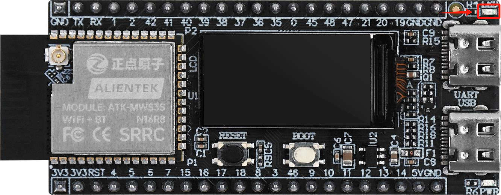

# LED

## Introduction

!!! note
    In this section, we will talk about the onboard LED light on the DNESP32S3M development board.

{ width=800px }

## Overview

In the project, we created a new directory named `LED` under the `components` directory to store the LED driver code, including the `led.h` and `led.c` files.

## Pin Configuration

According to the schematic, the onboard LED light is connected to GPIO1.

{ width=800px }

## Code

### LED.h
    
```c
/**
 * @file led.h
 * @author SHUAIWEN CUI (SHUAIWEN001@e.ntu.edu.sg)
 * @brief The led here indicates the onboard red led on the Alientek DNESP32S3M minimal development board.
 * @version 1.0
 * @date 2024-11-16
 * 
 * @copyright Copyright (c) 2024
 * 
 */

#ifndef __LED_H__
#define __LED_H__

/* Dependencies */
#include "driver/gpio.h"

/* GPIO Pin Definition */
#define LED_GPIO_PIN    GPIO_NUM_1  /* GPIO port connected to LED */

/* GPIO States */
#define LED_PIN_RESET       0
#define LED_PIN_SET         1

/**
 * @brief       Initialize the LED
 * @param       None
 * @retval      None
 */
void led_init(void);

/**
 * @brief       Control the LED
 * @param       x: 1 for on, 0 for off
 * @retval      None
 */
void led(int x);

/**
 * @brief       Toggle the LED
 * @param       None
 * @retval      None
 */
void led_toggle(void);

#endif /* __LED_H__ */

```

### LED.c

```c
/**
 * @file led.c
 * @author SHUAIWEN CUI (SHUAIWEN001@e.ntu.edu.sg)
 * @brief The led here indicates the onboard red led on the Alientek DNESP32S3M minimal development board.
 * @version 1.0
 * @date 2024-11-16
 * 
 * @copyright Copyright (c) 2024
 * 
 */

/* Dependencies */
#include "led.h"

/**
 * @brief       Initialize the LED
 * @param       None
 * @retval      None
 */
void led_init(void)
{
    gpio_config_t gpio_init_struct = {0};

    gpio_init_struct.intr_type = GPIO_INTR_DISABLE;         /* Disable GPIO interrupt */
    gpio_init_struct.mode = GPIO_MODE_INPUT_OUTPUT;         /* Set GPIO mode to input-output */
    gpio_init_struct.pull_up_en = GPIO_PULLUP_ENABLE;       /* Enable pull-up resistor */
    gpio_init_struct.pull_down_en = GPIO_PULLDOWN_DISABLE;  /* Disable pull-down resistor */
    gpio_init_struct.pin_bit_mask = 1ull << LED_GPIO_PIN;   /* Set pin bit mask for the configured pin */
    gpio_config(&gpio_init_struct);                         /* Configure GPIO */

    led(1); /* Turn on the LED */
}

/**
 * @brief       Control the LED
 * @param       x: 1 for on, 0 for off
 * @retval      None
 */
void led(int x)
{
    if(x)
    {
        gpio_set_level(LED_GPIO_PIN, LED_PIN_RESET);
    }
    else
    {
        gpio_set_level(LED_GPIO_PIN, LED_PIN_SET);
    }
}

/**
 * @brief       Toggle the LED
 * @param       None
 * @retval      None
 */
void led_toggle(void)
{
    gpio_set_level(LED_GPIO_PIN, !gpio_get_level(LED_GPIO_PIN));
}
```

## Core Functions

### led_init()

!!! note
    初始化LED灯。

### led()

!!! note
    控制LED灯。

### led_toggle()

!!! note
    翻转LED灯。

## Test Program

Replace the content of the `main` function in the `main.c` file with the following code:

```c
/* Dependencies */
// Basic
#include "esp_system.h"
#include "esp_chip_info.h"
#include "esp_psram.h"
#include "esp_flash.h"
#include "nvs_flash.h"

// RTOS
#include "freertos/FreeRTOS.h"
#include "freertos/task.h"

// BSP
#include "led.h"

/**
 * @brief Entry point of the program
 * @param None
 * @retval None
 */
void app_main(void)
{
    esp_err_t ret;
    uint32_t flash_size;
    esp_chip_info_t chip_info;

    // Initialize NVS
    ret = nvs_flash_init();
    if (ret == ESP_ERR_NVS_NO_FREE_PAGES || ret == ESP_ERR_NVS_NEW_VERSION_FOUND)
    {
        ESP_ERROR_CHECK(nvs_flash_erase()); // Erase if needed
        ret = nvs_flash_init();
    }

    // Get FLASH size
    esp_flash_get_size(NULL, &flash_size);
    esp_chip_info(&chip_info);

    // Display CPU core count
    printf("CPU Cores: %d\n", chip_info.cores);

    // Display FLASH size
    printf("Flash size: %ld MB flash\n", flash_size / (1024 * 1024));

    // Display PSRAM size
    printf("PSRAM size: %d bytes\n", esp_psram_get_size());

    // BSP
    led_init(); 

    while (1)
    {
        printf("Hello-ESP32\r\n");
        led_toggle();
        vTaskDelay(1000);
    }
}
```