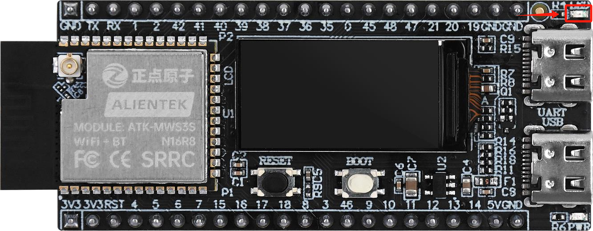

# LED

## 介绍

!!! note
    本章我们讲解DNESP32S3M开发板上的板载LED灯的驱动和控制。

{ width=800px }

## 概览

我们在项目中，在components目录下，新建了一个LED目录，用于存放LED灯的驱动代码，包括led.h和led.c文件。

## 引脚配置

根据图纸，板载LED灯连接到GPIO1。

{ width=800px }

## 代码

### LED.h
    
```c
/**
 * @file led.h
 * @author SHUAIWEN CUI (SHUAIWEN001@e.ntu.edu.sg)
 * @brief The led here indicates the onboard red led on the Alientek DNESP32S3M minimal development board.
 * @version 1.0
 * @date 2024-11-16
 * 
 * @copyright Copyright (c) 2024
 * 
 */

#ifndef __LED_H__
#define __LED_H__

/* Dependencies */
#include "driver/gpio.h"

/* GPIO Pin Definition */
#define LED_GPIO_PIN    GPIO_NUM_1  /* GPIO port connected to LED */

/* GPIO States */
#define LED_PIN_RESET       0
#define LED_PIN_SET         1

/**
 * @brief       Initialize the LED
 * @param       None
 * @retval      None
 */
void led_init(void);

/**
 * @brief       Control the LED
 * @param       x: 1 for on, 0 for off
 * @retval      None
 */
void led(int x);

/**
 * @brief       Toggle the LED
 * @param       None
 * @retval      None
 */
void led_toggle(void);

#endif

```

### LED.c

```c
/**
 * @file led.c
 * @author SHUAIWEN CUI (SHUAIWEN001@e.ntu.edu.sg)
 * @brief The led here indicates the onboard red led on the Alientek DNESP32S3M minimal development board.
 * @version 1.0
 * @date 2024-11-16
 * 
 * @copyright Copyright (c) 2024
 * 
 */

/* Dependencies */
#include "led.h"

/**
 * @brief       Initialize the LED
 * @param       None
 * @retval      None
 */
void led_init(void)
{
    gpio_config_t gpio_init_struct = {0};

    gpio_init_struct.intr_type = GPIO_INTR_DISABLE;         /* Disable GPIO interrupt */
    gpio_init_struct.mode = GPIO_MODE_INPUT_OUTPUT;         /* Set GPIO mode to input-output */
    gpio_init_struct.pull_up_en = GPIO_PULLUP_ENABLE;       /* Enable pull-up resistor */
    gpio_init_struct.pull_down_en = GPIO_PULLDOWN_DISABLE;  /* Disable pull-down resistor */
    gpio_init_struct.pin_bit_mask = 1ull << LED_GPIO_PIN;   /* Set pin bit mask for the configured pin */
    gpio_config(&gpio_init_struct);                         /* Configure GPIO */

    led(1); /* Turn on the LED */
}

/**
 * @brief       Control the LED
 * @param       x: 1 for on, 0 for off
 * @retval      None
 */
void led(int x)
{
    if(x)
    {
        gpio_set_level(LED_GPIO_PIN, LED_PIN_RESET);
    }
    else
    {
        gpio_set_level(LED_GPIO_PIN, LED_PIN_SET);
    }
}

/**
 * @brief       Toggle the LED
 * @param       None
 * @retval      None
 */
void led_toggle(void)
{
    gpio_set_level(LED_GPIO_PIN, !gpio_get_level(LED_GPIO_PIN));
}
```

## 核心函数

### led_init()

!!! note
    初始化LED灯。

### led()

!!! note
    控制LED灯。

### led_toggle()

!!! note
    翻转LED灯。