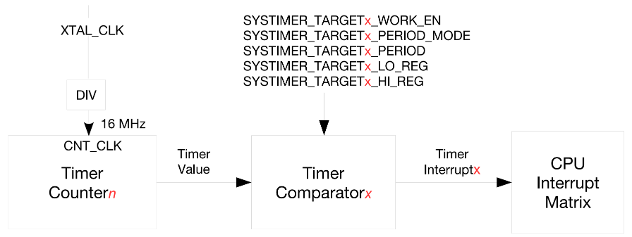

# ESPTIMER

## Introduction

This document introduces the use of the ESP32 timer.

!!! info "Timer"
    The timer is an integrated function of the microcontroller, which can be flexibly controlled by programming. The timing function of the microcontroller depends on the internal counter. Whenever the microcontroller experiences a machine cycle and generates a pulse, the counter will increase. The main function of the timer is to time. When the set time is reached, it will trigger an interrupt to notify the system that the timing is complete. In the interrupt service function, we can write specific programs to achieve the desired function.

!!! info "What can a timer do"
    - Execute scheduled tasks: Timers are often used to periodically execute specific tasks. For example, if a task needs to be executed every 500 milliseconds, the timer can accurately meet this requirement.

    - Time measurement: The timer can accurately measure time, whether it is the execution time of a code segment or the interval time of an event, it can be accurately measured by the timer.

    - Accurate delay: For delay scenarios that require microsecond accuracy, the timer can provide a reliable   solution to ensure the accuracy of the delay.

    - PWN signal generation: Through the precise control of the timer, we can generate PWM (pulse width modulation) signals, which is crucial for applications such as driving motors and adjusting LED brightness.

    - Event triggering and monitoring: The timer is not only used to trigger interrupts and implement event-driven logic, but also to implement watchdog functions, monitor system status, and perform reset operations when necessary to ensure stable operation of the system.

!!! info "Types of Timers"
    Timers can be implemented either in hardware or software, each with its unique characteristics suited for different scenarios:

    **Hardware Timers** rely on the built-in hardware mechanisms of microcontrollers, utilizing dedicated timing/counter circuits to achieve timing functionality. Their key advantages are high precision and reliability because hardware timers operate independently of software tasks and operating system scheduling, remaining unaffected by them. In scenarios demanding extremely high timing accuracy, such as generating PWM signals or performing precise time measurements, hardware timers are undoubtedly the best choice. Their design ensures that even if the main CPU is occupied with other tasks, the timer can still accurately trigger the designated operation at the preset time.

    **Software Timers**, on the other hand, simulate timing functionality through the operating system or software libraries. The performance of these timers is affected by the system's current load and task scheduling strategies, resulting in slightly lower precision compared to hardware timers. However, software timers excel in flexibility, allowing the creation of numerous timers, making them ideal for scenarios where strict timing control is not required. It is important to note that software timers may encounter timing accuracy issues, especially under heavy system loads or when there are many high-priority tasks. Nevertheless, for simple delays where high precision is not critical, software timers are typically sufficient to meet the requirements.

## ESP32-S3 Timer Overview


The system timer has two built-in counters UNIT0 and UNIT1 (as shown in the figure) and three comparators COMP0, COMP1, and COMP2 (as shown in the figure). The comparators are used to monitor whether the counter's count value reaches the alarm value.

(1) Counter

UNIT0 and UNIT1 are 52-bit counters built into the ESP32-S3 system timer. The counters use XTAL_CLK as the clock source (40MHz). After XTAL_CLK is divided, a clock signal with a frequency of fXTAL_CLK/3 is generated in one counting cycle, and then a clock signal with a frequency of fXTAL_CLK/2 is generated in another counting cycle. Therefore, the clock CNT_CLK used by the counter has an actual average frequency of fXTAL_CLK/2.5, which is 16MHz, as shown in Figure 14.1.2. For each CNT_CLK clock cycle, the count increases by 1/16µs, that is, 16 cycles increase by 1µs. Users can control the counter UNITn by configuring the following three bits in register SYSTIMER_CONF_REG. These three bits are:
①: SYSTIMER_TIMER_UNITn_WORK_EN
②: SYSTIMER_TIMER_UNITn_CORE0_STALL_EN
③: SYSTIMER_TIMER_UNITn_CORE1_STALL_EN
For the configuration of these three bits, please refer to the "esp32-s3_technical_reference_manual_en".

(2) Comparator

COMP0, COMP1, and COMP2 are 52-bit comparators built into the ESP32-S3 system timer. The comparators also use XTAL_CLK as the clock source (40MHz).



The above figure shows the process of the system timer generating an alarm. In the above process, a counter (Timer Countern) and a comparator (Timer Comparatorx) are used to generate an alarm interrupt based on the comparison result.

## Use Case

Let's design a program that configures a high-resolution timer to enable interrupts and toggle the LED status in the interrupt callback function. Since we are using on-board resources, no wiring is required.

## Code

### tim.h

```c
/**
 * @file tim.h
 * @author SHUAIWEN CUI (SHUAIWEN001@e.ntu.edu.sg)
 * @brief This file contains the function prototypes for the TIM component.
 * @version 1.0
 * @date 2024-11-18
 * 
 * @copyright Copyright (c) 2024
 * 
 */

#ifndef __TIM_H__
#define __TIM_H__

/* Dependencies */
#include "freertos/FreeRTOS.h"
#include "freertos/task.h"
#include "driver/gpio.h"
#include "esp_timer.h"
#include "led.h"


/* Function Prototypes */

/**
 * @brief       Initialize a high-precision timer (ESP_TIMER)
 * @param       tps: Timer period in microseconds (μs). For example, to execute the timer interrupt once every second, 
 *                   set tps = 1s = 1000000μs.
 * @retval      None
 */
void esptim_int_init(uint64_t tps);

/**
 * @brief       Timer callback function
 * @param       arg: No arguments passed
 * @retval      None
 */
void esptim_callback(void *arg); 

#endif /*__TIM_H__*/
```


### tim.c

```c
/**
 * @file tim.c
 * @author SHUAIWEN CUI (SHUAIWEN001@e.ntu.edu.sg)
 * @brief This file contains the implementation of the TIM component.
 * @version 1.0
 * @date 2024-11-18
 * 
 * @copyright Copyright (c) 2024
 * 
 */

#include "esptim.h"

/**
 * @brief       Initialize a high-precision timer (ESP_TIMER)
 * @param       tps: Timer period in microseconds (μs). For example, to execute the timer interrupt once every second, 
 *                   set tps = 1s = 1000000μs.
 * @retval      None
 */
void esptim_int_init(uint64_t tps)
{
    esp_timer_handle_t esp_tim_handle;                      /* Timer callback function handle */

    /* Define a timer configuration structure */
    esp_timer_create_args_t tim_periodic_arg = {
        .callback = &esptim_callback,                       /* Set the callback function */
        .arg = NULL,                                        /* No arguments passed */
    };

    esp_timer_create(&tim_periodic_arg, &esp_tim_handle);   /* Create a timer event */
    esp_timer_start_periodic(esp_tim_handle, tps);          /* Trigger periodically based on the timer period */
}

/**
 * @brief       Timer callback function
 * @param       arg: No arguments passed
 * @retval      None
 */
void esptim_callback(void *arg)
{
    led_toggle();
}

```
!!! warning 
    Make sure that you add the tim.c and tim.h paths to the CMakeLists.txt file. Also, add the esp_timer library to the dependencies.

### main.c

将主程序main.c中的内容替换为以下内容：

```c
/**
 * @file main.c
 * @author SHUAIWEN CUI (SHUAIWEN001@e.ntu.edu.sg)
 * @brief 
 * @version 1.0
 * @date 2024-11-17
 * 
 * @copyright Copyright (c) 2024
 * 
 */

/* Dependencies */
// Basic
#include "esp_system.h"
#include "esp_chip_info.h"
#include "esp_psram.h"
#include "esp_flash.h"
#include "nvs_flash.h"
#include "esp_log.h"

// RTOS
#include "freertos/FreeRTOS.h"
#include "freertos/task.h"

// BSP
#include "led.h"
#include "rgb.h"
#include "key.h"
#include "exit.h"
#include "tim.h"

/**
 * @brief Entry point of the program
 * @param None
 * @retval None
 */
void app_main(void)
{
    esp_err_t ret;
    uint32_t flash_size;
    esp_chip_info_t chip_info;

    // uint8_t key;

    // Initialize NVS
    ret = nvs_flash_init();
    if (ret == ESP_ERR_NVS_NO_FREE_PAGES || ret == ESP_ERR_NVS_NEW_VERSION_FOUND)
    {
        ESP_ERROR_CHECK(nvs_flash_erase()); // Erase if needed
        ret = nvs_flash_init();
    }

    // Get FLASH size
    esp_flash_get_size(NULL, &flash_size);
    esp_chip_info(&chip_info);

    // Display CPU core count
    printf("CPU Cores: %d\n", chip_info.cores);

    // Display FLASH size
    printf("Flash size: %ld MB flash\n", flash_size / (1024 * 1024));

    // Display PSRAM size
    printf("PSRAM size: %d bytes\n", esp_psram_get_size());

    // BSP
    led_init();
    rgb_init();
    // key_init();
    exit_init();
    esptim_int_init(1000000); // 1s enable timer, of which the callback function toggles the LED

    while (1)
    {
        printf("Hello-ESP32\r\n");
        vTaskDelay(1000);
    }

}

```
