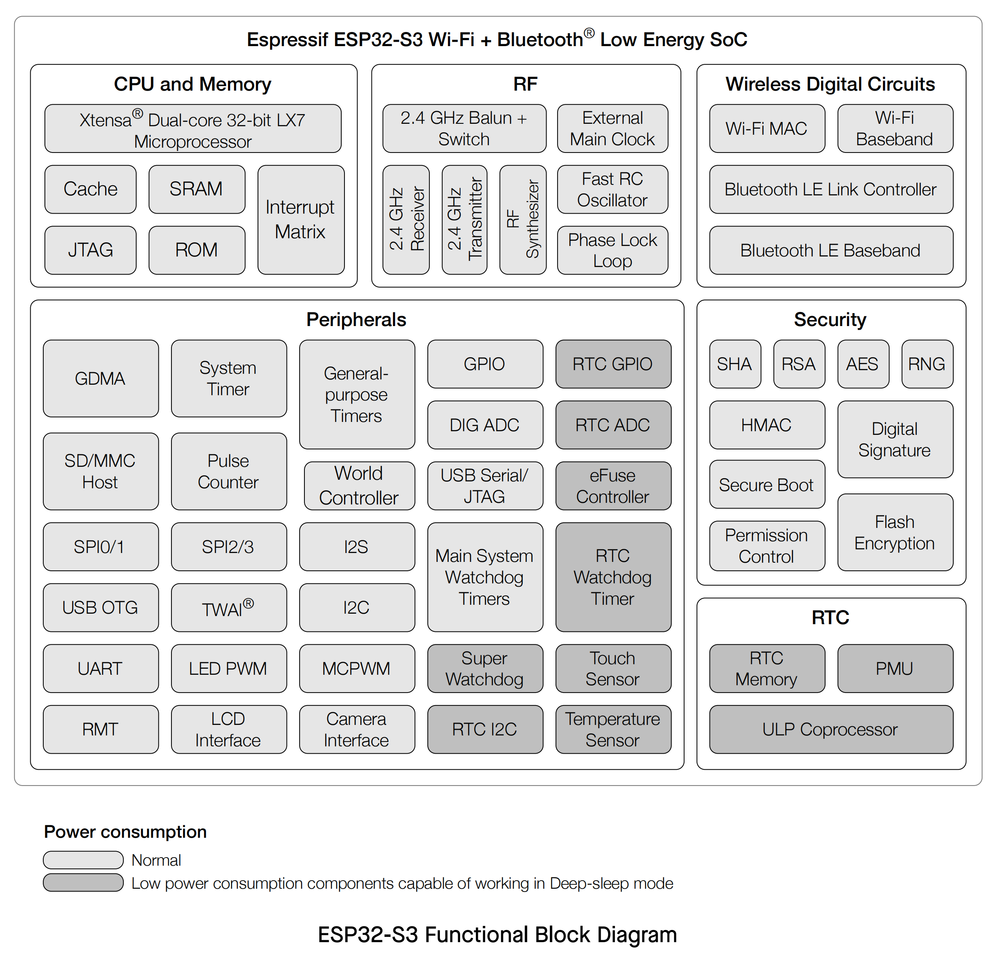
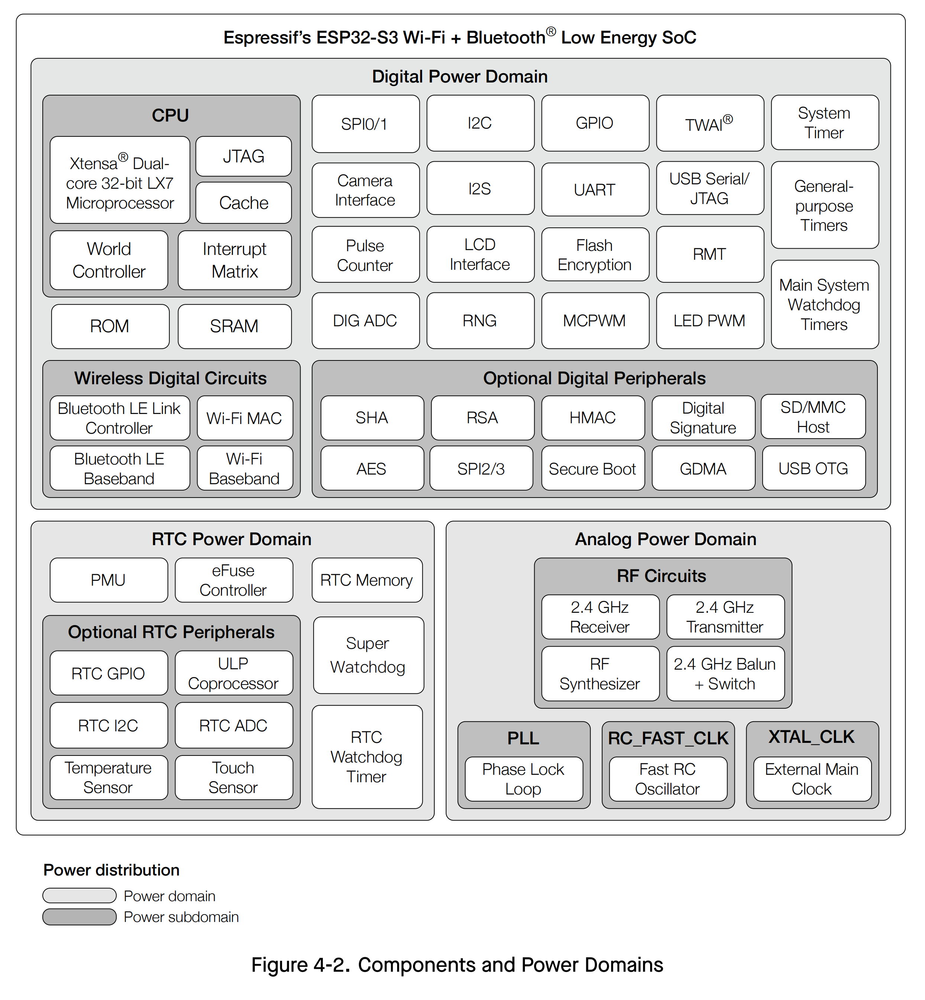

# HARDWARE

!!! info "DNESP32S3M"
    The hardware platform used in this document is the DNESP32S3M from Alientek， which is based on ESP32-S3, as shown in the figure above. It should be possible to migrate the relevant programs to other development boards, but adaptation should be made according to the actual situation.

{width=800px}

{width=800px}

!!! info "DNESP32S3M Hardware Features"
    ESP32-S3 is a system on a chip that integrates the following features:

    - Wi-Fi (2.4 GHz band)

    - Bluetooth Low Energy

    - Dual high performance Xtensa® 32-bit LX7 CPU cores

    - Ultra Low Power co-processor running either RISC-V or FSM core

    - Multiple peripherals

    - Built-in security hardware

    - USB OTG interface

    - USB Serial/JTAG Controller

    Powered by 40 nm technology, ESP32-S3 provides a robust, highly integrated platform, which helps meet   the continuous demands for efficient power usage, compact design, security, high performance, and     reliability.

    Espressif provides basic hardware and software resources to help application developers realize their   ideas using the ESP32-S3 series hardware. The software development framework by Espressif is intended     for development of Internet-of-Things (IoT) applications with Wi-Fi, Bluetooth, power management and    several other system features.

{width=800px}

{width=800px}

