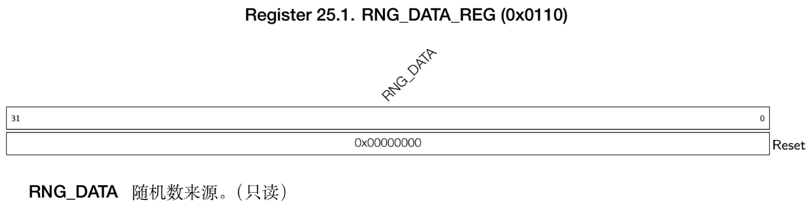

# RNG (Random Number Generator)

!!! info
    ESP32-S3 features a true random number generator (RNG) that generates 32-bit random numbers, which can serve as a basis for operations such as encryption. Unlike algorithm-based generators, the ESP32-S3 RNG produces true random numbers through physical processes, ensuring an equal probability of occurrence for all numbers within a specific range.

## RNG Features

To better understand the RNG, let's first examine its noise sources. Familiarizing yourself with the noise sources provides a solid foundation for programming and offers a clearer perspective on its workings. The noise sources of the ESP32-S3 RNG are illustrated below:


The ESP32 RNG generates 32-bit true random numbers via the **RNG_DATA_REG** register. Its noise sources mainly include thermal noise and asynchronous clocks:
- Thermal noise originates from the SAR ADC or high-speed ADC. When these modules are active, they generate bitstreams that are processed through an XOR operation to serve as random seeds for the RNG.
- When the RC_FAST_CLK (20MHz) is enabled for the digital core, the RNG samples the clock, leveraging its metastable characteristics to increase entropy.

For maximum entropy, it is recommended to enable at least one ADC (SAR ADC or high-speed ADC) as a random seed source in conjunction with the RC_FAST_CLK.

## RNG Random Number Register

**RNG_DATA_REG** Random Number Data 0x0110 Read-only




## Example

This example demonstrates how to use the ESP32-S3 built-in hardware random number generator (RNG) to obtain random numbers and display them on an LCD screen. Pressing the **BOOT** button retrieves a random number. Additionally, the program continuously generates random numbers in the range of 0 to 9 and displays them on the screen. The LED blinks to indicate that the program is running.

## Resources Used

LED: IO1
Independent Button: BOOT button
0.96-inch LCD
RNG: Hardware Random Number Generator

## Key Modules and Functions

Begin by importing the header file:

```c
#include "esp_random.h"
```

Key function:

```c
uint32_t esp_random(void);
```

## Code

### rng.h

```c
/**
 * @file rng.h
 * @author 
 * @brief This is the header file for the RNG component.
 * @version 1.0
 * @date 2024-11-19
 * @ref Alientek RNG Driver
 * @copyright Copyright (c) 2024
 * 
 */
 
#ifndef __RNG_H__
#define __RNG_H__

#include <stdint.h>
#include <stddef.h>
#include <string.h>
#include <sys/param.h>
#include "esp_attr.h"
#include "esp_cpu.h"
#include "soc/wdev_reg.h"
#include "esp_random.h"
#include "esp_private/esp_clk.h"


/* Function Declarations */

/**
 * @brief       Get a random number
 * @param       None
 * @retval      Random number (32-bit)
 */
uint32_t rng_get_random_num(void);          /* Get a random number */

/**
 * @brief       Get a random number within a specific range
 * @param       min,max: Minimum and maximum values
 * @retval      Random number (rval), satisfying: min <= rval <= max
 */
int rng_get_random_range(int min, int max); /* Get a random number within a specific range */

#endif

```

### rng.c

```c
/**
 * @file rng.c
 * @author 
 * @brief This is the source file for the RNG component.
 * @version 1.0
 * @date 2024-11-19
 * @ref Alientek RNG Driver
 * @copyright Copyright (c) 2024
 * 
 */

#include "rng.h"

/**
 * @brief       Get a random number
 * @param       None
 * @retval      Random number (32-bit)
 */
uint32_t rng_get_random_num(void)
{
    uint32_t randomnum;
    
    randomnum = esp_random();
    
    return randomnum;
}

/**
 * @brief       Get a random number within a specific range
 * @param       min,max: Minimum and maximum values
 * @retval      Random number (rval), satisfying: min <= rval <= max
 */
int rng_get_random_range(int min, int max)
{ 
    uint32_t randomnum;
    
    randomnum = esp_random();
    
    return randomnum % (max - min + 1) + min;
}

```

!!! tip
    请将rng.h和rng.c添加到CMakelists.txt中对应区域。

### main.c

```c
/**
 * @file main.c
 * @author
 * @brief Main application to demonstrate the use of ESP32 internal temperature sensor
 * @version 1.0
 * @date 2024-11-17
 *
 * @copyright Copyright (c) 2024
 *
 */

/* Dependencies */
// Basic
#include "esp_system.h"
#include "esp_chip_info.h"
#include "esp_psram.h"
#include "esp_flash.h"
#include "nvs_flash.h"
#include "esp_log.h"

// RTOS
#include "freertos/FreeRTOS.h"
#include "freertos/task.h"

// BSP
#include "led.h"
#include "rgb.h"
#include "key.h"
#include "exit.h"
#include "lcd.h"
#include "spi.h"
#include "esp_rtc.h"
#include "temp.h"
#include "rng.h"

void app_main(void)
{
    uint8_t key;
    uint32_t random;
    uint8_t t = 0;
    esp_err_t ret;
    
    ret = nvs_flash_init();                                         /* Initialize NVS */

    if (ret == ESP_ERR_NVS_NO_FREE_PAGES || ret == ESP_ERR_NVS_NEW_VERSION_FOUND)
    {
        ESP_ERROR_CHECK(nvs_flash_erase());
        ret = nvs_flash_init();
    }

    led_init();                                                     /* Initialize LED */
    spi2_init();                                                    /* Initialize SPI2 */
    lcd_init();                                                     /* Initialize LCD */
    key_init();                                                     /* Initialize keys */
    
    lcd_show_string(0, 0, 200, 16, 16, "RNG Test", RED);
    lcd_show_string(0, 20, 200, 16, 16, "BOOT:Get Random Num", RED);
    lcd_show_string(0, 40, 200, 16, 16, "Num:", RED);
    lcd_show_string(0, 60, 200, 16, 16, "Num[0-9]:", RED);

    while(1)
    {
        key = key_scan(0);
        
        if (key == BOOT)                                            /* Get a random number and display on LCD */
        {
            random = rng_get_random_num();
            lcd_show_num(30 + 8 * 5, 40, random, 10, 16, BLUE);
        }
        
        if ((t % 20) == 0)                                          /* Get a random number [0,9] and display on LCD */
        {
            led_toggle();                                           /* Toggle LED every 200ms */
            random = rng_get_random_range(0, 9);                    /* Generate a random number in [0,9] range */
            lcd_show_num(32 + 8 * 11, 60, random, 1, 16, BLUE);     /* Display the random number */
        }

        vTaskDelay(10);
        t++;
    }
}

```