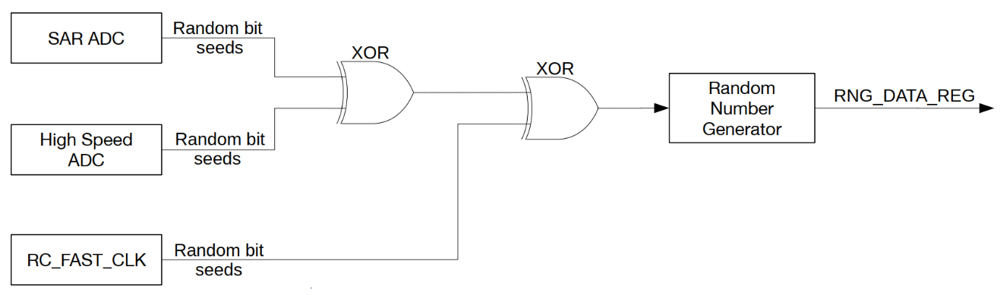
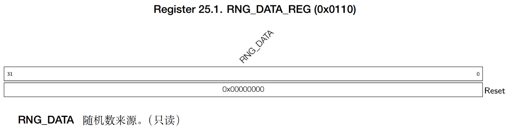

# 随机数发生器 RNG

!!! info
    ESP32-S3 内置一个真随机数发生器（RNG），其生成的 32 位随机数可作为加密等操作的基础。ESP32-S3 的随机数发生器可通过物理过程而非算法生成真随机数，所有生成的随机数在特定范围内出现的概率完全一致。

## RNG 功能描述

下面先来了解噪声源，通过学习噪声源会有一个很好的整体掌握，同时对之后的编程也会有一个清晰的思路。EDP32- S3 的随机数发生器噪声源如下图所示：



ESP32 的随机数发生器通过 RNG_DATA_REG 提供 32 位真随机数，其噪声源主要来自系统中的热噪声和异步时钟。热噪声可来源于 SAR ADC 或高速 ADC，当这些模块工作时，会产生比特流，并通过异或 (XOR) 运算作为随机数种子输入随机数生成器。同时，当数字内核使能 RC_FAST_CLK（20MHz）时，随机数发生器会对其进行采样，利用异步时钟源的亚稳态特性增加熵值。为了保证随机数的最大熵值，建议至少使能一路 ADC（SAR ADC 或高速 ADC）作为随机数种子，同时结合 RC_FAST_CLK 提高熵值。

## RND 随机数寄存器

RNG_DATA_REG 随机数数据 0x0110 只读



## 例程

本实验使用 ESP32-S3 自带的硬件随机数生成器（RNG），获取随机数，并显示在 LCD 屏幕上。按 BOOT 按键可以获取一次随机数。同时程序自动获取 0~9 范围内的随机数，显示在屏幕上。LED 闪烁用于提示程序正在运行。

## 涉及资源

1. LED - LED - IO1
2. 独立按键
3. 0.96 寸 LCD
4. RNG（硬件随机数生成器）

## 关键模块与函数

首先导入头文件：

```c
#include "esp_random.h"
```

关键函数：

```c
uint32_t esp_random(void);
```

## 代码

### rng.h

```c
/**
 * @file rng.h
 * @author 
 * @brief This is the header file for the RNG component.
 * @version 1.0
 * @date 2024-11-19
 * @ref Alientek RNG Driver
 * @copyright Copyright (c) 2024
 * 
 */
 
#ifndef __RNG_H__
#define __RNG_H__

#include <stdint.h>
#include <stddef.h>
#include <string.h>
#include <sys/param.h>
#include "esp_attr.h"
#include "esp_cpu.h"
#include "soc/wdev_reg.h"
#include "esp_random.h"
#include "esp_private/esp_clk.h"


/* Function Declarations */

/**
 * @brief       Get a random number
 * @param       None
 * @retval      Random number (32-bit)
 */
uint32_t rng_get_random_num(void);          /* Get a random number */

/**
 * @brief       Get a random number within a specific range
 * @param       min,max: Minimum and maximum values
 * @retval      Random number (rval), satisfying: min <= rval <= max
 */
int rng_get_random_range(int min, int max); /* Get a random number within a specific range */

#endif

```

### rng.c

```c
/**
 * @file rng.c
 * @author 
 * @brief This is the source file for the RNG component.
 * @version 1.0
 * @date 2024-11-19
 * @ref Alientek RNG Driver
 * @copyright Copyright (c) 2024
 * 
 */

#include "rng.h"

/**
 * @brief       Get a random number
 * @param       None
 * @retval      Random number (32-bit)
 */
uint32_t rng_get_random_num(void)
{
    uint32_t randomnum;
    
    randomnum = esp_random();
    
    return randomnum;
}

/**
 * @brief       Get a random number within a specific range
 * @param       min,max: Minimum and maximum values
 * @retval      Random number (rval), satisfying: min <= rval <= max
 */
int rng_get_random_range(int min, int max)
{ 
    uint32_t randomnum;
    
    randomnum = esp_random();
    
    return randomnum % (max - min + 1) + min;
}

```

!!! tip
    请将rng.h和rng.c添加到CMakelists.txt中对应区域。

### main.c

```c
/**
 * @file main.c
 * @author
 * @brief Main application to demonstrate the use of ESP32 internal temperature sensor
 * @version 1.0
 * @date 2024-11-17
 *
 * @copyright Copyright (c) 2024
 *
 */

/* Dependencies */
// Basic
#include "esp_system.h"
#include "esp_chip_info.h"
#include "esp_psram.h"
#include "esp_flash.h"
#include "nvs_flash.h"
#include "esp_log.h"

// RTOS
#include "freertos/FreeRTOS.h"
#include "freertos/task.h"

// BSP
#include "led.h"
#include "rgb.h"
#include "key.h"
#include "exit.h"
#include "lcd.h"
#include "spi.h"
#include "esp_rtc.h"
#include "temp.h"
#include "rng.h"

void app_main(void)
{
    uint8_t key;
    uint32_t random;
    uint8_t t = 0;
    esp_err_t ret;
    
    ret = nvs_flash_init();                                         /* Initialize NVS */

    if (ret == ESP_ERR_NVS_NO_FREE_PAGES || ret == ESP_ERR_NVS_NEW_VERSION_FOUND)
    {
        ESP_ERROR_CHECK(nvs_flash_erase());
        ret = nvs_flash_init();
    }

    led_init();                                                     /* Initialize LED */
    spi2_init();                                                    /* Initialize SPI2 */
    lcd_init();                                                     /* Initialize LCD */
    key_init();                                                     /* Initialize keys */
    
    lcd_show_string(0, 0, 200, 16, 16, "RNG Test", RED);
    lcd_show_string(0, 20, 200, 16, 16, "BOOT:Get Random Num", RED);
    lcd_show_string(0, 40, 200, 16, 16, "Num:", RED);
    lcd_show_string(0, 60, 200, 16, 16, "Num[0-9]:", RED);

    while(1)
    {
        key = key_scan(0);
        
        if (key == BOOT)                                            /* Get a random number and display on LCD */
        {
            random = rng_get_random_num();
            lcd_show_num(30 + 8 * 5, 40, random, 10, 16, BLUE);
        }
        
        if ((t % 20) == 0)                                          /* Get a random number [0,9] and display on LCD */
        {
            led_toggle();                                           /* Toggle LED every 200ms */
            random = rng_get_random_range(0, 9);                    /* Generate a random number in [0,9] range */
            lcd_show_num(32 + 8 * 11, 60, random, 1, 16, BLUE);     /* Display the random number */
        }

        vTaskDelay(10);
        t++;
    }
}

```