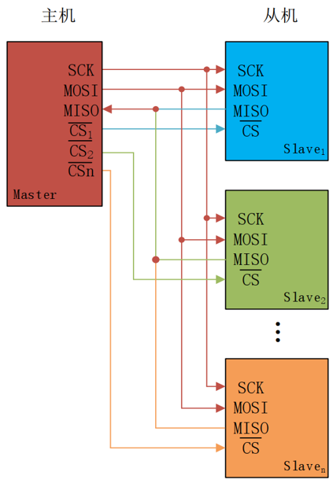
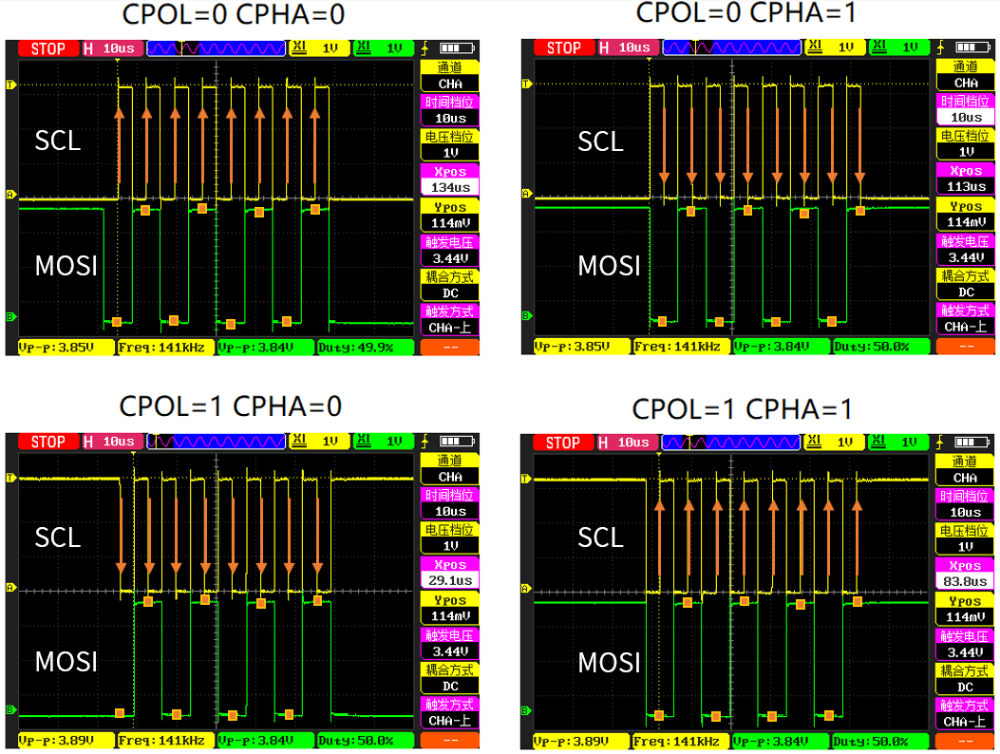
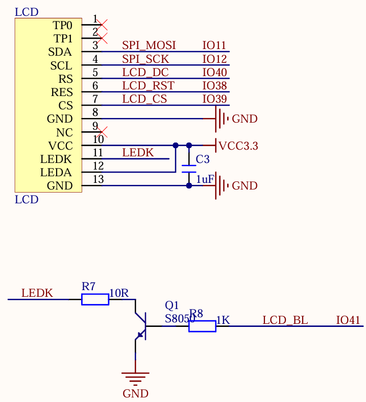

# SPI

## SPI介绍

!!! info "Serial Peripheral interface"

    SPI，Serial Peripheral interface，顾名思义，就是串行外围设备接口，是由原摩托罗拉公司在其 MC68HCXX 系列处理器上定义的。SPI 是一种高速的全双工、同步、串行的通信总线，已经广泛应用在众多 MCU、存储芯片、AD 转换器和 LCD 之间。
    SPI 通信跟 IIC 通信一样，通信总线上允许挂载一个主设备和一个或者多个从设备。为了跟从设备进行通信，一个主设备至少需要 4 跟数据线，分别为：

    - MOSI（Master Out / Slave In）：主数据输出，从数据输入，用于主机向从机发送数据。

    - MISO（Master In / Slave Out）：主数据输入，从数据输出，用于从机向主机发送数据。

    - SCLK（Serial Clock）：时钟信号，由主设备产生，决定通信的速率。

    - CS（Chip Select）：从设备片选信号，由主设备产生，低电平时选中从设备。

多从机SPI通信网络连接如下图所示：



从上图可以知道，MOSI、MISO、SCLK 引脚连接 SPI 总线上每一个设备，如果 CS 引脚为低电平，则从设备只侦听主机并与主机通信。SPI主设备一次只能和一个从设备进行通信。如果主设备要和另外一个从设备通信，必须先终止和当前从设备通信，否则不能通信。

SPI 通信有 4 种不同的模式，不同的从机可能在出厂时就配置为某种模式，这是不能改变的。通信双方必须工作在同一模式下，才能正常进行通信，所以可以对主机的 SPI 模式进行配置。SPI 通信模式是通过配置 CPOL（时钟极性）和 CPHA（时钟相位）来选择的。

CPOL，详称 Clock Polarity，就是时钟极性，当主从机没有数据传输的时候即空闲状态，SCL 线的电平状态，假如空闲状态是高电平，CPOL=1；若空闲状态时低电平，那么 CPOL = 0。

CPHA，详称 Clock Phase，就是时钟相位，实质指的是数据的采样时刻。CPHA = 0 表示数据的采样是从第 1 个边沿信号上即奇数边沿，具体是上升沿还是下降沿的问题，是由 CPOL 决定的。CPHA=1 表示数据采样是从第 2 个边沿即偶数边沿。



1）模式 0，CPOL=0，CPHA=0；空闲时，SCL 处于低电平，数据采样在第 1 个边沿，即SCL 由低电平到高电平的跳变，数据采样在上升沿，数据发送在下降沿。

2）模式 1，CPOL=0，CPHA=1；空闲时，SCL 处于低电平，数据采样在第 2 个边沿，即SCL 由高电平到低电平的跳变，数据采样在下升沿，数据发送在上降沿。

3）模式 2，CPOL=1，CPHA=0；空闲时，SCL 处于高电平，数据采样在第 1 个边沿，即SCL 由高电平到低电平的跳变，数据采样在下升沿，数据发送在上降沿。

4）模式 3，CPOL=1，CPHA=1；空闲时，SCL 处于高电平，数据采样在第 2 个边沿，即SCL 由低电平到高电平的跳变，数据采样在上升沿，数据发送在下降沿。

## ESP32-S3 SPI 控制器

ESP32-S3 芯片集成了四个 SPI 控制器，分别为 SPI0、SPI1、SPI2 和 SPI3。SPI0 和 SPI1 控制器主要供内部使用以访问外部 FLASH 和 PSRAM，所以只能使用 **SPI2** 和 **SPI3** 。SPI2 又称为HSPI，而 SPI3 又称为 VSPI，这两个属于 GP-SPI。
GP-SPI 特性：
- 支持主机模式和从机模式

- 支持半双工通信和全双工通信

- 支持多种数据模式：

    - SPI2：1-bit SPI 模式、2-bit Dual SPI 模式、4-bit Quad SPI 模式、QPI 模式、8-bit Octal 模式、OPI 模式

    - SPI3：1-bit SPI 模式、2-bit Dual SPI 模式、4-bit Quad SPI 模式、QPI 模式

- 时钟频率可配置：

    - 在主机模式下：时钟频率可达 80MHz

    - 在从机模式下：时钟频率可达 60MHz

- 数据位的读写顺序可配置

- 时钟极性和相位可配置

- 四种 SPI 时钟模式：模式 0 ~ 模式 3

- 在主机模式下，提供多条 CS 线

    - SPI2：CS0 ~ CS5

    - SPI3：CS0 ~ CS2

- 支持访问 SPI 接口的传感器、显示屏控制器、flash 或 RAM 芯片

SPI2 和 SPI3 接口相关信号线可以经过 GPIO 交换矩阵和 IO_MUX 实现与芯片引脚的映射，IO 使用起来非常灵活

## 测试用例

本章使用SPI控制LCD显示屏，请结合LCD章节进行学习。测试用例如下：

“按下复位之后，就可以看到 SPI LCD 模块不停的显示一些信息并不断切换底色。LED 闪烁用于提示程序正在运行。”

## 电路图



## 依赖

ESP-IDF提供一套API来使用SPI，要使用此功能，需要导入必要的头文件：

```c
#include "driver/spi_master.h"
```

## 重点函数解析

### 初始化和配置

该函数用于初始化 SPI 总线，并配置其 GPIO引脚和主模式下的时钟等参数，该函数原型如下所示：

```c
esp_err_t spi_bus_initialize(spi_host_device_t host_id,
                    const spi_bus_config_t *bus_config,
                                spi_dma_chan_t dma_chan);
```
该函数的形参描述如下表所示：

| 参数 | 描述 |
|------|------|
|host_id | 指定 SPI 总线的主机设备 ID |
|bus_config | 指向 spi_bus_config_t 结构体的指针，用于配置 SPI 总线的SCLK、MISO、MOSI 等引脚以及其他参数 |
|dma_chan | 指定使用哪个 DMA 通道。有效值为：SPI_DMA_CH_AUTO，SPI_DMA_DISABLED 或 1 至 2 之间的数字 |

返回值：ESP_OK 配置成功。其他配置失败。

该函数使用 spi_bus_config_t 类型的结构体变量传入，笔者此处列举了我们需要用到的结构体，该结构体的定义如下所示：

```c
typedef struct {
    int miso_io_num; /* MISO 引脚号 */ 
    int mosi_io_num; /* MOSI 引脚号 */ 
    int sclk_io_num; /* 时钟引脚号 */ 
    int quadwp_io_num; /* 用于 Quad 模式的 WP 引脚号，未使用时设置为-1 */ 
    int quadhd_io_num; /* 用于 Quad 模式的 HD 引脚号，未使用时设置为-1 */ 
    int max_transfer_sz; /* 最大传输大小 */
    … /* 其他特定的配置参数 */
} spi_bus_config_t;
```
完成上述结构体参数配置之后，可以将结构传递给 spi_bus_initialize 函数，用以实例化 SPI。


### 设备配置

该函数用于在 SPI 总线上分配设备，函数原型如下所示：

```c
esp_err_t spi_bus_add_device(spi_host_device_t host_id,
       const spi_device_interface_config_t *dev_config,
                           spi_device_handle_t *handle);
```

该函数的形参描述，如下表所示：

| 参数 | 描述 |
|------|------|
|host_id | 指定 SPI 总线的主机设备 ID |
|dev_config | 指向 spi_device_interface_config_t 结构体的指针，用于配置SPI 设备的通信参数，如时钟速率、SPI 模式等。 |
|handle | 返回创建的设备句柄 |

返回值：ESP_OK 配置成功。其他配置失败。

该函数使用 spi_host_device_t 类型以及 spi_device_interface_config_t 类型的结构体变量传入SPI 外围设备的配置参数，该结构体的定义如下所示：

```c
/**
* @brief 带有三个 SPI 外围设备的枚举，这些外围设备可通过软件访问
*/
typedef enum {
    /* SPI1 只能在 ESP32 上用作 GPSPI */
    SPI1_HOST = 0, /* SPI1 */
    SPI2_HOST = 1, /* SPI2 */
#if SOC_SPI_PERIPH_NUM > 2
    SPI3_HOST = 2, /* SPI3 */
#endif
    SPI_HOST_MAX, /* 无效的主机值 */
}spi_host_device_t
typedef struct {
    uint32_t command_bits; /* 命令阶段的位数 */
    uint32_t address_bits; /* 地址阶段的位数 */
    uint32_t dummy_bits; /* 虚拟阶段的位数 */
    int clock_speed_hz; /* 时钟速率 */
    uint32_t mode; /* SPI 模式（0-3） */
    int spics_io_num; /* CS 引脚号 */
    ...             /* 其他设备特定的配置参数 */
    } spi_device_interface_config_t;
```

### 数据传输

根据函数功能，以下函数可以归为一类进行讲解，下面将以表格的形式逐个介绍这些函数的作用与参数。

| 函数 | 描述|
| ------- | --------|
|spi_device_transmit()|该函数用于发送一个 SPI 事务，等待它完成，并返回结果。handle：设备的句柄。trans_desc：指向 spi_transaction_t 结构体的指针，描述了要发送的事务详情。|
|spi_device_polling_transmit()|该函数用于发送一个轮询事务，等待它完成，并返回结果。handle：设备的句柄。trans_desc：指向 spi_transaction_t 结构体的指针，描述了要发送的事务详情。|

## 代码

### spi.h

```c
/**
 * @file spi.h
 * @author SHUAIWEN CUI (SHUAIWEN001@e.ntu.edu.sg)
 * @brief 
 * @version 1.0
 * @date 2024-11-18
 * @ref Alientek SPI driver
 * @copyright Copyright (c) 2024
 * 
 */

#ifndef __SPI_H__
#define __SPI_H__

/* Dependencies */
#include <string.h>
#include "esp_log.h"
#include "driver/spi_master.h"
#include "driver/gpio.h"

/* GPIO Definitions */
#define SPI_MOSI_GPIO_PIN   GPIO_NUM_11         /* SPI2_MOSI */
#define SPI_CLK_GPIO_PIN    GPIO_NUM_12         /* SPI2_CLK */
#define SPI_MISO_GPIO_PIN   GPIO_NUM_13         /* SPI2_MISO */

/* Function Prototypes */

/**
 * @brief       Initialize SPI
 * @param       None
 * @retval      None
 */
void spi2_init(void);

/**
 * @brief       Send command via SPI
 * @param       handle : SPI handle
 * @param       cmd    : Command to send
 * @retval      None
 */
void spi2_write_cmd(spi_device_handle_t handle, uint8_t cmd);

/**
 * @brief       Send data via SPI
 * @param       handle : SPI handle
 * @param       data   : Data to send
 * @param       len    : Length of data to send
 * @retval      None
 */
void spi2_write_data(spi_device_handle_t handle, const uint8_t *data, int len); 

/**
 * @brief       Process data via SPI
 * @param       handle       : SPI handle
 * @param       data         : Data to send
 * @retval      t.rx_data[0] : Received data
 */
uint8_t spi2_transfer_byte(spi_device_handle_t handle, uint8_t byte);        

#endif


```

### spi.c

```c
/**
 * @file spi.c
 * @author 
 * @brief 
 * @version 1.0
 * @date 2024-11-18
 * @ref Alientek SPI driver
 * 
 */

#include "spi.h"

/**
 * @brief       Initialize SPI
 * @param       None
 * @retval      None
 */
void spi2_init(void)
{
    esp_err_t ret = 0;
    spi_bus_config_t spi_bus_conf = {0};

    /* SPI bus configuration */
    spi_bus_conf.miso_io_num = SPI_MISO_GPIO_PIN;                               /* SPI_MISO pin */
    spi_bus_conf.mosi_io_num = SPI_MOSI_GPIO_PIN;                               /* SPI_MOSI pin */
    spi_bus_conf.sclk_io_num = SPI_CLK_GPIO_PIN;                                /* SPI_SCLK pin */
    spi_bus_conf.quadwp_io_num = -1;                                            /* SPI write protection signal pin, not enabled */
    spi_bus_conf.quadhd_io_num = -1;                                            /* SPI hold signal pin, not enabled */
    spi_bus_conf.max_transfer_sz = 160 * 80 * 2;                                /* Configure maximum transfer size in bytes */
    
    /* Initialize SPI bus */
    ret = spi_bus_initialize(SPI2_HOST, &spi_bus_conf, SPI_DMA_CH_AUTO);        /* SPI bus initialization */
    ESP_ERROR_CHECK(ret);                                                       /* Check parameter values */
}

/**
 * @brief       Send command via SPI
 * @param       handle : SPI handle
 * @param       cmd    : Command to send
 * @retval      None
 */
void spi2_write_cmd(spi_device_handle_t handle, uint8_t cmd)
{
    esp_err_t ret;
    spi_transaction_t t = {0};

    t.length = 8;                                       /* Number of bits to transmit (1 byte = 8 bits) */
    t.tx_buffer = &cmd;                                 /* Fill the command */
    ret = spi_device_polling_transmit(handle, &t);      /* Start transmission */
    ESP_ERROR_CHECK(ret);                               /* Usually no issues */
}

/**
 * @brief       Send data via SPI
 * @param       handle : SPI handle
 * @param       data   : Data to send
 * @param       len    : Length of data to send
 * @retval      None
 */
void spi2_write_data(spi_device_handle_t handle, const uint8_t *data, int len)
{
    esp_err_t ret;
    spi_transaction_t t = {0};

    if (len == 0)
    {
        return;                                     /* No data to transmit if length is 0 */
    }

    t.length = len * 8;                             /* Number of bits to transmit (1 byte = 8 bits) */
    t.tx_buffer = data;                             /* Fill the data */
    ret = spi_device_polling_transmit(handle, &t);  /* Start transmission */
    ESP_ERROR_CHECK(ret);                           /* Usually no issues */
}

/**
 * @brief       Process data via SPI
 * @param       handle       : SPI handle
 * @param       data         : Data to send
 * @retval      t.rx_data[0] : Received data
 */
uint8_t spi2_transfer_byte(spi_device_handle_t handle, uint8_t data)
{
    spi_transaction_t t;

    memset(&t, 0, sizeof(t));

    t.flags = SPI_TRANS_USE_TXDATA | SPI_TRANS_USE_RXDATA;
    t.length = 8;
    t.tx_data[0] = data;
    spi_device_transmit(handle, &t);

    return t.rx_data[0];
}

```

在 spi2_init()函数中主要工作就是对于 SPI 参数的配置，如 SPI 管脚配置和数据传输大小以及 SPI 总线配置等，通过该函数就可以完成 SPI 初始化。