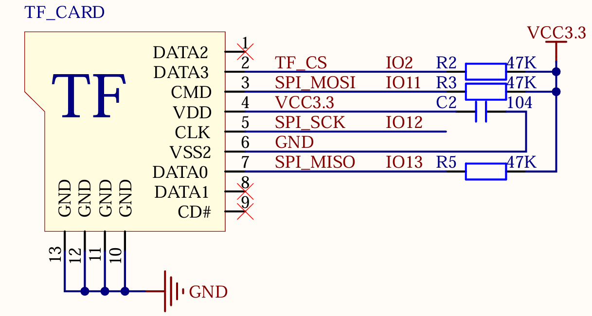

# TF卡（SD卡）操作 - SPI方式

## 介绍

!!! info "SD卡介绍"
    本很多单片机系统都需要大容量存储设备，以存储数据。目前常用的有U盘，FLASH芯片，SD卡等。他们各有优点，综合比较，最适合单片机系统的莫过于SD卡了，它不仅容量可以做到很大（32GB以上），支持SPI/SDIO驱动，而且有多种体积的尺寸可供选择（标准的SD卡尺寸及Micro SD卡尺寸等），能满足不同应用的要求。
    
    只需要少数几个IO口即可外扩一个高达32GB或以上的外部存储器，容量从几十M到几十G选择范围很大，更换也很方便，编程也简单，是单片机大容量外部存储器的首选。

    正点原子ESP32-S3最小系统板使用的接口是Micro SD卡接口，卡座带自锁功能，SD SPI主机驱动程序基于SPI Master Driver实现。借助SPI主控驱动程序，SD卡及其他SPI设备可以共享同一SPI总线。SPI主机驱动程序将处理来自不同任务的独占访问。

!!! info
    一个完整的 SD卡操作过程是：主机(单片机等)发起“命令”，SD卡根据命令的内容决定是否发送响应信息及数据等，如果是数据读/写操作，主机还需要发送停止读/写数据的命令来结束本次操作，这意味着主机发起命令指令后，SD 卡可以没有响应、数据等过程，这取决于命令的含义。

!!! info "卡模式"
    SD卡有两种有效操作模式：“卡识别模式”和“数据传输模式”。根据操作方式不同，分为SD模式和SPI模式。正点原子ESP32-S3最小系统板使用的是SPI模式。

## 关键步骤
1. SD卡初始化 （SPI模式/SDIO模式）
2. SD卡读写数据

!!! warning
    ESP32的SDIO驱动模式和SPI驱动模式不兼容，只能选择一种驱动模式。


## 用例

本章实验功能简介：经过一系列初始化之后，通过一个 while 循环以 SD 卡初始化为条件，以检测 SD 卡是否初始化成功，若初始化 SD 卡成功，则会通过串口或者 VSCode 终端输出 SD卡的相关参数，并在 LCD 上显示 SD 卡的总容量以及剩余容量。此时 LED 闪烁，表示程序正在运行。

## 涉及资源

1. LED 灯
LED -IO0
2. 0.96 寸 LCD
3. SD
CS-IO2
SCK-IO12
MOSI-IO11
MISO-IO13

## 接线图

本章实验使用 SPI 接口与 SD 卡进行连接，DNESP32S3M 最小系统板板载了一个 Micro SD卡座用于连接 SD 卡，SD 卡与 ESP32-S3 的连接原理图，如下图所示。



## ESP-IDF API

要使用SD卡相关功能，首先要导入需要的文件。

```c
#include "driver/sdspi_host.h"
#include "driver/spi_common.h"
#include "sdmmc_cmd.h"
#include "driver/sdmmc_host.h"
#include "spi.h"
```

## 关键函数

### 挂载SD卡

```c
esp_err_t esp_vfs_fat_sdspi_mount(const char* base_path,
                                  const sdmmc_host_t* host_config_input,
                                  const sdspi_device_config_t* slot_config,
                                  const esp_vfs_fat_mount_config_t*mount_config,
                                  sdmmc_card_t** out_card);
```

参数说明：

| 参数 | 说明 |
| :--- | :--- |
| base_path | 挂载点，应该注册分区的路径（例如“/sdcard”） |
| host_config_input | SDMMC主机配置，指向描述 SDMMC 主机的结构的指针。此结构可以使用
SDSPI_HOST_DEFAULT 宏初始化。 |
| slot_config | SD卡配置，指向具有插槽配置的结构的指针,对于 SPI 外设，将指针传递到使用 sdspi_device_config_DEFAULT 初始化的sdspi_device_config_t 结构。 |
| mount_config | 挂载配置，指向 esp_vfs_fat_mount_config_t 结构的指针，用于配置 FAT 文件系统的挂载选项。 |
| out_card | 如果不是 NULL，指向卡片信息结构的指针将通过此参数
返回。 |

返回值说明：

| 返回值 | 说明 |
| :--- | :--- |
| ESP_OK | 成功 |
| ESP_ERR_INVALID_STATE | 无效状态，如果已经调用了 esp_vfs_fat_sdmmc_mount |
| ESP_ERR_NO_MEM |如果无法分配内存 |
| ESP_FAIL | 如果分区无法安装，则来自 SDMMC 或 SPI 驱动程序、SDMMC 协议或 FATFS 驱动程序的其他错误代码 |

### 取消挂载SD卡

```c
esp_err_t esp_vfs_fat_sdcard_unmount(const char* base_path, sdmmc_card_t *card);
```

参数说明：

| 参数 | 说明 |
| :--- | :--- |
| base_path | 挂载点，应该注册分区的路径（例如“/sdcard”） |
| card | SD / MMC 卡结构 |

返回值说明：

| 返回值 | 说明 |
| :--- | :--- |
| ESP_OK | 成功 |
| ESP_ERR_INVALID_ARG | 如果 card 参数未注册 |
| ESP_ERR_INVALID_STATE | 如果尚未调用 esp_vfs_fat_sdmmc_mount |

## 驱动代码

### spi_sdcard.h

```c
/**
 * @file spi_sdcard.h
 * @author SHUAIWEN CUI (SHUAIWEN001@e.ntu.edu.sg)
 * @brief This file is for SD card initialization and related functions
 * @version 1.0
 * @date 2024-11-19
 * @ref Alientek SD card driver.
 * @copyright Copyright (c) 2024
 * 
 */

#ifndef __SPI_SDCARD_H__
#define __SPI_SDCARD_H__

#include <unistd.h>
#include "esp_vfs_fat.h"
#include "driver/sdspi_host.h"
#include "driver/spi_common.h"
#include "sdmmc_cmd.h"
#include "driver/sdmmc_host.h"
#include "spi.h"


/* Pin definitions */
#define SD_NUM_CS       GPIO_NUM_2
#define MOUNT_POINT     "/0:"

/* Function declarations */
esp_err_t sd_spi_init(void);                                                /* Initialize SD card */
void sd_get_fatfs_usage(size_t *out_total_bytes, size_t *out_free_bytes);   /* Get SD card usage information */

#endif

```

### spi_sdcard.c

```c
/**
 * @file spi_sdcard.c
 * @author SHUAIWEN CUI
 * @brief This file is for SD card initialization and related functions
 * @version 1.0
 * @date 2024-11-19
 * @ref Alientek SD card driver.
 */

#include "spi_sdcard.h"

spi_device_handle_t MY_SD_Handle = NULL;                            /* SD card handle */
sdmmc_card_t *card;                                                 /* SD/MMC card structure */
const char mount_point[] = MOUNT_POINT;                             /* Mount point/root directory */
esp_err_t ret = ESP_OK;
esp_err_t mount_ret = ESP_OK;

/**
 * @brief       Initialize SD card
 * @param       None
 * @retval      esp_err_t
 */
esp_err_t sd_spi_init(void)
{
    if (MY_SD_Handle != NULL)                                       /* Re-mount or reinitialize SD card */
    {
        spi_bus_remove_device(MY_SD_Handle);                        /* Remove SD card device from SPI bus */

        if (mount_ret == ESP_OK)
        {
            esp_vfs_fat_sdcard_unmount(mount_point, card);          /* Unmount file system */
        }
    }

    /* SPI driver interface configuration. SPI SD card clock is 20-25MHz */
    spi_device_interface_config_t devcfg = {
        .clock_speed_hz = 20 * 1000 * 1000,                         /* SPI clock speed */
        .mode = 0,                                                  /* SPI mode 0 */
        .spics_io_num = SD_NUM_CS,                                  /* Chip select pin */
        .queue_size = 7,                                            /* Queue size: 7 transactions */
    };

    /* Add SPI bus device */
    ret = spi_bus_add_device(SPI2_HOST, &devcfg, &MY_SD_Handle);

    /* File system mount configuration */
    esp_vfs_fat_sdmmc_mount_config_t mount_config = {
        .format_if_mount_failed = false,                            /* If mounting fails: true to reformat, false otherwise */
        .max_files = 5,                                             /* Maximum number of open files */
        .allocation_unit_size = 4 * 1024 * sizeof(uint8_t)          /* Allocation unit size of disk clusters */
    };

    /* SD card host configuration */
    sdmmc_host_t host = SDSPI_HOST_DEFAULT();

    /* SD card pin configuration */
    sdspi_device_config_t slot_config = {0};
    slot_config.host_id   = host.slot;
    slot_config.gpio_cs   = SD_NUM_CS;
    slot_config.gpio_cd   = GPIO_NUM_NC;
    slot_config.gpio_wp   = GPIO_NUM_NC;
    slot_config.gpio_int  = GPIO_NUM_NC;

    mount_ret = esp_vfs_fat_sdspi_mount(mount_point, &host, &slot_config, &mount_config, &card);      /* Mount file system */
    ret |= mount_ret;

    return ret;
}

/**
 * @brief       Get SD card usage information
 * @param       out_total_bytes: Total size
 * @param       out_free_bytes: Free size
 * @retval      None
 */
void sd_get_fatfs_usage(size_t *out_total_bytes, size_t *out_free_bytes)
{
    FATFS *fs;
    size_t free_clusters;
    int res = f_getfree("0:", (DWORD *)&free_clusters, &fs);
    assert(res == FR_OK);
    size_t total_sectors = (fs->n_fatent - 2) * fs->csize;
    size_t free_sectors = free_clusters * fs->csize;

    size_t sd_total = total_sectors / 1024;
    size_t sd_total_KB = sd_total * fs->ssize;
    size_t sd_free = free_sectors / 1024;
    size_t sd_free_KB = sd_free * fs->ssize;

    /* Assuming total size is less than 4GiB, which should be true for SPI flash */
    if (out_total_bytes != NULL)
    {
        *out_total_bytes = sd_total_KB;
    }
    
    if (out_free_bytes != NULL)
    {
        *out_free_bytes = sd_free_KB;
    }
}

```

### main.c

```c
/**
 * @file main.c
 * @author
 * @brief Main application to demonstrate the use of ESP32 internal temperature sensor
 * @version 1.0
 * @date 2024-11-17
 *
 * @copyright Copyright (c) 2024
 *
 */

/* Dependencies */
// Basic
#include "esp_system.h"
#include "esp_chip_info.h"
#include "esp_psram.h"
#include "esp_flash.h"
#include "nvs_flash.h"
#include "esp_log.h"

// RTOS
#include "freertos/FreeRTOS.h"
#include "freertos/task.h"

// BSP
#include "led.h"
#include "rgb.h"
#include "key.h"
#include "exit.h"
#include "lcd.h"
#include "spi.h"
#include "esp_rtc.h"
#include "temp.h"
#include "rng.h"
#include "spi_sdcard.h"

void app_main(void)
{
    esp_err_t ret;
    size_t bytes_total, bytes_free;                     /* Total and free space of the SD card */

    ret = nvs_flash_init();                             /* Initialize NVS */

    if (ret == ESP_ERR_NVS_NO_FREE_PAGES || ret == ESP_ERR_NVS_NEW_VERSION_FOUND)
    {
        ESP_ERROR_CHECK(nvs_flash_erase());
        ret = nvs_flash_init();
    }

    led_init();                                         /* Initialize LED */
    spi2_init();                                        /* Initialize SPI */
    lcd_init();                                         /* Initialize LCD */

    while (sd_spi_init())                               /* SD card not detected */
    {
        lcd_show_string(0, 0, 200, 16, 16, "SD Card Error!", RED);
        vTaskDelay(500);
        lcd_show_string(0, 20, 200, 16, 16, "Please Check!", RED);
        vTaskDelay(500);
    }

    lcd_show_string(0, 0, 200, 16, 16, "SD Card OK!", RED);
    lcd_show_string(0, 20, 200, 16, 16, "Total:       MB", RED);
    lcd_show_string(0, 40, 200, 16, 16, "Free :       MB", RED);
    sd_get_fatfs_usage(&bytes_total, &bytes_free);

    lcd_show_num(60, 20, (int)bytes_total / 1024, 5, 16, BLUE);
    lcd_show_num(60, 40, (int)bytes_free / 1024, 5, 16, BLUE);

    while (1)
    {
        led_toggle();
        vTaskDelay(500);
    }
}

```