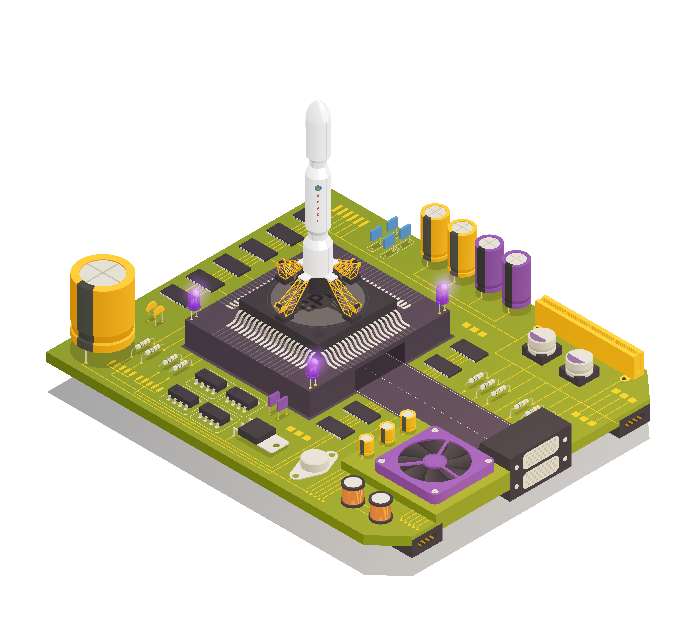

# ESP32微控制器边缘智能节点
这个项目致力于基于ESP32的微控制器边缘智能节点的开发。如果你对这个项目感兴趣，请给它点个赞并保持关注。

## 开发参考

-   :material-book:{ .lg .middle } __ATK DNESP32S3 开发板__

    ---

    ATK DNESP32S3 dvelopment board resources.

    [:octicons-arrow-right-24: <a href="http://47.111.11.73/docs/boards/esp32/ATK-DNESP32S3.html" target="_blank"> Portal </a>](#)

-  :fontawesome-brands-bilibili:{ .lg .middle } __正点原子ESP32教程__

    ---

    ATK DNESP32S3 dvelopment board tutorial.

    [:octicons-arrow-right-24: <a href="https://www.bilibili.com/video/BV1sH4y1W7Tc/?spm_id_from=333.337.search-card.all.click&vd_source=5a427660f0337fedc22d4803661d493f" target="_blank"> Portal </a>](#)

