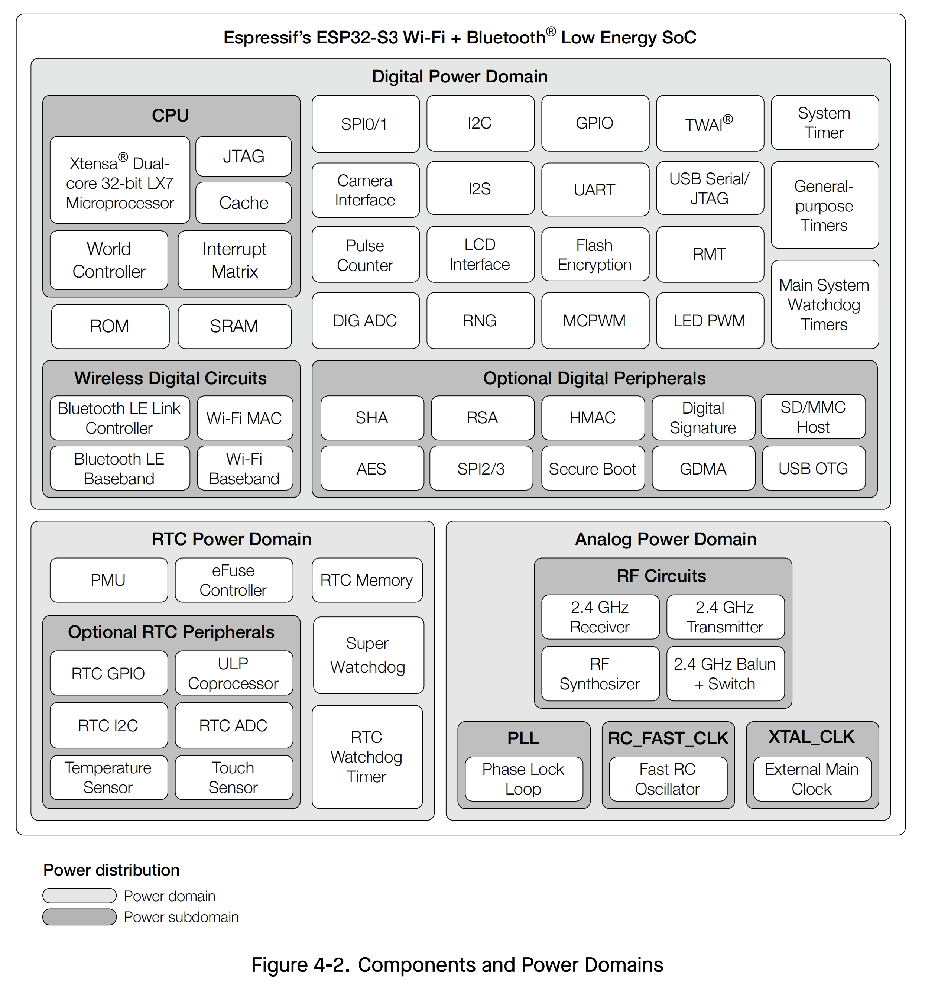

# ATK-DNESP32S3M DEV BOARD 🎯

{ width=500px }

{ width=500px }

{width=800px}

{width=800px}

## DEV BOARD INFO

-   :material-book:{ .lg .middle } __ATK DNESP32S3M DEV BOARD 🎯🏆✅__

    ---

    ATK DNESP32S3M dvelopment board resources.

    [:octicons-arrow-right-24: <a href="http://www.openedv.com/docs/boards/xiaoxitongban/ESP32/ESP32S3M.html" target="_blank"> Portal </a>](#)

-  :fontawesome-brands-bilibili:{ .lg .middle } __TUTORIAL 🎯🏆✅__

    ---

    ATK DNESP32S3 dvelopment board tutorial. 

    [:octicons-arrow-right-24: <a href="https://www.bilibili.com/video/BV1sH4y1W7Tc/?spm_id_from=333.337.search-card.all.click&vd_source=5a427660f0337fedc22d4803661d493f" target="_blank"> Portal </a>](#)

<iframe src="http://www.cuishuaiwen.com:7500/DEV/ESP32/ATK-DNESP32S3M/DNESP32S3M-HW-MANUAL.pdf" width="100%" height="600px"></iframe>

## DEV FRAMEWORK

### ESP-IDF 🎯🏆✅
<iframe src="http://www.cuishuaiwen.com:7500/DEV/ESP32/ATK-DNESP32S3M/DNESP32S3M-ESP-IDF-DEV.pdf" width="100%" height="600px"></iframe>

### Arduino
<iframe src="http://www.cuishuaiwen.com:7500/DEV/ESP32/ATK-DNESP32S3M/DNESP32S3M-ARDUINO-DEV.pdf" width="100%" height="600px"></iframe>

### MicroPython
<iframe src="http://www.cuishuaiwen.com:7500/DEV/ESP32/ATK-DNESP32S3M/DNESP32S3M-MPY-DEV.pdf" width="100%" height="600px"></iframe>